# Lecture 0 — Introduction to Thermodynamics

**MS1016 Thermodynamics of Materials · NTU · Prof Leonard Ng**

---

## 0.1 Why thermodynamics?

Thermodynamics is the language that connects **heat**, **work**, and the **properties of materials**. Almost everything a materials engineer cares about — why metals melt where they do, why alloys form the phases they form, why reactions run forwards or backwards, why batteries deliver the voltages they deliver — is predicted by a few simple laws about energy and entropy.

This course has two halves:

- **Classical thermodynamics** (L1–L4) — the First and Second Laws, free energy, and the idea of equilibrium.
- **Thermodynamics of materials** (L5–L7) — solid solutions, phase diagrams, chemical equilibrium.

The power of thermodynamics lies in how much you get from remarkably little. Four laws, applied carefully, tell you what *must* happen, what *cannot* happen, and when a system has *nothing left to do*.

---

## 0.2 The Four Laws — the big picture

| Law | Informal statement | What it lets you compute |
|---|---|---|
| **Zeroth** | If A and B are each in thermal equilibrium with C, then A and B are in thermal equilibrium with each other. | Defines temperature consistently. |
| **First** | Energy is conserved. | Heat, work, and internal-energy balances. |
| **Second** | The entropy of an isolated system must increase (or stay constant). | Whether a process goes forward or reverses. |
| **Third** | Entropy $\to 0$ as $T \to 0\,\text{K}$ for a perfect crystal. | Absolute entropies, referenced at 0 K. |

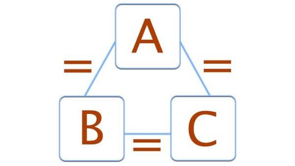{width=260px} 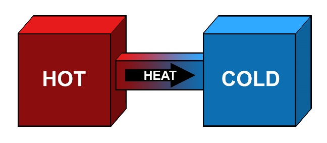{width=320px}

The First Law is usually written as

$$
\Delta U = Q + W
$$

where $\Delta U$ is the change in internal energy, $Q$ is the heat added to the system, and $W$ is the work done *on* the system.

> **⚠ Sign-convention alert.** The sign in front of $W$ depends on whose convention you use. See §0.10 — we'll use $\Delta U = Q + W$ (work **on** the system is positive) throughout this course.

---

## 0.3 Everyday glimpses of the laws

- **Zeroth** — If your house, car, and office are all at the same temperature, any two of them are in thermal equilibrium.
- **First** — A pendulum swaps kinetic and potential energy back and forth; the total is constant (ignoring friction).
- **Second** — A wound-up watch runs down. Order leaks away; you have to put energy back in to wind it.
- **Third** — Steam is hot, molecules move fast, and its entropy is very high — far from the $S \to 0$ limit at absolute zero.

{width=260px} {width=260px}

The **heat engine** (any engine burning fuel to produce motion) and its reverse the **refrigerator / heat pump** are thermodynamics' most famous applications — engines extract work from a hot-to-cold heat flow, fridges use work to pump heat from cold to hot.

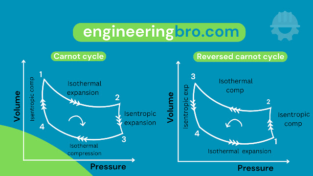{width=520px}

---

## 0.4 Systems, surroundings, and boundaries

Thermodynamics is always about a **system** — a piece of the universe you draw a box around. Everything outside the box is the **surroundings** (or *environment*). The imagined surface between them is the **boundary**.

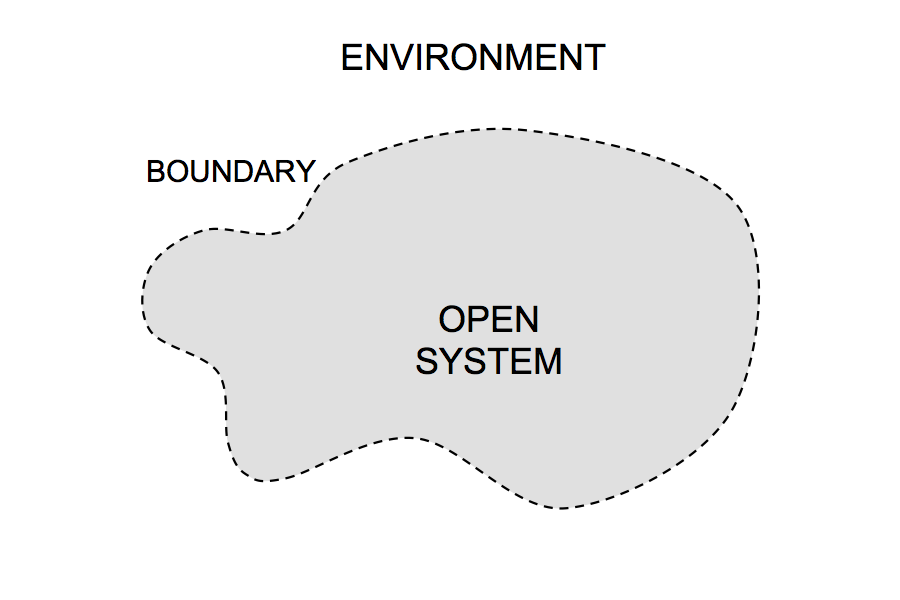{width=380px}

### Three kinds of system

| System | Matter crosses boundary? | Energy crosses boundary? |
|---|:---:|:---:|
| **Isolated** | ✗ | ✗ |
| **Closed** | ✗ | ✓ (heat, work) |
| **Open** | ✓ | ✓ |

**Examples:**

- **Injection moulding machine** — open system (pellets in, plastic out, heat & work in).

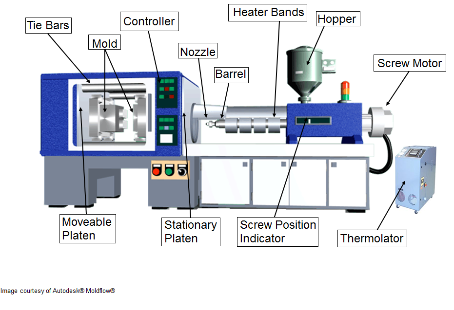{width=220px}

- **Ocean** — open (matter and energy both cross the boundary).

{width=220px}

- **Ideal thermos flask** — isolated (idealisation with no heat/work/matter transfer).

{width=160px}

- **Earth + atmosphere (greenhouse cycle)** — approximately closed (radiation crosses, mass roughly fixed).

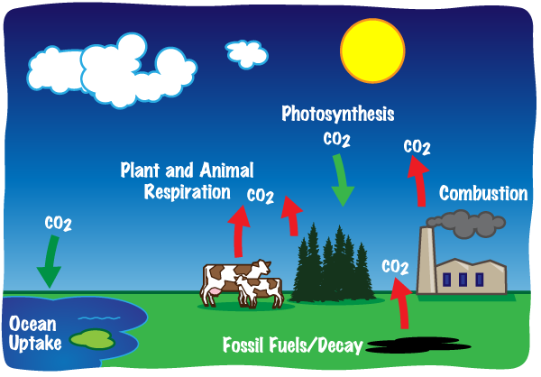{width=220px}

### Three kinds of boundary

| Boundary | Allows through | Blocks |
|---|---|---|
| **Permeable** | matter | — |
| **Adiabatic** | work | heat |
| **Rigid** | heat | work (no volume change) |

In real life no boundary is perfectly any of these; they're idealizations that make problems tractable.

---

## 0.5 State, path, properties, and quantities

The **state** of a system is its condition at a given instant, described by values of its state variables ($T$, $P$, $V$, composition, …). Two systems in the same state are thermodynamically indistinguishable — you can't tell from any measurement *how* they got there.

### Property vs. quantity

A **property** depends only on the present state, not the history. A **quantity** depends on the path taken.

- $U$, $H$, $S$, $G$, $T$, $P$, $V$ are properties (state functions).
- $Q$ (heat) and $W$ (work) are quantities (path functions).

> You do not "have heat in you" — you *transfer* heat. You do not "have work stored" — you *do* work. This distinction matters mathematically (see §0.9).

### Intensive vs. extensive

| | Depends on amount of matter? | Examples |
|---|:---:|---|
| **Extensive** | yes | $V$, $U$, $S$, $n$, mass |
| **Intensive** | no | $T$, $P$, density, molar volume |

A useful fact: **the ratio of two extensive properties is intensive.** For example, mass / volume = density.

### State functions vs. path functions — graphically

Consider a gas going from state 1 ($P_1, V_1$) to state 2 ($P_2, V_2$) on a $P\text{–}V$ diagram. Two different paths (expand-then-compress vs. compress-then-expand) give the same change in $U$ (because $U$ is a state function) but generally different $Q$ and $W$ (path functions). The area under each path is the work, and it's path-dependent.

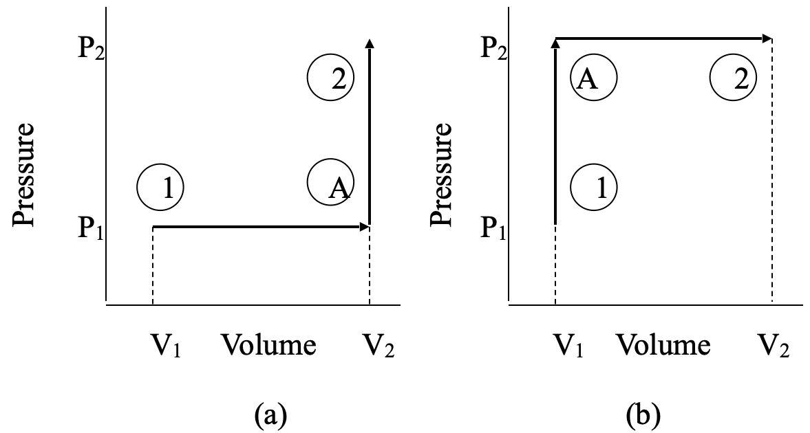{width=500px}

---

## 0.6 Thermodynamic equilibrium

If you leave a system alone long enough, macroscopic changes die down and the system **settles into equilibrium**. The driver of any change is some **unbalanced potential**:

| Driver | Equilibrium reached when… |
|---|---|
| Temperature gradient | Everything is at the same $T$ (thermal equilibrium) |
| Pressure / stress gradient | Nothing is expanding, contracting, or deforming (mechanical equilibrium) |
| Chemical-potential gradient | No reaction, diffusion, or dissolution occurring (chemical equilibrium) |

**Thermodynamic equilibrium** requires *all three* simultaneously. This is a strong condition — partial equilibrium (e.g. thermal but not chemical) is common in the lab.

---

## 0.7 Energy, work, and heat

### Internal energy $U$

The **internal energy** of a system is the sum of all its microscopic energies — kinetic energy of molecules translating, rotating, vibrating; potential energy stored in chemical bonds; energy in free conduction electrons; and so on. It is an extensive property.

$U$ goes up when you heat a material (roughly $U \propto T$ at low orders), when you compress it against intermolecular forces, or when you change its composition in an energetically favourable direction.

### Kinetic energy (KE)

For a particle of mass $m$ moving at speed $v$,

$$
\text{KE} = \tfrac{1}{2}mv^2 \qquad \text{units: J} = \text{kg}\,\text{m}^2/\text{s}^2
$$

KE comes in three flavours at the molecular level:

| Mode | Example |
|---|---|
| Translational | plane flying straight, gas molecule bouncing between walls |
| Rotational | turbine blade spinning, diatomic molecule tumbling |
| Vibrational | phone on silent, atoms in a solid oscillating about lattice sites |

{width=200px} {width=200px} {width=200px}

### Potential energy (PE)

Energy *stored* by virtue of position or configuration:

| Type | Source |
|---|---|
| Gravitational | $\text{PE} = mgh$ — mass in a gravitational field |
| Elastic | energy in a compressed spring or stretched rubber band |
| Electrical | charge in an electric field |
| Magnetic | magnetic material in a magnetic field |

By the First Law, PE can convert to KE (or heat, or any other form of energy) without being destroyed. A drawn bow stores elastic PE; released, that PE becomes KE of the arrow.

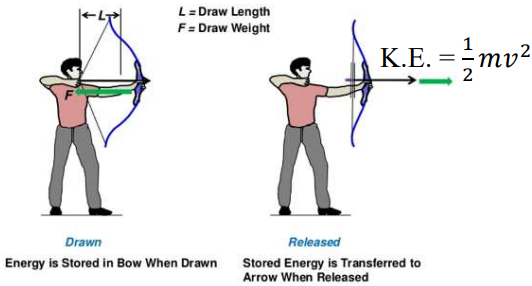{width=520px}

### Work

**Work** is force acting through a displacement:

$$
W = F \cdot d \qquad \text{units: J} = \text{N}\cdot\text{m}
$$

Only force components *parallel* to the displacement do work.

**Expansion / compression work** (most important for gases):

$$
\delta W = -P\,\mathrm{d}V
$$

- When a gas is **compressed** ($\mathrm{d}V < 0$), $\delta W > 0$: work is done **on** the gas, its internal energy rises.
- When a gas **expands** ($\mathrm{d}V > 0$), $\delta W < 0$: the gas does work **on** its surroundings, losing energy in the process.

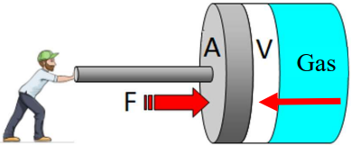{width=300px} 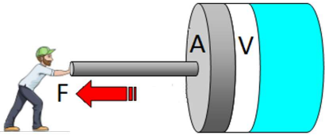{width=300px}

Other forms of work you'll meet:

| Form | Expression |
|---|---|
| Electrical | $W_\text{elec} = V \cdot I \cdot t$ (volts × current × time) |
| Magnetic | $W_\text{mag} \propto H \cdot M$ |
| Surface | $W_\text{surf} = \gamma \cdot \mathrm{d}A$ (surface tension × area change) |
| Chemical | energy associated with making/breaking bonds, e.g. heat of fusion |

### Heat

**Heat** is energy transferred across a boundary due to a temperature difference. Like work, it's a path function — you can't point to a reservoir of heat "inside" a body, only describe heat as it flows.

### The sign convention we'll use

Throughout MS1016 we'll adopt:

$$
\boxed{\;\Delta U \;=\; Q \;+\; W\;}
$$

with

- $Q > 0$ if heat is absorbed **by** the system,
- $W > 0$ if work is done **on** the system.

This gives $\delta W = -P\,\mathrm{d}V$ for expansion/compression, as written above. (A different textbook may write $\Delta U = Q - W$ with $W = $ work done *by* the system — same physics, different bookkeeping.)

---

## 0.8 Standard notation

The symbols below appear throughout the course.

| Symbol | Meaning |
|---|---|
| $T$ | temperature |
| $P$ | pressure |
| $V$ | volume |
| $n$ | number of moles |
| $X_i$ | composition / mole fraction of component $i$ |
| $U$ | internal energy |
| $Q$ | heat absorbed by the system |
| $W$ | work done on the system |
| $\Delta U$ | change in internal energy |
| $H$ | enthalpy |
| $S$ | entropy |
| $F$ (or $A$) | Helmholtz free energy |
| $G$ | Gibbs free energy |
| $C_P$ | heat capacity at constant pressure |
| $C_V$ | heat capacity at constant volume |
| $\Omega$ | number of accessible microstates |
| $l_w$ | lost work |
| $\mu$ (or $\bar{G}$) | chemical potential (molar Gibbs energy) |
| $a$ | activity |
| **Underlined variable** (e.g. $\underline{U}$) | "per mole" or "per unit mass" — intensive |

---

## 0.9 The math you need

Thermodynamics leans on just a few pieces of calculus. If these are rusty, a short detour now will save pain later.

### Functions

A function maps inputs to outputs. Single-variable:

$$
y = f(x)
$$

Multi-variable — very common in thermo:

$$
G = G(T, P, n_1, n_2, \ldots)
$$

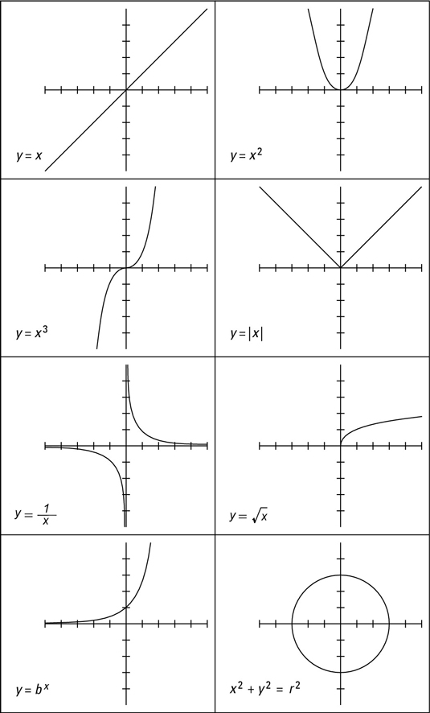{width=520px}

### Differentiation — power rule

For $y = k\,x^n$ with $k$ a constant,

$$
\frac{\mathrm{d}y}{\mathrm{d}x} = n\,k\,x^{n-1}
$$

Bring the exponent down, drop it by one.

### Sum/difference rule

$$
\frac{\mathrm{d}}{\mathrm{d}x}[f(x) \pm g(x)] = \frac{\mathrm{d}f}{\mathrm{d}x} \pm \frac{\mathrm{d}g}{\mathrm{d}x}
$$

Differentiate each term separately and combine.

### Partial differentiation

When a quantity depends on several variables, we differentiate with respect to one while **holding the others constant**. The notation $\left(\tfrac{\partial G}{\partial T}\right)_{\!P,n}$ means "differentiate $G$ with respect to $T$, holding $P$ and $n$ fixed".

For $f = f(x, y)$:

$$
\mathrm{d}f \;=\; \left(\frac{\partial f}{\partial x}\right)_{\!y}\mathrm{d}x \;+\; \left(\frac{\partial f}{\partial y}\right)_{\!x}\mathrm{d}y
$$

This is the **total differential** — it says how $f$ changes when both inputs change a little.

For more variables, just add terms. For the Gibbs energy $G = G(T, P, n_1, n_2, \ldots)$:

$$
\mathrm{d}G \;=\; \left(\frac{\partial G}{\partial T}\right)_{\!P,n_i}\!\mathrm{d}T
\;+\; \left(\frac{\partial G}{\partial P}\right)_{\!T,n_i}\!\mathrm{d}P
\;+\; \sum_i \left(\frac{\partial G}{\partial n_i}\right)_{\!T,P,n_{j\neq i}}\!\mathrm{d}n_i
$$

### Four useful identities

For $z = z(x, y)$ (so any two of $x,y,z$ determine the third):

1. **Reciprocal:** $\quad \left(\dfrac{\partial x}{\partial y}\right)_{\!z} = \dfrac{1}{\left(\partial y/\partial x\right)_{\!z}}$

2. **Chain:** $\quad \left(\dfrac{\partial x}{\partial z}\right)_{\!u} = \left(\dfrac{\partial x}{\partial y}\right)_{\!u} \left(\dfrac{\partial y}{\partial z}\right)_{\!u}$

3. **Cyclic (triple product):** $\quad \left(\dfrac{\partial x}{\partial y}\right)_{\!z} \left(\dfrac{\partial y}{\partial z}\right)_{\!x} \left(\dfrac{\partial z}{\partial x}\right)_{\!y} = -1$

4. **From cyclic:** $\quad \left(\dfrac{\partial x}{\partial y}\right)_{\!z} = -\dfrac{(\partial z/\partial y)_x}{(\partial z/\partial x)_y}$

> The **minus sign in identity 4** is easy to drop but essential. It comes straight from rearranging the cyclic relation — don't lose it.

### Four flavours of "small change"

| Symbol | Use |
|---|---|
| $\mathrm{d}x$ | small change in $x$ (state function) — *exact* differential |
| $\partial x$ | small change holding other variables constant — used in partial derivatives |
| $\delta x$ | small change in a path function (e.g. $\delta Q$, $\delta W$) — *inexact* differential |
| $\Delta x$ | total (finite) change, $x_\text{final} - x_\text{initial}$ |

The distinction between $\mathrm{d}$ and $\delta$ is load-bearing: **state functions have exact differentials, path functions do not.** You can write $\mathrm{d}U$ but never $\mathrm{d}Q$ — only $\delta Q$.

### Constants vanish under differentiation

If a variable is held fixed during a process, its differential is zero:

- At constant $P$: $\mathrm{d}P = 0$, so $(\mathrm{d}G)_P = -S\,\mathrm{d}T$ reduces from $\mathrm{d}G = V\,\mathrm{d}P - S\,\mathrm{d}T$.
- At constant $V$: $\mathrm{d}V = 0$, so any $P\,\mathrm{d}V$ term drops out.

This is how we get useful working equations from the general differential forms.

---

## 0.10 Worked examples

### Example 1 — Work and gravitational PE

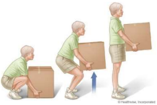{width=380px}

*A man lifts a 5 kg box a height of 2 m. How much work does he do?*

Force needed to lift at constant velocity = weight of box = $mg = 5 \times 9.81 = 49.05\text{ N}$ (upward, against gravity).

Displacement parallel to force = 2 m.

$$
W \;=\; F \cdot d \;=\; 49.05 \times 2 \;=\; 98.1\text{ J}
$$

This work went into gravitational PE of the box: $\text{PE} = mgh = 5 \times 9.81 \times 2 = 98.1$ J. ✓

### Example 2 — Power rule

Differentiate $y = 2x^4$.

$$
\frac{\mathrm{d}y}{\mathrm{d}x} = 2 \cdot 4\,x^{4-1} = 8x^3
$$

### Example 3 — Sum/difference + power rule

Differentiate $y = x^5 + 2x^{-3}$.

$$
\frac{\mathrm{d}y}{\mathrm{d}x} = 5x^4 + 2\cdot(-3)\,x^{-3-1} = 5x^4 - 6x^{-4}
$$

### Example 4 — Total differential of the ideal gas law

$PV = nRT$, with $P, V, T$ variables and $n, R$ constants. Differentiating both sides:

$$
P\,\mathrm{d}V + V\,\mathrm{d}P \;=\; nR\,\mathrm{d}T
$$

This is the ideal-gas law in **differential form**; you'll use it constantly in L1 and L2.

### Example 5 — Total differential of $G = H - TS$

$$
\mathrm{d}G = \mathrm{d}H - T\,\mathrm{d}S - S\,\mathrm{d}T
$$

(Product rule on $TS$.)

### Example 6 — Using a constant to simplify

$\mathrm{d}G = V\,\mathrm{d}P - S\,\mathrm{d}T$. At **constant pressure** ($\mathrm{d}P = 0$):

$$
\mathrm{d}G = -S\,\mathrm{d}T \quad\Longrightarrow\quad \left(\frac{\partial G}{\partial T}\right)_{\!P} = -S
$$

This identity is central to L3.

---

## 0.11 Answers to the "Test Your Understanding" prompts

| Prompt (from slides) | Answer |
|---|---|
| Ratio of mass to volume — intensive or extensive? | **Intensive** (it's density; ratio of two extensives). |
| Sample property reads $Y$; after mixing in identical sample, reads $2Y$. Intensive or extensive? | **Extensive** — doubling the system doubled the property. |
| A process with **only heat transfer**. | Sunlight warming a rock; hot water cooling in a sealed rigid container. |
| A process with **only work done**. | Stretching an ideal spring in a thermally-insulated enclosure; turning a frictionless crank on an adiabatic piston. |
| KE type: vibrating phone / flying plane / rotating turbine? | Vibrational / translational / rotational. |
| Gas in a closed system — macroscopic flow KE or individual-molecule KE? | **Individual-molecule KE.** The centre of mass isn't moving; the gas has internal energy from the thermal motion of its molecules. |
| Is writing $\delta P$ correct? | **No.** Pressure is a state function, so use $\mathrm{d}P$. Only path functions (heat, work) take $\delta$. |

Worked partial-differentiation answers for the remaining Test-Your-Understanding items are in §0.9 / §0.10.

---

## Flags for Prof Leonard — please review before we propagate these into L1–L7

These are places in the original L0 notes where I think something may be wrong or ambiguous. I haven't changed your source material; I've written this consolidated doc in whichever way seems most defensible, and I'm flagging so you can confirm or correct.

1. **Sign convention for the First Law (slide 2 vs. slides 21, 28, 32).**
   Slide 2 states $\Delta U = Q - W$ with *$W$ = work done* ***by*** *the system*. Slides 21, 28, and 32 (and the partial-differentiation derivation) use $U = Q + W$ with no sign flip, which only works if $W$ is redefined as *work done* ***on*** *the system*. Both conventions are valid, but your slides use them interchangeably without flagging the switch. In this consolidated doc I've used $\Delta U = Q + W$ (work-on convention) throughout, because that's what appears in three of the four places and is consistent with $\delta W = -P\,\mathrm{d}V$. **Please confirm which convention you want me to use for L1 onward.**

2. **Slide 15 — units on KE.** The slide says "Kinetic energy (J or Kg.m/s²)". It should be **kg·m²/s²** (i.e. J = kg·m²/s²). Slide 12 has it correct. Also on the same slide, "v = velocity (m/s²)" — velocity is **m/s**; m/s² is acceleration.

3. **Slides 9–10 — compression work labels.** The equation reads "Work (J) = Force (N/m²) × Distance (m³)". The units are right for $W = P\Delta V$, but calling $P$ "force" and $V$ "distance" will confuse students. Also, the sign treatment ("work done by the man on the gas = PV") doesn't include the expected minus sign in $W = -P\,\Delta V$; under the work-on convention, compressing (with $\Delta V < 0$) gives $W > 0$. I'd recommend rewriting this slide to use $P$ and $V$ directly with the signed form.

4. **Slide 27 — identity 4.** As written: $\left(\tfrac{\partial x}{\partial y}\right)_z = \dfrac{(\partial z/\partial y)_x}{(\partial z/\partial x)_y}$. The **minus sign is missing** — rearranging the cyclic relation in identity 3 gives $\left(\tfrac{\partial x}{\partial y}\right)_z = -\dfrac{(\partial z/\partial y)_x}{(\partial z/\partial x)_y}$. I used the signed form in this doc.

5. **Slide 31 — typo in PV = nRT partial.** The working shows "(∂(PV)/∂V)_{P,T} dP = V dP" in step 2; the subscript should be "(∂(PV)/∂**P**)_{V,T} dP = V dP" (partial with respect to $P$, holding $V,T$).

6. **Slide 6 — Reverse Carnot description.** Reads "work is provided to transfer the heat from the 'colder region to the hotter region' or from the 'Hotter region to the colder region.'" The second option shouldn't require work (heat flows hot → cold spontaneously). I think the "or" clause was meant to describe the forward cycle; it currently reads as if both directions require input work.

7. **Figure-caption placeholders** ("figure xxxx" on slide 5). Likely leftover TODO.

Happy to apply any of these in your preferred way and then continue to L1 in the same style.
