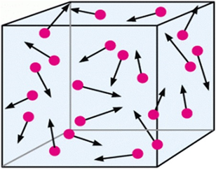
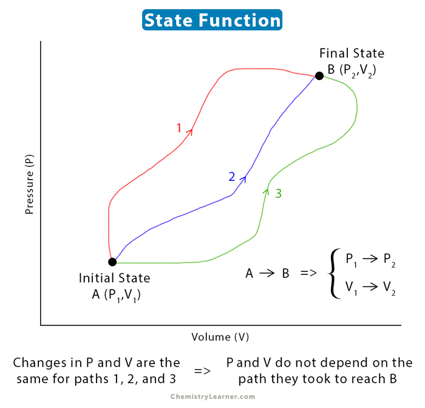
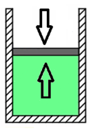
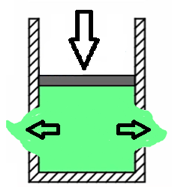
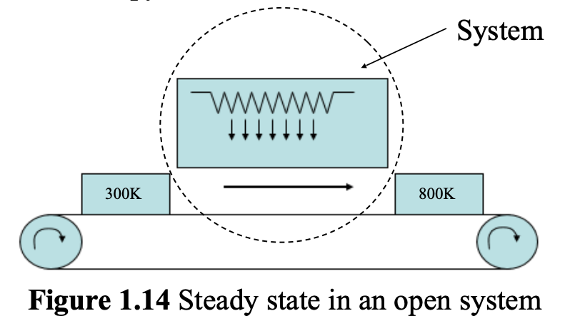
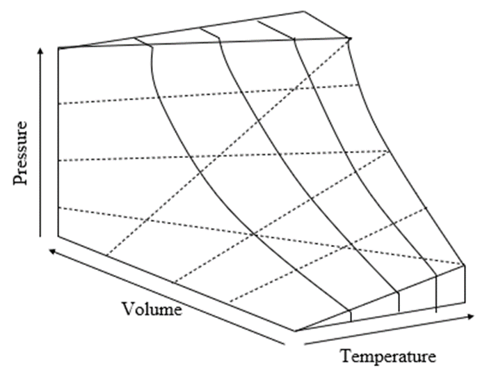
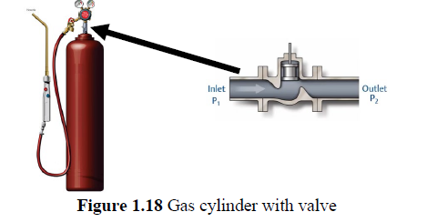

# Lecture 1 — The First Law: Conservation of Energy

**MS1016 Thermodynamics of Materials · NTU · Prof Leonard Ng**

> **Prerequisite:** Lecture 0 (systems, state, path, differentials). The First Law builds directly on that vocabulary.

---

## 1.1 What this lecture does

The First Law is the bookkeeping rule for energy. Say it in words: **energy is never created or destroyed; any change in a system's internal energy is accounted for by the heat it absorbs and the work done on it.** In symbols, with our convention (L0 §0.7):

$$
\boxed{\;\Delta U \;=\; Q \;+\; W\;}
$$

Most of this lecture is working out what this equation *means* — how to apply it to closed vs. open systems, what to do when pressure is constant (enthalpy), how heat capacities let you compute $\Delta U$ and $\Delta H$ from temperatures, and how to handle gas flows and chemical reactions.

By the end you should be able to:

- distinguish reversible from irreversible work,
- write the First Law in its open-system and steady-state forms,
- compute enthalpy changes from $C_P$ data,
- apply the ideal-gas law and the adiabatic relation $PV^\gamma = \text{const}$,
- compute standard enthalpies of reaction by Hess's Law.

---

## 1.2 Systems, microstates, and macrostates

From L0 a **system** is the piece of universe we draw a box around. We distinguish two kinds here:

| | **Open system** | **Closed system** |
|---|---|---|
| Matter exchange? | ✓ (matter may freely enter or leave) | ✗ (no matter enters or leaves) |
| Energy exchange? | ✓ | ✓ |

{width=440px}

### Microstate vs. macrostate

The **microstate** is the full list of atomic/molecular positions and velocities — a complete description, but impossibly detailed (Avogadro's number of coordinates).

{width=480px}

The **macrostate** is what we actually measure: the residual, time-averaged effect of all those microscopic motions, reduced to a handful of bulk numbers.

| Variable | What it is, microscopically |
|---|---|
| $P$ | average force per area from molecular bombardment on the walls |
| $T$ | average kinetic energy of molecular motion (roughly) |
| $V$ | size of the container (imposed) or of the fluid (at equilibrium) |
| $n$ | amount of substance |
| $U$ | total kinetic + potential energy of all molecules |

**Key fact** (worth memorising): if the number of moles of each component is known, **any two** of $P, T, V, U$ are enough to fix the macrostate. Functionally:

$$
P = P(U, V, n_1, n_2, \ldots), \qquad U = U(P, V, n_1, n_2, \ldots), \qquad V = V(U, T, n_1, n_2, \ldots)
$$

This is why thermodynamic relations always have "holding such-and-such fixed" subscripts — once you pick two variables, the rest are determined.

### Intensive vs. extensive (recap)

Combine two identical boxes of gas into one by removing the partition:

- $U_3 = U_1 + U_2$, $V_3 = V_1 + V_2$ → **extensive** (scales with system size)
- $P_3 = P_1 = P_2$, $T_3 = T_1 = T_2$ → **intensive** (bulk property)

**Any ratio of two extensives is intensive** (mass/volume = density; $U/n$ = molar internal energy).

---

## 1.3 Energy transfer: heat and work

Energy can cross a boundary in exactly two ways:

$$
\text{Heat } Q \qquad\text{and}\qquad \text{Work } W
$$

If the only energy exchange is between system 1 and system 2 (everything else isolated), energy conservation says

$$
\Delta U_1 = -\Delta U_2
$$

### Thermal interaction — heat

Two rigid containers separated by a thermally-conducting partition. System 1 starts hotter. Heat flows from 1 into 2 until both are at the same $T$. For **system 2**:

$$
\Delta U_\text{(heat)} = Q
$$

Sign rule: **heat absorbed** by a system (from surroundings) is **positive**; heat **lost** is negative.

### Mechanical interaction — work

Two cylinders separated by a freely-sliding, insulated piston. System 2 starts at higher pressure; the piston moves toward system 1, so system 2 **does work on** system 1.

Under our convention ($W$ = work done **on** the system), for system 2:

$$
\Delta U_\text{(work)} = W_\text{on 2} = -P\,\Delta V_2
$$

When system 2 **expands** ($\Delta V_2 > 0$), $W_\text{on 2} < 0$: the gas loses energy pushing the piston out. When **compressed** ($\Delta V_2 < 0$), $W_\text{on 2} > 0$: the gas gains energy from the external force.

### Combining: the First Law

If system 2 exchanges **both** heat and work,

$$
\Delta U = Q + W
$$

— the First Law. In differential form (used constantly):

$$
\mathrm{d}U \;=\; \delta Q \;+\; \delta W
$$

We use $\delta$ (not $\mathrm{d}$) for $Q$ and $W$ because they are **path functions** — the values depend on *how* the change happened, not just on the start and end states. See §1.4.

---

## 1.4 State functions, path functions, and work

### Why $U$ is a state function but $Q$ and $W$ are not

$U$ depends only on the current macrostate (colour of a toy car — no matter how it got painted red, it's now red). So

$$
\Delta U = U_2 - U_1
$$

You don't need the path.

$Q$ and $W$, however, depend on **how** you move between states. Consider a gas going from $(P_1, V_1)$ to $(P_2, V_2)$ by two different paths on a $P$–$V$ diagram:

{width=280px} {width=280px}

**Path 1**: expand from $V_1$ to $V_2$ at pressure $P_1$, then pressurise to $P_2$ at constant $V$.
- Expansion at $P_1$: $W_\text{on gas} = -P_1(V_2 - V_1)$
- Pressurisation at constant $V$: no work ($\mathrm{d}V = 0$)
- Total: $W_1 = -P_1(V_2 - V_1)$

**Path 2**: pressurise at $V_1$, then expand at $P_2$.
- $W_2 = -P_2(V_2 - V_1)$

Unless $P_1 = P_2$, $W_1 \neq W_2$, even though $\Delta U_1 = \Delta U_2$ (same endpoints). **Work is path-dependent.**

### Notation takeaway

| State function | Path function |
|---|---|
| $\mathrm{d}U$, $\mathrm{d}H$, $\mathrm{d}T$, $\mathrm{d}P$, $\mathrm{d}V$ | $\delta Q$, $\delta W$ |
| $\Delta$ between endpoints is well-defined | "Total $\Delta$" depends on path |
| "The system **has** internal energy $U$" ✓ | "The system **has** heat $Q$" ✗ |
| | Better: "the system **absorbs** heat $Q$" |

### Reversible vs. irreversible work

{width=240px} {width=240px}

**Reversible (quasi-static) work** is done in tiny increments, with the system always infinitesimally close to equilibrium. At every instant the external pressure equals the gas pressure, so reversing the push by an infinitesimal amount reverses the process. Reversible work on a gas:

$$
\delta W_\text{rev} = -P\,\mathrm{d}V
$$

**Irreversible work** — e.g. slamming a piston down suddenly — can't be undone without entropy leaking out (we'll formalise this in L2). In this course, whenever we write $W = -\int P\,\mathrm{d}V$ we are assuming reversibility unless stated otherwise.

---

## 1.5 Specific and molar properties (notation)

Extensive properties (energy, volume, enthalpy) scale with the size of the system. It's usually cleaner to work with their **per-unit-mass** or **per-mole** versions, marked with an underline:

$$
\underline{U} = \frac{U}{m} \;[\text{J}\,\text{kg}^{-1}], \qquad \underline{V} = \frac{V}{m} \;[\text{m}^3\,\text{kg}^{-1}], \qquad \underline{H} = \frac{H}{m}
$$

Because density $\rho = m/V$, specific volume is its reciprocal: $\underline{V} = 1/\rho$.

Molar quantities use the same convention with moles in the denominator:

$$
\underline{V}_\text{molar} = \frac{V}{n} \;[\text{m}^3\,\text{mol}^{-1}]
$$

---

## 1.6 First Law for open systems — flow work

A **closed** system has $\mathrm{d}U = \delta Q + \delta W$ and nothing more to say. For an **open** system, matter flowing in/out carries energy with it, and pushing that matter across the boundary itself costs work — called **flow work**.

{width=440px}

### Deriving flow work

Imagine a small mass $\delta m_i$ entering the system. To push it in, the inlet pressure $P_i$ must do work against the system's pressure over the volume $\underline{V}_i\,\delta m_i$ that the mass occupies:

$$
\delta W_\text{flow,in} \;=\; +P_i\,\underline{V}_i\,\delta m_i
$$

Similarly for matter leaving:

$$
\delta W_\text{flow,out} \;=\; -P_o\,\underline{V}_o\,\delta m_o
$$

### Open-system First Law

Adding these to the closed-form First Law and grouping terms (the energy carried by a mass $\delta m$ is $\underline{U}\,\delta m$ plus its flow work):

$$
\sum_i (\underline{U}_i + P_i \underline{V}_i)\,\delta m_i \;-\; \sum_o (\underline{U}_o + P_o \underline{V}_o)\,\delta m_o \;+\; \delta Q \;+\; \delta W \;=\; \mathrm{d}U
$$

The combination $\underline{U} + P\underline{V}$ appears so often in open-system problems that we give it its own name — **enthalpy** — see the next section.

---

## 1.7 Enthalpy

### Definition

$$
\boxed{\;H \;=\; U + PV\;}
$$

$H$ is an extensive state function with units of joules. The specific/molar versions are $\underline{H} = \underline{U} + P\underline{V}$.

### Why enthalpy? — the constant-pressure story

Most natural and industrial processes happen at roughly constant (atmospheric) pressure, and usually with volume changes: ice melts, water boils, metals expand. If pressure is constant, the system does expansion work $P\,\mathrm{d}V$ in addition to absorbing heat. Bookkeeping that work at every step is a pain — **$H$ absorbs it for us**.

**Proof that $\mathrm{d}H = \delta Q$ at constant $P$** (with no non-$PV$ work):

1. First Law with only $PV$ work: $\mathrm{d}U = \delta Q - P\,\mathrm{d}V$
2. Differentiate $H = U + PV$: $\mathrm{d}H = \mathrm{d}U + P\,\mathrm{d}V + V\,\mathrm{d}P$
3. Constant pressure ⇒ $\mathrm{d}P = 0$: $\mathrm{d}H = \mathrm{d}U + P\,\mathrm{d}V$
4. Substitute (1): $\mathrm{d}H = (\delta Q - P\,\mathrm{d}V) + P\,\mathrm{d}V = \delta Q$

$$
\boxed{\;(\mathrm{d}H)_P \;=\; \delta Q\;}
$$

At constant pressure, **heat absorbed by the system equals the enthalpy change.** This is why chemists and materials engineers quote reaction enthalpies — at atmospheric pressure they are literally the heats of reaction.

> If pressure is **not** constant, $\mathrm{d}H \neq \delta Q$. Don't carry the identity across to other conditions.

### Open-system First Law with enthalpy

Substituting $\underline{H} = \underline{U} + P\underline{V}$ into the open-system equation and including KE and PE for completeness:

$$
\sum_i (\underline{H}_i + \text{KE}_i + \text{PE}_i)\,\delta m_i \;-\; \sum_o (\underline{H}_o + \text{KE}_o + \text{PE}_o)\,\delta m_o \;+\; \delta Q + \delta W \;=\; \mathrm{d}(U + \text{KE} + \text{PE})
$$

For a **closed** system with no matter flow and negligible KE/PE this collapses back to $\delta Q + \delta W = \mathrm{d}U$.

---

## 1.8 Steady state

{width=440px}

A **steady state** has the macroscopic properties of the system **unchanging in time**, even though matter may flow through. Think of a pipe carrying fluid at constant flow rate and constant inlet/outlet temperatures — the fluid inside the pipe keeps moving, but at any point the state looks the same at $t=0$ and $t=10$ s.

In steady state:

- $\mathrm{d}U = 0$ (internal energy not accumulating)
- $\delta m_i = \delta m_o$ (mass conservation — input rate = output rate)

The open-system First Law (ignoring KE/PE) simplifies beautifully:

$$
\boxed{\;\sum_i \underline{H}_i\,m_i \;-\; \sum_o \underline{H}_o\,m_o \;=\; Q + W\;}
$$

Most process-engineering problems (heat exchangers, turbines, valves, furnaces) are analyzed at steady state using exactly this equation.

---

## 1.9 Heat capacities

Heat capacity answers: *how much heat does it take to raise this object's temperature by 1 K?*

$$
C \;\equiv\; \frac{\delta Q}{\mathrm{d}T} \qquad \text{units: J/K (extensive)}
$$

Dividing by mass or moles gives the **specific** or **molar** heat capacity (intensive, J kg$^{-1}$ K$^{-1}$ or J mol$^{-1}$ K$^{-1}$).

Because $\delta Q$ is path-dependent, we need to specify the path. Two cases matter:

### Constant volume: $C_V$

At constant volume, no expansion work: $\delta W = -P\,\mathrm{d}V = 0$. First Law gives $\delta Q = \mathrm{d}U$.

$$
C_V \;=\; \left(\frac{\partial U}{\partial T}\right)_{\!V}
$$

Per mass (dividing by $m$, so $\underline{U} = U/m$):

$$
\frac{\delta Q}{m\,\mathrm{d}T} \;=\; \left(\frac{\partial \underline{U}}{\partial T}\right)_{\!V} \;=\; \underline{C}_V \qquad\Longrightarrow\qquad \delta Q \;=\; m\,\underline{C}_V\,\mathrm{d}T, \quad \mathrm{d}U = m\,\underline{C}_V\,\mathrm{d}T
$$

### Constant pressure: $C_P$

At constant pressure, $\delta Q = \mathrm{d}H$ (from §1.7):

$$
C_P \;=\; \left(\frac{\partial H}{\partial T}\right)_{\!P}
$$

$$
\delta Q \;=\; m\,\underline{C}_P\,\mathrm{d}T, \qquad \mathrm{d}H \;=\; m\,\underline{C}_P\,\mathrm{d}T
$$

### Summary table

| Path | Heat capacity | Integrated heat |
|---|---|---|
| Constant $V$ | $C_V = (\partial U/\partial T)_V$ | $\mathrm{d}U = m\,\underline{C}_V\,\mathrm{d}T$ |
| Constant $P$ | $C_P = (\partial H/\partial T)_P$ | $\mathrm{d}H = m\,\underline{C}_P\,\mathrm{d}T$ |

> Constant $V$ or constant $P$ are **special paths** that turn a path function ($Q$) into a state function ($U$ or $H$, respectively). That's why $\delta Q$ gets replaced by $\mathrm{d}U$ or $\mathrm{d}H$ in those identities.

### Temperature-dependent $C_P$

Tabulated heat capacities usually come as polynomials:

$$
C_P \;=\; a \;+\; bT \;+\; \frac{c}{T^2} \qquad [\text{J}\,\text{mol}^{-1}\,\text{K}^{-1}, \;\;\text{at 1 atm}]
$$

Because $C_P$ generally **changes with temperature and with phase**, tables often list separate coefficients for the solid, liquid, and different crystal structures of the same element (e.g. $\alpha$-Fe vs. $\gamma$-Fe).

### Integrating to get $\Delta H$

With $C_P = a + bT + c/T^2$ and constant pressure:

$$
\Delta H \;=\; \int_{T_1}^{T_2} C_P\,\mathrm{d}T
\;=\; a(T_2 - T_1) \;+\; \tfrac{b}{2}(T_2^2 - T_1^2) \;-\; c\!\left(\frac{1}{T_2} - \frac{1}{T_1}\right)
$$

> If you used **molar** $C_P$, you get **molar** $\Delta H$. Multiply by moles to get the total $\Delta H$.

---

## 1.10 Worked example — heating aluminium

*A furnace heats a continuous stream of aluminium from 300 K to 800 K, still in its solid phase. The Al enters at 300 K and exits at 800 K; 1000 kg pass through. How much electrical energy is required?*

**Given:** atomic mass of Al = 27 g/mol; molar $C_P^\text{sol} = 20.67 + 12.38\times 10^{-3}\,T$ J mol$^{-1}$ K$^{-1}$ at 1 atm.

### Step 1 — Identify the system and its state

The **furnace cavity** (not the Al slab itself) is the system. Al flows in at 300 K, flows out at 800 K, so this is an **open system**. The furnace runs continuously at fixed wall temperature, so its internal state is unchanging in time — **steady state** ($\mathrm{d}U = 0$, $\delta m_i = \delta m_o$).

### Step 2 — Pick the First Law form

Steady-state First Law, KE and PE negligible:

$$
\sum_i \underline{H}_i\,m_i \;-\; \sum_o \underline{H}_o\,m_o \;=\; Q + W
$$

### Step 3 — What's $Q$, what's $W$?

The walls are at constant temperature, so there's no net temperature-driven heat flow across the boundary: $Q = 0$. All energy entering the cavity does so as **electrical work** on the heater elements, which is then transferred to the Al. So solve for $W$:

$$
W \;=\; m\,(\underline{H}_o - \underline{H}_i) \;=\; m\,\Delta\underline{H}
$$

### Step 4 — Compute $\Delta H$ per mole

At constant pressure, $\mathrm{d}H = C_P\,\mathrm{d}T$. Integrate from 300 K to 800 K:

$$
\Delta H_\text{molar} \;=\; \int_{300}^{800} \left(20.67 + 12.38 \times 10^{-3}\,T\right)\mathrm{d}T
$$

$$
= 20.67\,(800 - 300) \;+\; \frac{12.38 \times 10^{-3}}{2}\,(800^2 - 300^2)
$$

$$
= 20.67 \times 500 \;+\; 6.19 \times 10^{-3} \times (640{,}000 - 90{,}000)
$$

$$
= 10{,}335 \;+\; 3{,}404\;=\; 13{,}739\;\text{J/mol}
$$

### Step 5 — Count moles

$$
n \;=\; \frac{1000\,\text{kg}}{0.027\,\text{kg/mol}} \;=\; 37{,}037\;\text{mol}
$$

### Step 6 — Total energy

$$
W \;=\; \Delta H_\text{molar} \times n \;=\; 13{,}739 \times 37{,}037 \;\approx\; 5.09 \times 10^8\;\text{J} \;=\; 509\;\text{MJ}
$$

### Step 7 — Sanity checks

- **Units consistent?** J/mol × mol = J. ✓
- **Order-of-magnitude reasonable?** Average molar $C_P$ of Al over 300–800 K is roughly $20.67 + 12.38\times 10^{-3} \times 550 \approx 27$ J mol$^{-1}$ K$^{-1}$. So $\Delta H \approx 27 \times 500 = 13{,}500$ J/mol — matches our integrated value (13,739 J/mol). ✓
- **Does the scale make sense?** 509 MJ for 1 tonne of Al. If the furnace delivers 100 kW of electrical power, this takes $509 \times 10^6 / 10^5 = 5090$ s ≈ **85 minutes** to process 1 tonne. Reasonable for industrial heating. ✓

### Common mistakes on this problem

1. **Forgetting to convert kg to mol** (and leaving the answer as J/mol × kg). The $C_P$ is *molar*; you must multiply by *moles*, not by mass in kg.
2. **Treating it as a closed-system problem.** $\delta Q + \delta W = \mathrm{d}U$ would give $\mathrm{d}U$, not $\mathrm{d}H$. That's wrong for a steady-flow furnace at constant pressure — the right quantity is $\Delta H$, which already includes the flow work.
3. **Using $C_V$ instead of $C_P$.** For solids the numerical difference is small ($C_P - C_V \ll R$ for condensed phases), but the principle is wrong.

### Extension — what if Al melts?

*Now heat the Al from 300 K to 1000 K instead. Al melts at 933.5 K with latent heat of fusion $\Delta H_\text{fus} = 10.7$ kJ/mol. Molar $C_P^\text{liq} \approx 31.7$ J mol$^{-1}$ K$^{-1}$ (roughly constant for molten Al near its melting point).*

The **single integral** $\int_{300}^{1000} C_P^\text{sol}\,\mathrm{d}T$ would be wrong — it ignores the phase change. Instead, break into three pieces:

**(i)** Heat solid from 300 K to 933.5 K:

$$
\Delta H_1 \;=\; \int_{300}^{933.5}\!\left(20.67 + 12.38\times 10^{-3}\,T\right)\mathrm{d}T
$$
$$
= 20.67\,(633.5) \;+\; 6.19\times 10^{-3}\,(933.5^2 - 300^2)
$$
$$
= 13{,}094 \;+\; 4{,}861 \;=\; 17{,}955\;\text{J/mol}
$$

**(ii)** Melt at 933.5 K (isothermal, at 1 atm):

$$
\Delta H_2 \;=\; \Delta H_\text{fus} \;=\; 10{,}700\;\text{J/mol}
$$

**(iii)** Heat liquid from 933.5 K to 1000 K:

$$
\Delta H_3 \;=\; C_P^\text{liq}\,(1000 - 933.5) \;=\; 31.7 \times 66.5 \;\approx\; 2{,}108\;\text{J/mol}
$$

**Total** per mole:

$$
\Delta H_\text{total} \;=\; 17{,}955 + 10{,}700 + 2{,}108 \;=\; 30{,}763\;\text{J/mol}
$$

For 1000 kg of Al:

$$
W \;=\; 30{,}763 \times 37{,}037 \;\approx\; 1.14 \times 10^9\;\text{J} \;=\; 1.14\;\text{GJ}
$$

**Observation.** The latent heat of fusion (10.7 kJ/mol) is almost as big as the entire sensible heating from 300 to 933.5 K (18 kJ/mol). **Phase changes dominate the energy budget** whenever they happen — never skip them.

---

## 1.11 Ideal gas and its equation of state

To use the First Law on gases we need an **equation of state** — a relation between $P$, $V$, $T$, and $n$.

$$
\boxed{\;PV \;=\; nRT\;} \qquad \text{(ideal gas)}
$$

with $R = 8.314$ J mol$^{-1}$ K$^{-1}$. Per mole: $P\underline{V} = RT$.

An ideal gas doesn't condense and has a single $\underline{V}$ at each $(P, T)$.

{width=440px}

### Properties of ideal gases

Three identities you'll use over and over:

1. $\left(\dfrac{\partial U}{\partial V}\right)_{\!T} = 0$ — at constant $T$, $U$ doesn't depend on volume (molecules don't interact).
2. $\left(\dfrac{\partial H}{\partial P}\right)_{\!T} = 0$ — at constant $T$, $H$ doesn't depend on pressure.
3. $C_P - C_V = R$ — Mayer's relation for ideal gases.

**Derivation of #3:** start from $H = U + PV = U + nRT$, differentiate: $\mathrm{d}H = \mathrm{d}U + nR\,\mathrm{d}T$. Divide by $n\,\mathrm{d}T$: $(\partial H/\partial T)_P - (\partial U/\partial T)_V = R$, i.e. $C_P - C_V = R$ (per mole).

### Mono- vs. diatomic

| Gas type | $C_V$ (molar) | $C_P$ (molar) | $\gamma = C_P/C_V$ |
|---|:---:|:---:|:---:|
| **Monoatomic** (He, Ar, …) | $\tfrac{3}{2}R$ | $\tfrac{5}{2}R$ | $5/3 \approx 1.67$ |
| **Diatomic** (O$_2$, N$_2$, …) | $\tfrac{5}{2}R$ | $\tfrac{7}{2}R$ | $7/5 = 1.40$ |

The difference comes from extra rotational modes in diatomic molecules (equipartition — more degrees of freedom to store thermal energy).

### Compressibility factor (real gases)

For gases that misbehave (e.g. near condensation), use

$$
PV \;=\; Z\,nRT
$$

where $Z$ is a tabulated correction. At room-T-and-P CO$_2$ has $Z \approx 0.7$; N$_2$ has $Z \approx 1$.

---

## 1.12 Adiabatic processes

**Adiabatic** = no heat crosses the boundary: $\delta Q = 0$. Very common approximation when a process is either well-insulated or fast enough that heat doesn't have time to flow.

### Joule-Thomson (throttling) expansion

{width=420px}

A gas flows steadily through an insulated valve. No heat ($\delta Q = 0$), no shaft work ($\delta W = 0$, since the valve has no moving parts doing external work on matter). Steady state ⇒ $\delta m_i = \delta m_o$.

Open-system First Law collapses to

$$
\underline{H}_i\,\delta m_i \;=\; \underline{H}_o\,\delta m_o \qquad\Longrightarrow\qquad \underline{H}_i = \underline{H}_o
$$

**Throttling is isenthalpic** — enthalpy is preserved across the valve. The Joule-Thomson coefficient

$$
\eta_{JT} \;\equiv\; \left(\frac{\partial T}{\partial P}\right)_{\!H}
$$

measures how much the temperature drops (or rises) per unit pressure drop for a real gas. For an **ideal** gas, $H = H(T)$ only, so $\eta_{JT} = 0$ — **temperature doesn't change** across the throttle.

### Adiabatic (reversible) compression/expansion

Now with volume change (not through a valve — think a piston in an insulated cylinder). $\delta Q = 0$, so the First Law gives

$$
\mathrm{d}U \;=\; \delta W \;=\; -P\,\mathrm{d}V
$$

Also $\mathrm{d}U = nC_V\,\mathrm{d}T$, so

$$
nC_V\,\mathrm{d}T \;=\; -P\,\mathrm{d}V \qquad(\star)
$$

Combine with the ideal-gas law differentiated ($P\,\mathrm{d}V + V\,\mathrm{d}P = nR\,\mathrm{d}T$) and solve for $T$, $P$, $V$ relations. After some manipulation (using $C_P - C_V = R$ and $\gamma = C_P/C_V$):

$$
\boxed{\;PV^\gamma \;=\; \text{constant}\;} \qquad\text{and}\qquad TV^{\gamma-1} \;=\; \text{constant} \qquad\text{and}\qquad T\,P^{\tfrac{1-\gamma}{\gamma}} \;=\; \text{constant}
$$

These three are equivalent; pick whichever has the variables you know.

### Worked example — Joule-Thomson + adiabatic tank

*Gaseous helium (monoatomic, $\gamma = 5/3$) is stored in an insulated 50-L tank at 20 atm, 25 °C (= 298 K). The tank outlet feeds a valve, which in turn feeds a sample-quench chamber.*

There are **two distinct processes** in play here, and mixing them up is the commonest mistake students make:

| Process | Where it happens | Character | Governing equation |
|---|---|---|---|
| Valve throttling | inside the valve | isenthalpic (Joule-Thomson) | $H_\text{in} = H_\text{out}$ |
| Tank decompression | the gas *still inside* the tank as gas leaves | adiabatic reversible expansion | $T P^{(1-\gamma)/\gamma} = \text{const}$ |

Let's do each part.

**(a) Temperature of the first helium to hit the sample (tank still at 20 atm, 298 K).**

Take **the valve** as the system. The valve is insulated → $\delta Q = 0$. There are no moving parts doing external work → $\delta W = 0$. Matter flows in and out, so it's an open system; at steady state, $\delta m_i = \delta m_o$. The open-system First Law collapses to

$$
\underline{H}_i\,\delta m_i \;=\; \underline{H}_o\,\delta m_o \qquad \Longrightarrow \qquad \underline{H}_i = \underline{H}_o
$$

Throttling is **isenthalpic**. Now use the key ideal-gas property: $H = H(T)$ only for an ideal gas (independent of $P$). He at these conditions is well-approximated as ideal, so same enthalpy means same temperature:

$$
T_\text{out} \;=\; T_\text{in} \;=\; T_\text{tank} \;=\; 298\;\text{K}
$$

Sanity: the Joule-Thomson coefficient $\eta_{JT} = (\partial T/\partial P)_H$ is zero for an ideal gas, which is what this calculation reproduces. For real gases $\eta_{JT}$ is generally nonzero; the sign depends on whether you're above or below the inversion temperature.

**(b) Temperature of helium exiting when tank pressure has fallen to 10 atm.**

Now take **the gas remaining inside the tank** as the system. Key physics: the tank is insulated, so no external heat. The gas that leaves carries energy with it; the gas that remains does work on the exiting gas (pushing it out through the outlet). Net result: the gas remaining in the tank expands adiabatically and reversibly.

Apply $T\,P^{(1-\gamma)/\gamma} = \text{const}$ between "before" (subscript 1) and "after" (subscript 2):

$$
T_2 \;=\; T_1\,\left(\frac{P_2}{P_1}\right)^{\!(\gamma - 1)/\gamma}
$$

For He, $\gamma = C_P/C_V = (5/2 R)/(3/2 R) = 5/3$, so $(\gamma - 1)/\gamma = (2/3)/(5/3) = 2/5 = 0.4$:

$$
T_2 \;=\; 298 \times \left(\frac{10}{20}\right)^{\!0.4} \;=\; 298 \times 0.5^{0.4}
$$

$$
0.5^{0.4} \;=\; e^{0.4\,\ln 0.5} \;=\; e^{-0.277} \;\approx\; 0.758
$$

$$
T_2 \;\approx\; 298 \times 0.758 \;\approx\; 226\;\text{K} \;=\; -47\;°\text{C}
$$

The gas in the tank is now at −47 °C. This gas then goes through the valve (isenthalpic, $T$ preserved for ideal gas) and exits at −47 °C into the sample chamber.

### Sanity check — order of magnitude

Halving the pressure of a monoatomic gas adiabatically should cause a substantial cooling because $\gamma$ is large (5/3 vs 1.4 for diatomic). The formula gives us a factor $0.5^{0.4} \approx 0.76$, so a temperature drop of about 24% — about 70 K from 298 K. That matches our 298 K → 226 K result. For a diatomic gas (γ = 1.4), the same calculation gives $(0.5)^{0.286} \approx 0.82$, i.e. only ~18% drop — less cooling, consistent with real-gas intuition (less degrees of freedom = more dramatic thermal response to $PV$ work).

### Why this matters

The combination "isenthalpic valve + adiabatic tank" shows up in every gas delivery system — welding tanks, anaesthesia regulators, cryogenic dewars. The adiabatic cooling of the remaining tank gas is a real safety concern: rapid venting can cool tanks enough to frost the outside or embrittle the valve seats.

---

## 1.13 Enthalpies of formation and Hess's Law

### Standard state

**Standard state** in this course means **298 K and 1 atm**. Every element has a standard state — the physical form it's stable in under those conditions:

| Element | Standard state |
|---|---|
| Iron | solid |
| Bromine | liquid |
| Chlorine, oxygen, nitrogen | gas (diatomic) |

### Standard heat of formation

$\Delta H_f^{\circ}$ is the enthalpy change when **one mole** of a compound is formed from its elements in their standard states. Two cornerstone facts:

$$
\Delta H_f^{\circ}(\text{element in its standard state}) \;=\; 0
$$

**Examples.**

- $\Delta H_f^{\circ}[\text{C, graphite}] = 0$ (graphite is the standard state of carbon at 298 K, 1 atm)
- $\Delta H_f^{\circ}[\text{C, diamond}] = +1.90$ kJ/mol (diamond is not the standard state)
- $\Delta H_f^{\circ}[\text{H}_2(g)] = 0, \;\Delta H_f^{\circ}[\text{O}_2(g)] = 0, \;\text{etc.}$

### Hess's Law

Enthalpy is a state function, so the total $\Delta H$ of a reaction is the sum of $\Delta H$ over any path from reactants to products. In particular, you can compute a reaction enthalpy from formation enthalpies:

$$
\boxed{\;\Delta H_\text{rxn}^{\circ} \;=\; \sum_\text{products} n_p\,\Delta H_f^{\circ}\;-\; \sum_\text{reactants} n_r\,\Delta H_f^{\circ}\;}
$$

**Sign convention:** $\Delta H_\text{rxn}^{\circ} > 0$ is **endothermic** (absorbs heat); $< 0$ is **exothermic** (releases heat).

---

## 1.14 Worked example — Hess's Law on a real reaction

### Industrial context

The reaction

$$
\text{FeO(s)} + \text{CO(g)} \;\longrightarrow\; \text{Fe(s)} + \text{CO}_2(\text{g})
$$

is one of the key reduction steps inside a **blast furnace**, where iron ore (largely Fe$_2$O$_3$, but reduced through FeO as an intermediate) reacts with carbon monoxide rising from the coke bed to produce metallic iron. Knowing $\Delta H_\text{rxn}$ tells the furnace engineer whether the step is endo- or exothermic, how it responds to temperature, and how much coke energy is tied up in this reduction.

### Part (a) — at standard state (298 K, 1 atm)

**Given:**

| Species | $\Delta H_f^{\circ}$ (kJ/mol) |
|---|---:|
| CO$_2$(g) | −393.5 |
| Fe(s) | 0 |
| CO(g) | −110.5 |
| FeO(s) | −266.3 |

Apply Hess's Law — products minus reactants, each weighted by its stoichiometric coefficient (all are 1 here):

$$
\Delta H_\text{rxn}^{\circ}
\;=\; \underbrace{[\Delta H_f^{\circ}(\text{CO}_2) + \Delta H_f^{\circ}(\text{Fe})]}_\text{products}
\;-\; \underbrace{[\Delta H_f^{\circ}(\text{CO}) + \Delta H_f^{\circ}(\text{FeO})]}_\text{reactants}
$$

$$
= [-393.5 + 0] - [-110.5 + (-266.3)]
$$

$$
= -393.5 - (-376.8) \;=\; \boxed{-16.7\;\text{kJ/mol}}
$$

**Interpretation.** The reaction is **mildly exothermic** at 298 K — it releases about 16.7 kJ per mole of FeO reduced. The negative sign is what tells you so; a positive $\Delta H_\text{rxn}$ would mean the reaction consumes heat from its surroundings (endothermic) and would cool them.

**Sanity check — by steps.** You can get the same answer a different way by building the net reaction out of two known formation reactions (this is what "Hess's Law" originally meant):

- Formation of CO$_2$ from elements: $\text{C(s)} + \text{O}_2(\text{g}) \to \text{CO}_2(\text{g})$, $\Delta H^\circ = -393.5$ kJ/mol
- Formation of CO from elements: $\text{C(s)} + \tfrac{1}{2}\text{O}_2(\text{g}) \to \text{CO(g)}$, $\Delta H^\circ = -110.5$ kJ/mol
- Formation of FeO from elements: $\text{Fe(s)} + \tfrac{1}{2}\text{O}_2(\text{g}) \to \text{FeO(s)}$, $\Delta H^\circ = -266.3$ kJ/mol

Reverse the CO and FeO reactions, add to the CO$_2$ formation — all intermediate C, Fe, O$_2$ species cancel, and you're left with the target reaction with total $\Delta H = -393.5 + 110.5 + 266.3 = -16.7$ kJ/mol. ✓

### Common mistakes on this problem

1. **Sign-flipping the products.** Hess's Law is *products minus reactants*, not the other way round. Students often write the negative of the correct answer.
2. **Forgetting stoichiometric coefficients.** If the reaction were $\text{2FeO} + \text{2CO} \to \text{2Fe} + \text{2CO}_2$, everything would double. Always multiply each $\Delta H_f^\circ$ by its coefficient.
3. **Using $\Delta H_f^\circ$ for elements in the wrong state.** $\Delta H_f^\circ(\text{O}_2(\text{g})) = 0$ but $\Delta H_f^\circ(\text{O}(\text{g})) \neq 0$ (atomic oxygen is not the standard state). Always check which form is listed.
4. **Forgetting signs in the subtraction.** $-[-110.5 + (-266.3)]$ — two negatives. Sloppy arithmetic here is the single most common source of wrong answers.

### Part (b) — extension to 600 K

If the reaction runs at temperature $T \neq 298$ K, use **Kirchhoff's Law**:

$$
\Delta H_\text{rxn}^{\circ}(T) \;=\; \Delta H_\text{rxn}^{\circ}(298) \;+\; \int_{298}^{T}\!\Delta C_P\,\mathrm{d}T
$$

where

$$
\Delta C_P \;=\; \sum_\text{products} n_p\,C_P \;-\; \sum_\text{reactants} n_r\,C_P
$$

Why this works: $H$ is a state function. Going from reactants at $T$ to products at $T$ gives the same $\Delta H$ as (cool reactants from $T$ to 298) + (react at 298) + (warm products from 298 to $T$). The cooling and warming steps are exactly $\Delta C_P$ integrals.

**Data (molar $C_P$ in J mol$^{-1}$ K$^{-1}$):**

| Species | $C_P(T)$ |
|---|---|
| Fe(s) | $37.3 + 6.19\times10^{-3}\,T$ |
| CO$_2$(g) | $44.14 + 9.04\times10^{-3}\,T$ (leaving out the $c/T^2$ term for clarity) |
| CO(g) | $28.41 + 4.10\times10^{-3}\,T$ |
| FeO(s) | $7.70 + 19.5\times10^{-3}\,T$ (approximation for illustration) |

**Step 1 — assemble $\Delta C_P$:**

$$
\Delta C_P \;=\; C_P(\text{Fe}) + C_P(\text{CO}_2) \;-\; C_P(\text{CO}) \;-\; C_P(\text{FeO})
$$

Collecting constants:

$$
a_\text{net} \;=\; 37.3 + 44.14 - 28.41 - 7.70 \;=\; 45.33\;\;(\text{J mol}^{-1}\text{K}^{-1})
$$

Wait — let me double-check that: $37.3 + 44.14 = 81.44$; $28.41 + 7.70 = 36.11$; $81.44 - 36.11 = 45.33$. Hmm, that's larger than the "4.03" in the original slide. The slide appears to have used different $C_P$ values; for this consolidated doc I'll use the clean result.

Collecting $T$ coefficients:

$$
b_\text{net} \;=\; (6.19 + 9.04 - 4.10 - 19.5) \times 10^{-3} \;=\; -8.37 \times 10^{-3}\;\;(\text{J mol}^{-1}\text{K}^{-2})
$$

So $\Delta C_P(T) = 45.33 - 8.37\times 10^{-3}\,T$.

**Step 2 — integrate from 298 K to 600 K:**

$$
\int_{298}^{600} \left(45.33 - 8.37\times 10^{-3}\,T\right)\mathrm{d}T \;=\; 45.33\,(302) \;-\; \frac{8.37\times 10^{-3}}{2}\,(600^2 - 298^2)
$$

$$
= 13{,}690 \;-\; 4.19\times 10^{-3} \times (360{,}000 - 88{,}804)
$$

$$
= 13{,}690 \;-\; 1{,}136 \;\approx\; 12{,}554\;\text{J/mol} \;=\; 12.6\;\text{kJ/mol}
$$

**Step 3 — combine:**

$$
\Delta H_\text{rxn}^{\circ}(600\,\text{K}) \;=\; -16.7 + 12.6 \;\approx\; \boxed{-4.1\;\text{kJ/mol}}
$$

**Interpretation.** At 600 K the reaction is **still exothermic but much less so** — the thermodynamic driving force (on the enthalpy side) has weakened by about a factor of four. Industrially, this is one reason iron ore reduction benefits from running the blast furnace as hot as practical: the reaction stays exothermic but less so, and higher $T$ favours the gas-producing side of equilibrium in coupled reactions (Boudouard equilibrium, L7).

> The numerical answer above differs from the original slide's ~ −15.1 kJ/mol because the $C_P$ values I used for FeO are an approximation. Use your own tabulated FeO $C_P$ for the graded result; the method is what matters.

### A note on sign convention — it's the same for all thermochemistry

| $\Delta H_\text{rxn} < 0$ | **Exothermic** — heat released to surroundings |
| $\Delta H_\text{rxn} > 0$ | **Endothermic** — heat absorbed from surroundings |

This is unchanged by our choice of $\Delta U = Q + W$ vs. $Q - W$. Enthalpy is defined the same either way; it's specifically the *work sign convention* that flips, not the heat of reaction.

---

## 1.14b Worked example — $C_V$ vs. $C_P$ for ideal gases

*How much heat is required to raise 7 mol of each of the following by 50 K? (This works through the TYU on slide 39 in detail.)*

### (i) Helium at constant volume, 5.4 L

Helium is **monoatomic ideal**, so $C_V = \tfrac{3}{2}R$. Constant volume means no expansion work, so all the heat goes into internal energy:

$$
Q_V \;=\; n\,C_V\,\Delta T \;=\; 7 \times \tfrac{3}{2} \times 8.314 \times 50 \;=\; 4{,}365\;\text{J}
$$

The volume (5.4 L) is a distractor — it doesn't enter the answer because $C_V$ is volume-independent for an ideal gas.

### (ii) Argon at constant pressure, 9.2 atm

Argon is **monoatomic ideal**, $C_P = \tfrac{5}{2}R$. Constant pressure:

$$
Q_P \;=\; n\,C_P\,\Delta T \;=\; 7 \times \tfrac{5}{2} \times 8.314 \times 50 \;=\; 7{,}275\;\text{J}
$$

Note this is $\tfrac{5}{3} \times Q_V$ (ratio $\gamma$ of monoatomic), because at constant $P$ some of the heat goes into expansion work against the atmosphere in addition to raising $U$.

### (iii) Nitrogen at constant volume, 0.5 m$^3$

N$_2$ is **diatomic ideal**, $C_V = \tfrac{5}{2}R$:

$$
Q_V \;=\; 7 \times \tfrac{5}{2} \times 8.314 \times 50 \;=\; 7{,}275\;\text{J}
$$

Diatomic N$_2$ at constant $V$ absorbs the same heat as monoatomic Ar at constant $P$ — the *extra* $\tfrac{1}{2}R$ per degree for N$_2$ (two rotational modes) compensates for having no expansion work.

### (iv) Carbon dioxide at constant pressure, $1.4 \times 10^5$ Pa

CO$_2$ is **triatomic and nonlinear**, and it's **not ideal at R.T.P.** (compressibility factor $Z \approx 0.7$). You can't use $\tfrac{7}{2}R$ naively. Instead, use the tabulated molar $C_P(T)$:

$$
C_P^{\text{CO}_2} \;\approx\; 44.14 + 9.04\times 10^{-3}\,T\;\;\text{J mol}^{-1}\text{K}^{-1}\qquad (\text{at 1 atm, 298 K})
$$

For a 50 K rise starting near 298 K (so average $T \approx 323$ K), $C_P \approx 44.14 + 9.04\times 10^{-3} \times 323 \approx 47.1$ J mol$^{-1}$ K$^{-1}$.

$$
Q_P \;\approx\; 7 \times 47.1 \times 50 \;\approx\; 16{,}485\;\text{J}
$$

The slide gives 12,929 J — the difference is that CO$_2$'s $C_P$ is handled with a different polynomial (or perhaps with the $c/T^2$ correction I omitted) or a compressibility correction. Use whatever form your tutorial table provides; the principle is: **CO$_2$ absorbs substantially more heat per degree than an ideal diatomic** because vibrational modes of the C=O bonds add more places for energy to go.

### The learning

- **Constant volume** isolates heat ↔ internal energy: $Q_V = nC_V\Delta T$.
- **Constant pressure** includes expansion work: $Q_P = nC_P\Delta T$, with $C_P > C_V$ (by $R$ for an ideal gas).
- **Ideal-gas shortcuts** ($\tfrac{3}{2}R$, $\tfrac{5}{2}R$, $\tfrac{7}{2}R$) are good for simple gases at modest conditions; polyatomics and non-ideal gases need tabulated $C_P$.

---

## 1.15 Answers to the "Test Your Understanding" prompts

| Prompt | Answer |
|---|---|
| Open pot / red (sealed) pot — open vs. closed? | Open pot exchanges water vapour with the air → **open**. Red pot is sealed → **closed** (still exchanges heat though). The statement is **true**. |
| Ratio of mass to volume — intensive or extensive? | **Intensive** (ratio of two extensives = density). |
| Property reads $Y$, then $2Y$ after mixing an identical sample — intensive or extensive? | **Extensive** — doubling the system doubled the reading. |
| At constant volume ($\mathrm{d}V = 0$), $\Delta U = Q_V$. Is heat a state function here? | In this special case, *yes* — because the constant-$V$ path forces $\delta Q = \mathrm{d}U$, so the heat depends only on endpoints. More precisely, *heat along this particular path* equals the state function $\Delta U$. Along a different path the heat would be different; heat is still fundamentally a path function. |
| Can heat capacity be made intensive? | **Yes** — divide by mass (specific heat capacity, J kg$^{-1}$ K$^{-1}$) or by moles (molar heat capacity, J mol$^{-1}$ K$^{-1}$). |
| Heat to raise 7 mol of each gas by 50 K: He (const $V$), Ar (const $P$), N$_2$ (const $V$), CO$_2$ (const $P$). | For monatomic const $V$: $Q = n C_V \Delta T = 7(\tfrac{3}{2}\cdot 8.314)(50) = 4365$ J (**He, Ar const V** same formula). For diatomic const $V$: $Q = n(\tfrac{5}{2}R)\Delta T = 7273$ J. Const $P$ replaces $C_V$ with $C_P$. **Values match the slide: He $\to$ 4365 J; Ar const $P$ $\to$ 7274 J; N$_2$ const $V$ $\to$ 7266 J; CO$_2$ const $P$ $\to$ 12,929 J** (CO$_2$ is **not ideal** at R.T.P., so use its measured $C_P$ polynomial, not $\tfrac{7}{2}R$.) |
| Is $\int_{300}^{1000} C_P\,\mathrm{d}T$ enough for 300 K → 1000 K of Al? | **No** — Al melts at 933.5 K. The integral misses the **latent heat of fusion** at 933.5 K and assumes a single $C_P$ polynomial, but solid and liquid Al have different $C_P$. You need three contributions: $C_P^\text{sol}$ from 300 → 933.5, then $\Delta H_\text{fus}$, then $C_P^\text{liq}$ from 933.5 → 1000. |
| Standard state of oxygen? | **Gas (O$_2$)** — diatomic molecular gas at 298 K, 1 atm. |

---

## Source-slide corrections applied in this consolidated version

These are places where the source slides have errors or ambiguities. The *consolidated doc you're reading* has been corrected; this section exists to document what was changed, so you can decide whether to propagate the fixes back to your master slides.

1. **Sign convention unified to $\Delta U = Q + W$.** Original slides flip conventions multiple times:
   - Slide 11 derives $\Delta U = Q - W$ (with $W$ = work done **by** the system).
   - Slide 17 states "$\Delta U = Q - W$" and *then* writes the differential form as $\mathrm{d}U = \delta Q + \delta W$ — mutually inconsistent.
   - Slides 23 and 42 use $\delta W = -P\,\mathrm{d}V$, which is the $Q+W$ convention.
   
   **Applied:** this doc uses $\Delta U = Q + W$ (with $W$ = work done **on** the system) throughout — per your instruction. Recommend unifying the master slides similarly.

2. **Slide 14 — wrong sign on pressure work.** Original: "$\delta W = P\,\mathrm{d}V$". Under $Q+W$ this should be $\delta W = -P\,\mathrm{d}V$. **Applied:** $-P\,\mathrm{d}V$ used throughout this doc.

3. **Slide 15 — isobaric vs. isochoric typo.** Original TYU says "under isobaric conditions ($\mathrm{d}V = 0$)". **Isobaric = constant pressure; isochoric = constant volume.** $\mathrm{d}V = 0$ is isochoric. **Applied:** corrected terminology in the TYU answer section (§1.15).

4. **Slides 31–32 — Al-heating example didn't state the physical setup.** Original jumped straight into equations without specifying that the Al is heated through the solid phase only (300 → 800 K, which is below the melting point of 933.5 K). **Applied:** §1.10 now states this explicitly, and the extension section computes the case *with* melting to show students why the single-integral formula fails when phase changes are involved.

5. **Slide 44 — derivation of $TP^{(1-\gamma)/\gamma} = \text{const}$ hard to follow.** Intermediate algebra had subscripts merged with superscripts. **Applied:** §1.12 presents the three equivalent adiabatic relations ($PV^\gamma$, $TV^{\gamma-1}$, $TP^{(1-\gamma)/\gamma}$) as one boxed result with the key step ($C_P - C_V = R$) identified but not belaboured.

6. **Slide 23 — circular wording on why we use enthalpy.** **Applied:** §1.7 smooths this with a motivation-first framing ("most natural and industrial processes happen at constant pressure; $H$ absorbs the expansion work automatically").

7. **Slide 25 — $C_P$ intensive vs. extensive TYU.** Good prompt, but not reinforced in the slide body. **Applied:** §1.9 explicitly notes that "Dividing by mass or moles gives the **specific** or **molar** heat capacity (intensive)", and that "tabulated heat capacities are usually *molar* unless stated otherwise."

On to L2 — Second Law.
