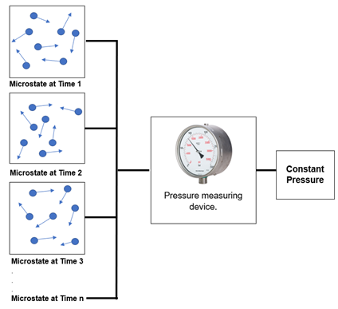
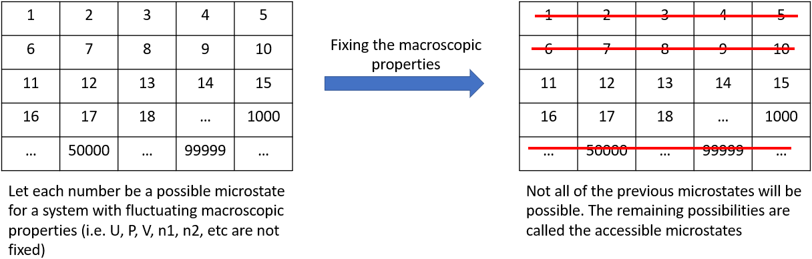
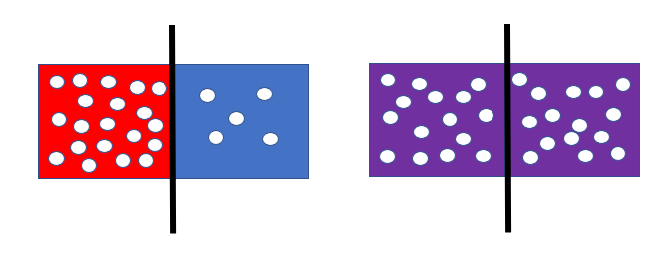
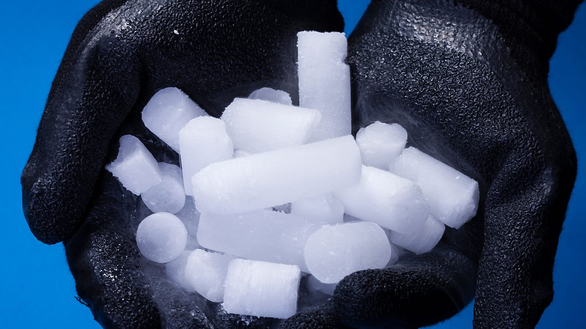
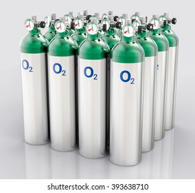
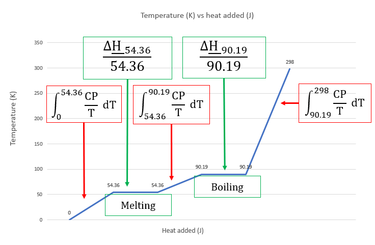
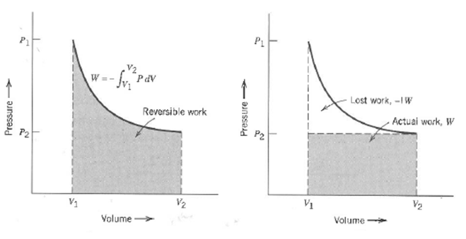
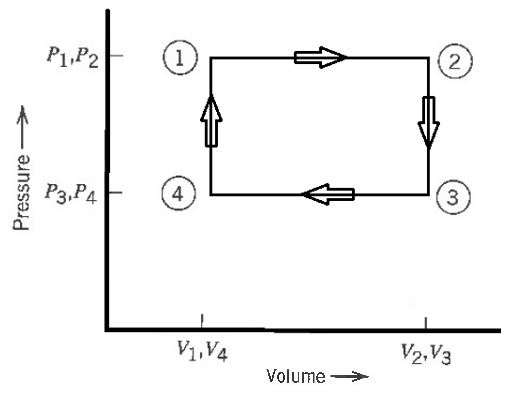
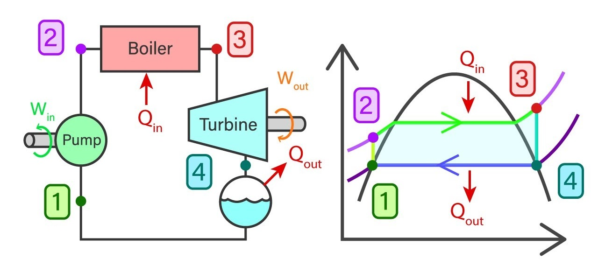
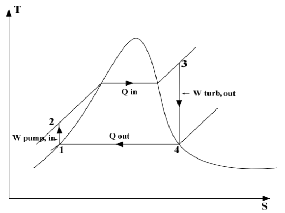

# Lecture 2 — The Second Law: Entropy and Direction

**MS1016 Thermodynamics of Materials · NTU · Prof Leonard Ng**

> **Prerequisite:** Lecture 1 (First Law, enthalpy, heat capacities, reversible work). The Second Law tells you **which direction** a process runs; the First Law only tells you that energy is conserved whichever direction it runs.

---

## 2.1 What this lecture does

The First Law is balance-keeping: whatever energy flows in, flows out, or piles up inside, must add up. But it's silent on a crucial question:

> *Why does heat flow from hot to cold, and never the other way? Why does sugar dissolve in water but water doesn't spontaneously un-dissolve? Why does an engine always waste some of its heat?*

The First Law allows all those reversals. The **Second Law** forbids them. It singles out a direction for spontaneous processes by introducing a new state function — **entropy** $S$ — that can only increase (or stay the same) for an isolated system.

By the end of this lecture you should be able to:

- explain what $S = k_B \ln \Omega$ means and why it gives entropy an arrow,
- compute $\Delta S$ for heating, phase changes, and chemical reactions,
- use standard entropies $S^\circ_{298}$ with the Third Law to get absolute entropies,
- combine the First and Second Laws into $\mathrm{d}U = T\,\mathrm{d}S - P\,\mathrm{d}V$,
- compute the Carnot efficiency of a heat engine and explain why perfect efficiency is impossible,
- interpret a work-cycle diagram (Rankine, Otto, etc.).

---

## 2.2 Microstates, macrostates, and accessible $\Omega$

From L1: a **macrostate** is described by a handful of bulk variables ($T, P, V, n, U, \ldots$). A **microstate** is the detailed snapshot of every particle's position and velocity — hopelessly unobservable (∼$10^{23}$ coordinates).

{width=360px}

### The key observation

Sit a gas at equilibrium and watch the microstate: particles are constantly changing position and velocity. The microstate is **always changing**, yet the macrostate ($P$, $T$, $V$) sits still. That means **a huge number of microstates all correspond to the same macrostate**. Equilibrium isn't a single microstate — it's the *most-populated bucket* of microstates.

### Accessible microstates $\Omega$

Not every conceivable microstate is accessible — constraints like fixed total energy and fixed volume narrow the set.

{width=360px}

The number of accessible microstates consistent with a given macrostate is called **$\Omega$** (capital omega). Three facts matter:

1. **Spontaneous processes increase $\Omega$ for an isolated system.** Heating a system (more kinetic energy per particle → more velocity configurations), adding particles, expanding volume — all raise $\Omega$.
2. **$\Omega$ can decrease for a sub-system if another sub-system gains more.** The total $\Omega$ of the combined isolated system only ever increases.
3. **At equilibrium, $\Omega$ is at its maximum** for the allowed constraints.

{width=360px}

**Example** (TYU from slide 4): *hot water + cold water, placed side by side, become warm water.* The hot water's $\Omega$ decreased (fewer high-energy states). The cold water's $\Omega$ increased by more. **Combined $\Omega$ increased.** No violation.

---

## 2.3 The Second Law, in two equivalent statements

### Statistical form — Boltzmann

$$
\boxed{\;S \;=\; k_B \ln \Omega\;}
$$

with $k_B = 1.38 \times 10^{-23}$ J/K. Entropy in joules per kelvin is just a logarithmic count of accessible microstates.

- $\Omega$ doubles → $S$ increases by $k_B \ln 2$.
- $\Omega$ halves → $S$ decreases by $k_B \ln 2$ (but only if another system picks up more).

### Thermodynamic form — Carnot-Clausius

For a **reversible** heat exchange at temperature $T$:

$$
\boxed{\;\mathrm{d}S \;=\; \frac{\delta Q_\text{rev}}{T}\;}
$$

Units check: J/K, as expected.

### Putting the two forms together: the Second Law

> **For any spontaneous process occurring in an isolated system, the total entropy increases. In equilibrium, entropy is at a maximum.**

Symbolically, for the **universe** (system + surroundings):

$$
\mathrm{d}S_\text{universe} \;\geq\; 0
$$

with equality only in a reversible process. The **system's** entropy alone can go up, down, or stay put — what the Second Law restricts is the *total* ($S_\text{system} + S_\text{surroundings}$).

### Important clarification

$\mathrm{d}S = \delta Q_\text{rev}/T$ is an **equality** for reversible processes — and because $S$ is a state function, you can compute $\Delta S_\text{system}$ between two states by picking *any* reversible path between them, even if the real process wasn't reversible. That's the trick you'll use for calculations.

The **inequality** $\mathrm{d}S \geq 0$ applies to the **universe**, not the system:

- Reversible: $\mathrm{d}S_\text{universe} = 0$ (so $\Delta S_\text{system} = -\Delta S_\text{surroundings}$).
- Irreversible: $\mathrm{d}S_\text{universe} > 0$ (something is lost to disorder, irrecoverably).

---

## 2.4 Computing $\Delta S$

### Case 1 — phase change at a single temperature

Ice melting at 273 K, water boiling at 373 K, etc. Constant $T$ (the phase change happens *at* that temperature), constant $P$, so $\delta Q_\text{rev} = \mathrm{d}H$:

$$
\Delta S \;=\; \int \frac{\mathrm{d}H}{T} \;=\; \frac{\Delta H_\text{transition}}{T_\text{transition}}
$$

**Example.** Melting water at 273 K, $\Delta H_\text{fus} = 6.01$ kJ/mol:

$$
\Delta S_\text{fus} \;=\; \frac{6{,}010\,\text{J/mol}}{273\,\text{K}} \;=\; 22.0\,\text{J mol}^{-1}\text{K}^{-1}
$$

Always **positive** for melting / vaporisation (higher disorder in the less-ordered phase). Always **negative** for freezing / condensation.

### Case 2 — heating over a temperature range (no phase change)

Constant $P$, $\delta Q_\text{rev} = \mathrm{d}H = C_P\,\mathrm{d}T$, so

$$
\Delta S \;=\; \int_{T_1}^{T_2} \frac{C_P}{T}\,\mathrm{d}T
$$

Contrast this with the enthalpy formula $\Delta H = \int_{T_1}^{T_2} C_P\,\mathrm{d}T$ — just an extra factor of $1/T$ inside the integral. If $C_P = a + bT + c/T^2$, then

$$
\Delta S \;=\; a\,\ln\!\frac{T_2}{T_1} \;+\; b\,(T_2 - T_1) \;-\; \tfrac{c}{2}\!\left(\frac{1}{T_2^2} - \frac{1}{T_1^2}\right)
$$

> **Pro tip.** Enthalpy → $\int C_P\,\mathrm{d}T$; entropy → $\int (C_P/T)\,\mathrm{d}T$. The factor of $1/T$ is the *only* difference between the two integrals. Remember one, divide, get the other.

### Case 3 — heating through a phase change

Split the integral at each transition temperature:

$$
\Delta S \;=\; \underbrace{\int_{T_1}^{T_\text{trans}} \frac{C_P^\text{phase A}}{T}\,\mathrm{d}T}_\text{heat phase A} \;+\; \underbrace{\frac{\Delta H_\text{trans}}{T_\text{trans}}}_\text{phase change} \;+\; \underbrace{\int_{T_\text{trans}}^{T_2} \frac{C_P^\text{phase B}}{T}\,\mathrm{d}T}_\text{heat phase B}
$$

If there are multiple transitions (solid → liquid → gas), use one such term per transition.

---

## 2.5 The Third Law and standard entropies

### The Third Law

> **As $T \to 0$ K, the entropy of a perfect crystalline substance approaches a constant value, independent of pressure and aggregation state. That constant is conventionally taken as zero.**

$$
S^\circ_0 \;=\; 0 \qquad\text{(perfect crystal, 0 K)}
$$

Why is this powerful? It gives us a **reference point**. $\Delta S$ is all we can ever measure directly, but combined with $S^\circ_0 = 0$, we can build **absolute entropies** by integrating upward from 0 K.

### Standard entropy $S^\circ_{298}$

The absolute entropy of a substance at 298 K and 1 atm, computed by integrating $C_P/T$ from 0 K up to 298 K while accounting for every phase change along the way:

$$
S^\circ_{298} \;=\; \int_0^{T_\text{melt}} \frac{C_P^\text{solid}}{T}\,\mathrm{d}T \;+\; \frac{\Delta H_\text{fus}}{T_\text{melt}} \;+\; \int_{T_\text{melt}}^{T_\text{boil}} \frac{C_P^\text{liq}}{T}\,\mathrm{d}T \;+\; \frac{\Delta H_\text{vap}}{T_\text{boil}} \;+\; \int_{T_\text{boil}}^{298} \frac{C_P^\text{gas}}{T}\,\mathrm{d}T
$$

(If the substance is solid at 298 K, you stop after the first integral. If it's liquid, after the first phase-change term. Etc.)

Tabulated $S^\circ_{298}$ values exist for essentially every common compound — you'll look them up rather than compute from scratch.

### Worked example — standard entropy of oxygen

*Oxygen melts at 54.36 K and boils at 90.19 K. Sketch the construction of $S^\circ_{298}(\text{O}_2)$.*

  

$$
S^\circ_{298}(\text{O}_2) \;=\; \underbrace{\int_0^{54.36}\!\frac{C_P^\text{solid}}{T}\,\mathrm{d}T}_\text{heat solid 0 → 54.36} \;+\; \underbrace{\frac{\Delta H_\text{fus}}{54.36}}_\text{melt} \;+\; \underbrace{\int_{54.36}^{90.19}\!\frac{C_P^\text{liq}}{T}\,\mathrm{d}T}_\text{heat liquid} \;+\; \underbrace{\frac{\Delta H_\text{vap}}{90.19}}_\text{vaporise} \;+\; \underbrace{\int_{90.19}^{298}\!\frac{C_P^\text{gas}}{T}\,\mathrm{d}T}_\text{heat gas}
$$

Numerically this evaluates to $S^\circ_{298}(\text{O}_2) \approx 205$ J mol$^{-1}$ K$^{-1}$. (The dominant contributions are the two phase changes and the long integral through the gaseous range.)

> **Note on "during phase change."** While melting, solid and liquid coexist at 54.36 K; while boiling, liquid and gas coexist at 90.19 K. The $\Delta H/T$ formula handles both phases implicitly — you don't need to track the mixture.

---

## 2.6 Entropy changes in chemical reactions

Treat $S^\circ_{298}$ exactly like $\Delta H_f^{\circ}$ in L1 — products minus reactants, weighted by stoichiometry:

$$
\boxed{\;\Delta S^\circ_{298,\,\text{rxn}} \;=\; \sum_\text{products} n_p\,S^\circ_{298,p} \;-\; \sum_\text{reactants} n_r\,S^\circ_{298,r}\;}
$$

### Worked example — forming AgCl

*Compute $\Delta S^\circ_{298}$ for*

$$
\text{Ag(s)} + \tfrac{1}{2}\text{Cl}_2(\text{g}) \;\longrightarrow\; \text{AgCl(s)}
$$

| Species | $S^\circ_{298}$ (J mol$^{-1}$ K$^{-1}$) |
|---|---:|
| Ag(s) | 42.73 |
| Cl$_2$(g) | 223.00 |
| AgCl(s) | 96.53 |

Apply the formula:

$$
\Delta S^\circ_{298} \;=\; S^\circ_{298}(\text{AgCl}) \;-\; S^\circ_{298}(\text{Ag}) \;-\; \tfrac{1}{2}\,S^\circ_{298}(\text{Cl}_2)
$$

$$
= 96.53 \;-\; 42.73 \;-\; \tfrac{1}{2}(223.00) \;=\; 96.53 - 42.73 - 111.50 \;=\; -57.70\;\text{J mol}^{-1}\text{K}^{-1}
$$

**What does the negative sign mean?** The reaction **decreases** the entropy of the chemical system. That's unsurprising: on the reactant side we have a gas (Cl$_2$) with high molar entropy (223 J mol$^{-1}$ K$^{-1}$); on the product side everything is condensed (solid AgCl). Consuming a gas to make a solid *is* an entropy-losing step.

**But does the reaction still proceed?** Yes — Ag + Cl$_2$ is highly exothermic, and the heat released dumps entropy into the surroundings. The Second Law is satisfied by the **total** $\Delta S_\text{universe}$, not by $\Delta S_\text{system}$ alone. We'll quantify this balance with **Gibbs free energy** in L3.

### At a temperature other than 298 K — Kirchhoff for entropy

Just like Kirchhoff's Law for enthalpy:

$$
\Delta S^\circ_T \;=\; \Delta S^\circ_{298} \;+\; \int_{298}^{T}\!\frac{\Delta C_P}{T}\,\mathrm{d}T
$$

with $\Delta C_P = \sum_\text{prod} C_P - \sum_\text{reac} C_P$.

---

## 2.7 Combining the First and Second Laws

Two of the most useful differential relations in all of thermodynamics drop out directly.

**Starting point:** First Law (reversible, mechanical work only):

$$
\mathrm{d}U \;=\; \delta Q_\text{rev} + \delta W_\text{rev} \;=\; \delta Q_\text{rev} - P\,\mathrm{d}V
$$

**Second Law:** $\delta Q_\text{rev} = T\,\mathrm{d}S$. Substitute:

$$
\boxed{\;\mathrm{d}U \;=\; T\,\mathrm{d}S \;-\; P\,\mathrm{d}V\;}
$$

This is the **fundamental thermodynamic equation** for a closed system. From it you can read off:

- $\left(\partial U/\partial S\right)_V = T$
- $\left(\partial U/\partial V\right)_S = -P$

And by differentiating $H = U + PV$ and substituting:

$$
\mathrm{d}H \;=\; T\,\mathrm{d}S \;+\; V\,\mathrm{d}P
$$

These identities drive almost everything you'll do in L3 (free energy, property relations, equilibrium).

---

## 2.8 Lost work — the cost of irreversibility

{width=520px}

**Reversible work** is the maximum possible work a process can deliver (or the minimum it demands). Every real process falls short.

For a gas expanding against a piston:

| Process | Work extracted from gas |
|---|---|
| **Reversible** (quasi-static, resisting pressure $\approx$ gas pressure at every instant) | $W_\text{rev} = \int P\,\mathrm{d}V$ — the full area under the $P(V)$ curve. |
| **Irreversible** (sudden release, resisting pressure $P_\text{ext} \ll P_\text{gas}$) | $W_\text{irr} = P_\text{ext}\,\Delta V$ — only the rectangle under $P_\text{ext}$. |

The difference, $W_\text{rev} - W_\text{irr}$, is the **lost work** $l_w \geq 0$. That lost work manifests as extra entropy in the universe:

$$
\Delta S_\text{universe} \;=\; \frac{l_w}{T} \;\geq\; 0
$$

### Reversibility, entropy, and direction

A common pitfall: *"reversible ⇔ $\mathrm{d}S = 0$"*. That's **only true for reversible adiabatic processes** (isentropic). More carefully:

- **Reversible, adiabatic ("isentropic"):** $\mathrm{d}S_\text{system} = 0$.
- **Reversible, non-adiabatic:** $\mathrm{d}S_\text{system} = \delta Q_\text{rev}/T \neq 0$ in general — but $\mathrm{d}S_\text{universe} = 0$ (the surroundings take an equal and opposite entropy change).
- **Irreversible:** $\mathrm{d}S_\text{universe} > 0$ always. $\mathrm{d}S_\text{system}$ can still be anything.

---

## 2.9 Heat engines and Carnot efficiency

A **heat engine** extracts work from a hot-to-cold heat flow. Two reservoirs: hot at $T_H$, cold at $T_L$, with an engine between them.

### Derivation

Consider one **reversible cycle**. The working fluid returns to its starting state, so $\Delta U_\text{cycle} = 0$ and $\Delta S_\text{cycle} = 0$ (both are state functions).

**First Law** (cycle, using our convention with $Q > 0$ = heat absorbed by engine, $W > 0$ = work done **on** engine):

$$
\Delta U_\text{cycle} \;=\; Q_H + Q_L + W \;=\; 0
$$

where $Q_H > 0$ (engine absorbs from hot reservoir), $Q_L < 0$ (engine dumps to cold reservoir), and $W < 0$ (engine does work on something outside — so work done *on* the engine is negative).

**Second Law** (reversible cycle, $\Delta S_\text{engine} = 0$):

$$
\frac{Q_H}{T_H} + \frac{Q_L}{T_L} \;=\; 0 \quad\Longrightarrow\quad Q_L \;=\; -\frac{T_L}{T_H}\,Q_H
$$

Substitute into the First Law:

$$
W \;=\; -(Q_H + Q_L) \;=\; -Q_H + \frac{T_L}{T_H}\,Q_H \;=\; -Q_H\!\left(1 - \frac{T_L}{T_H}\right)
$$

The **work extracted** (what you actually care about) is $-W$ — positive because $W < 0$:

$$
-W \;=\; Q_H\!\left(\frac{T_H - T_L}{T_H}\right)
$$

### Carnot efficiency

The efficiency of a heat engine is (work extracted) / (heat absorbed from hot reservoir):

$$
\boxed{\;\eta_\text{Carnot} \;=\; \frac{-W}{Q_H} \;=\; \frac{T_H - T_L}{T_H} \;=\; 1 - \frac{T_L}{T_H}\;}
$$

This is the **maximum possible efficiency** for *any* heat engine operating between $T_H$ and $T_L$. Real engines do worse; no engine does better.

### Why 100% efficiency is impossible

To get $\eta = 1$ you'd need either $T_L \to 0$ (absolute zero — unachievable by Third Law) or $T_H \to \infty$ (unachievable — and even so, infinite $T$ means infinite materials-science problems).

### Practical implications

{width=420px}

To push engine efficiency up, either:
1. **Raise $T_H$** — limited by materials (turbine blades soften, combustor liners melt). This is why jet engines use exotic superalloys and ceramic coatings.
2. **Lower $T_L$** — limited by ambient temperature (you can't cool below sea water / outside air without running a fridge, which costs more work than you save).

Modern gas turbines reach ∼40% efficiency; combined-cycle plants push ~60%; a Carnot engine at the same reservoir temperatures would get ~70%. The gap between real and Carnot is "lost work" from every irreversibility in the loop.

---

## 2.10 Work cycles — pumping around a $P$–$V$ loop

A heat engine's working fluid traces a closed loop on $P$–$V$:

{width=380px}

**Net work done *by* the gas per cycle** = area enclosed by the loop:

$$
W_\text{by gas, per cycle} \;=\; \oint P\,\mathrm{d}V
$$

For a clockwise loop (as drawn), this is positive — the engine **does net work** on the surroundings. Counterclockwise loops (fridges, heat pumps) have negative $W_\text{by}$, meaning you **put work in** to drive the cycle.

Under our $Q+W$ convention (where $W$ = work done **on** the gas), you'd write

$$
W_\text{on gas, per cycle} \;=\; -\oint P\,\mathrm{d}V
$$

— negative for a clockwise cycle (gas gives up work to the surroundings).

### The Rankine cycle (steam power)

{width=640px}

The Rankine cycle is the thermodynamic backbone of every steam power plant. Four steps:

| Step | Device | Process | What happens |
|---|---|---|---|
| 1 → 2 | Pump | Isentropic compression | Saturated liquid pumped up to boiler pressure; small $W_\text{in}$ |
| 2 → 3 | Boiler | Constant-pressure heat addition | Liquid → superheated vapour; large $Q_\text{in}$ from fuel combustion |
| 3 → 4 | Turbine | Isentropic expansion | Vapour expands, drives generator shaft; large $W_\text{out}$ |
| 4 → 1 | Condenser | Constant-pressure heat rejection | Vapour → liquid, dumping heat to cooling water or air |

On a $T$–$S$ diagram this looks like:

{width=360px}

**Heat flows** are areas under the constant-pressure legs on the $T$–$S$ diagram; **net work** per cycle is the area enclosed by the loop on the $P$–$V$ diagram (same number, different diagram).

### Why the ideal Rankine uses isentropic compression/expansion

The pump and turbine steps are idealised as adiabatic ($\delta Q = 0$, negligible heat loss in short residence times) and reversible (quasi-static, no friction). Together, adiabatic + reversible = **isentropic**: $\mathrm{d}S = 0$ for the working fluid.

Real Rankine cycles fall short of this ideal because of:

- **Friction in turbine blades and pump seals** → irreversibility → extra entropy generated.
- **Heat leaks** through insulation in the turbine and pump → $\delta Q \neq 0$.
- **Pressure drops in the boiler and condenser** → the "constant-pressure" idealisation fails.

Every irreversibility costs work the plant could otherwise have sold. That's why plant operators care so much about keeping condensers clean and turbine blades unpitted.

### Why water as the working fluid?

- Cheap and abundant.
- Nontoxic.
- Liquid-vapour transition at convenient temperatures for industrial boilers/condensers.
- High latent heat of vaporisation — a lot of energy moved per kg of fluid → smaller plant.

Alternatives exist (organic Rankine cycles for low-grade heat, supercritical CO₂ cycles for advanced plants), but water remains the default.

---

## 2.11 Answers to the "Test Your Understanding" prompts

| Prompt | Answer |
|---|---|
| Hot + cold water → warm water: the hot side's $\Omega$ fell. How is this not a Second Law violation? | The **combined** system's $\Omega$ increased. The cold water's $\Omega$ increased by more than the hot water's decreased, because heat flowing into a cold system raises $\Omega$ more steeply (by $1/T$). Second Law applies to the isolated total, not to a sub-part. |
| Oxygen standard entropy — compute. | See §2.5 — sketch the five-piece integral/phase-change formula. Result $\approx 205$ J mol$^{-1}$ K$^{-1}$. |
| $\Delta S = -57.7$ J mol$^{-1}$ K$^{-1}$ for Ag + ½ Cl$_2$ → AgCl. What does it tell us? | The reaction *decreases* entropy of the chemical system — expected, because a gas (Cl$_2$) is being consumed to make a condensed solid. It does **not** mean the reaction won't proceed — the entropy dumped into the surroundings by the exothermic heat release can (and does) make $\Delta S_\text{universe} > 0$. L3's Gibbs free energy is the right tool for deciding spontaneity at constant $T$ and $P$. |
| Limits to raising jet-engine $T_H$? | Materials. Turbine-blade alloys soften above ∼1200 °C; combustor liners burn through if uncooled; ceramic thermal-barrier coatings delaminate above ∼1500 °C. Also NOx emissions rise sharply with $T_H$. |
| Why are Rankine compression/expansion isentropic in the ideal case? | Idealised as adiabatic (short residence time, good insulation) and reversible (no friction). Adiabatic + reversible = isentropic ($\mathrm{d}S = 0$). |
| Why water for Rankine? | See §2.10 — cheap, nontoxic, convenient transition temperature, high latent heat. |
| Why are real Rankine cycles less efficient than ideal? | Friction (turbine blades, pump seals), heat leaks, pressure drops in boiler/condenser pipes. All irreversibilities → extra entropy → less useful work. |

---

## Source-slide corrections applied in this consolidated version

1. **Slide 5 — "$\mathrm{d}S = \delta Q_\text{rev}/T \geq 0$" conflates two separate statements.** The equality $\mathrm{d}S = \delta Q_\text{rev}/T$ is the Carnot-Clausius definition; it applies to the *system* and can take any sign. The inequality $\mathrm{d}S \geq 0$ applies to the *universe* (or an isolated system) and is the Second Law proper. Original slide's notation suggests they are the same thing. **Applied:** §2.3 separates the two clearly.

2. **Slide 10 — "AgCl$_2$" in the entropy table is a typo for "AgCl".** Silver is +1 in this reaction; AgCl$_2$ doesn't exist. The numerical value (96.53 J mol$^{-1}$ K$^{-1}$) is correct for AgCl. **Applied:** table in §2.6 uses "AgCl".

3. **Slide 13 — "For reversible work, $\mathrm{d}S = 0$" is too strong.** $\mathrm{d}S_\text{system} = 0$ only for reversible *adiabatic* (isentropic) processes. A reversible isothermal expansion has $\mathrm{d}S_\text{system} > 0$ (matched by $\mathrm{d}S_\text{surroundings} < 0$, so $\mathrm{d}S_\text{universe} = 0$). **Applied:** §2.8 distinguishes reversible-adiabatic from reversible-non-adiabatic from irreversible.

4. **Slide 14 — heat-engine derivation uses $\sum \delta Q + \delta W = 0$ without stating it's for a complete cycle** ($\Delta U_\text{cycle} = 0$). Easy to misread as applying instantaneously. **Applied:** §2.9 explicitly says "one reversible cycle → $\Delta U_\text{cycle} = 0$". Also states the sign conventions on $Q_H$, $Q_L$, $W$ up front to avoid ambiguity.

5. **Slide 16 — "$W = -\oint P\,\mathrm{d}V$" needs a convention note.** Under the $Q+W$ (work-on) convention it's correct; under $Q-W$ (work-by) it's the opposite sign. **Applied:** §2.10 writes both forms with labels.

6. **Slide 7 — standard state temperature.** "24.85 °C or 298 K." Technically standard state is 298.15 K (= 25.00 °C). Minor rounding; left as "298 K" throughout this doc for simplicity.

On to L3 — Property Relationships, Free Energy, Equilibrium.
