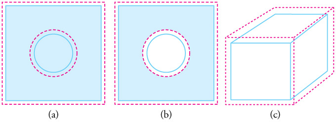

# Lecture 3 — Free Energy, Property Relationships, and Equilibrium

**MS1016 Thermodynamics of Materials · NTU · Prof Leonard Ng**

> **Prerequisite:** Lectures 1 and 2. You need enthalpy, entropy, heat capacities, the Carnot-Clausius identity $\mathrm{d}S = \delta Q_\text{rev}/T$, and the combined-law form $\mathrm{d}U = T\,\mathrm{d}S - P\,\mathrm{d}V$.

---

## 3.1 What this lecture does

Lectures 1 and 2 gave you two competing "drivers" of spontaneous processes:

- **Enthalpy** prefers to go down — systems lose heat when they can ($\Delta H < 0$ is favourable).
- **Entropy** prefers to go up — universe gets more disordered ($\Delta S > 0$ is favourable).

Sometimes these agree (exothermic + entropy-increasing = spontaneous at every $T$). Sometimes they fight (endothermic + entropy-increasing — happens only if $T$ is high enough). How do we quantify which wins?

The answer is **free energy**. We define two of them — **Gibbs** $G$ and **Helmholtz** $F$ — each one bundling $\Delta H$ (or $\Delta U$) and $T\Delta S$ into a single number whose sign tells you whether a process is spontaneous under the relevant conditions.

After the free-energy definitions we'll derive the **Maxwell relations** — four identities that link derivatives of $P, V, T, S$ that you'd *never* guess by hand but which fall out of $\mathrm{d}G$, $\mathrm{d}F$, $\mathrm{d}H$, $\mathrm{d}U$ being exact differentials.

By the end you should be able to:

- decide whether a reaction is spontaneous at given $(T, P)$ from $\Delta H$, $\Delta S$,
- compute $\Delta G^\circ$ from tabulated $\Delta H_f^\circ$ and $S^\circ_{298}$,
- distinguish **thermodynamic spontaneity** from **kinetic feasibility** (diamond vs graphite),
- state and derive the four Maxwell relations,
- apply a Maxwell relation to get $\Delta S$ under a pressure change,
- name the six standard thermodynamic path conditions.

---

## 3.2 Gibbs free energy

**Definition:**

$$
\boxed{\;G \;\equiv\; H - TS\;}
$$

$G$ is a state function (combination of state functions $H$ and $S$, with the intensive state function $T$). Units: joules.

### What does $G$ mean physically?

$G$ is the **maximum useful non-$PV$ work** a system can deliver (or the minimum external work required to drive it) at constant $T$ and $P$. To see this, derive $\mathrm{d}G$ from scratch.

**Step 1.** Total reversible work = $PV$ work + "other" useful work:

$$
\delta W_\text{rev} \;=\; \underbrace{-P\,\mathrm{d}V}_\text{expansion work} \;+\; \underbrace{\delta W_\text{rev}^{\*}}_\text{useful non-}PV\text{ work}
$$

**Step 2.** From the First Law and $\delta Q_\text{rev} = T\,\mathrm{d}S$:

$$
\mathrm{d}U \;=\; \delta Q_\text{rev} + \delta W_\text{rev} \;=\; T\,\mathrm{d}S - P\,\mathrm{d}V + \delta W_\text{rev}^{*}
$$

**Step 3.** Rearrange for the useful work:

$$
\delta W_\text{rev}^{*} \;=\; \mathrm{d}U - T\,\mathrm{d}S + P\,\mathrm{d}V
$$

**Step 4.** Differentiate $H = U + PV$ and then $G = H - TS$:

$$
\mathrm{d}G \;=\; \mathrm{d}H - T\,\mathrm{d}S - S\,\mathrm{d}T \;=\; \mathrm{d}U + P\,\mathrm{d}V + V\,\mathrm{d}P - T\,\mathrm{d}S - S\,\mathrm{d}T
$$

**Step 5.** At constant $T$ and $P$, $\mathrm{d}T = \mathrm{d}P = 0$:

$$
(\mathrm{d}G)_{T,P} \;=\; \mathrm{d}U + P\,\mathrm{d}V - T\,\mathrm{d}S \;=\; \delta W_\text{rev}^{*}
$$

So **$(\mathrm{d}G)_{T,P}$ equals the useful non-$PV$ work the system can perform reversibly.** For a spontaneous process at constant $T, P$, this work can be *extracted* — meaning $G$ **decreases**.

### $\mathrm{d}G$ in its most useful form

Dropping the "reversible" subscript (valid for any path *between* two states, since $G$ is a state function):

$$
\boxed{\;\mathrm{d}G \;=\; V\,\mathrm{d}P \;-\; S\,\mathrm{d}T\;}
$$

From this you read off two beautiful identities (which will be used everywhere from L4 onwards):

$$
\left(\frac{\partial G}{\partial P}\right)_{\!T} = V, \qquad \left(\frac{\partial G}{\partial T}\right)_{\!P} = -S
$$

### Spontaneity criterion at constant $T$ and $P$

| | |
|---|---|
| $\Delta G < 0$ | Process is **spontaneous** in the forward direction. |
| $\Delta G = 0$ | System is at **equilibrium**. |
| $\Delta G > 0$ | **Reverse** direction is spontaneous. |

$|\Delta G|$ also tells you **how far from equilibrium** you are — a large $\Delta G$ means a lot of driving force remains.

**Why constant $T$ and $P$?** Because that's the condition under which the $S\,\mathrm{d}T$ and $V\,\mathrm{d}P$ terms vanish and $(\mathrm{d}G)_{T,P}$ cleanly equals the maximum useful work. Nature — room-temperature chemistry, industrial processes, biological reactions — overwhelmingly runs at constant $T$ and $P$, which is why $G$ is by far the most-used free energy in practice.

---

## 3.3 Helmholtz free energy

**Definition:**

$$
\boxed{\;F \;\equiv\; U - TS\;}
$$

Also called $A$ in some textbooks (Arbeit = work). Derived exactly like $G$ but at **constant $T$ and $V$** instead of $T$ and $P$:

$$
\boxed{\;\mathrm{d}F \;=\; -S\,\mathrm{d}T \;-\; P\,\mathrm{d}V\;}
$$

with the spontaneity criterion $\Delta F < 0$ at constant $T, V$.

### When to use $F$ vs. $G$

| Use $G$ | Use $F$ |
|---|---|
| Chemical reactions in open vessels (atmospheric $P$) | Rigid sealed containers, constant $V$ |
| Biological systems | Statistical-mechanics calculations (canonical ensemble) |
| Most industrial unit operations | Closed-volume combustion (bomb calorimetry) |

For a typical engineering problem, $G$ is the default; Helmholtz shows up mainly in theory-heavy settings.

---

## 3.4 Summary table — all four potentials

| Potential | Definition | Natural variables | Differential | Spontaneity at constant | |
|---|---|---|---|:---:|---|
| Internal energy | $U$ | $S, V$ | $\mathrm{d}U = T\,\mathrm{d}S - P\,\mathrm{d}V$ | $S, V$ | $\Delta U < 0$ |
| Enthalpy | $H = U + PV$ | $S, P$ | $\mathrm{d}H = T\,\mathrm{d}S + V\,\mathrm{d}P$ | $S, P$ | $\Delta H < 0$ |
| Helmholtz | $F = U - TS$ | $T, V$ | $\mathrm{d}F = -S\,\mathrm{d}T - P\,\mathrm{d}V$ | $T, V$ | $\Delta F < 0$ |
| Gibbs | $G = H - TS$ | $T, P$ | $\mathrm{d}G = -S\,\mathrm{d}T + V\,\mathrm{d}P$ | $T, P$ | $\Delta G < 0$ |

Each potential is minimised at equilibrium under *its own* natural variables. The "natural variables" are the ones whose differentials appear on the RHS of $\mathrm{d}(\text{potential})$ — hold those constant and the potential becomes a simple function of the (few) remaining ones.

---

## 3.5 The temperature-spontaneity matrix

At constant $T, P$:

$$
\Delta G \;=\; \Delta H \;-\; T\,\Delta S
$$

Four combinations of signs for $\Delta H$ and $\Delta S$ give four qualitatively different behaviours:

| | $\Delta H < 0$ *(exothermic)* | $\Delta H > 0$ *(endothermic)* |
|---|---|---|
| $\Delta S > 0$ *(entropy-up)* | $\Delta G < 0$ at **all** $T$ — **always spontaneous** | Spontaneous **only at high $T$** (need $T\Delta S > \Delta H$) |
| $\Delta S < 0$ *(entropy-down)* | Spontaneous **only at low $T$** (need $T|\Delta S| < |\Delta H|$) | $\Delta G > 0$ at all $T$ — **never spontaneous** (in the forward direction) |

**Worked TYU:** where does **water boiling** (H$_2$O(l) → H$_2$O(g)) sit?

- Endothermic (need to add heat to boil water) → $\Delta H > 0$
- Entropy increases (gas is more disordered than liquid) → $\Delta S > 0$
- Top-right cell. Spontaneous only at high enough $T$ — specifically, $T > \Delta H/\Delta S = 100$ °C at 1 atm. ✓

---

## 3.6 Computing $\Delta G$ from tables

$$
\boxed{\;\Delta G_\text{rxn}^\circ \;=\; \Delta H_\text{rxn}^\circ \;-\; T\,\Delta S_\text{rxn}^\circ\;}
$$

where $\Delta H_\text{rxn}^\circ$ and $\Delta S_\text{rxn}^\circ$ come from tabulated $\Delta H_f^\circ$ and $S^\circ_{298}$ via the usual products-minus-reactants recipe.

### Worked example 1 — water vaporisation at 298 K

*Compute $\Delta G^\circ_{298}$ for H$_2$O(l) → H$_2$O(g).*

| Species | $\Delta H_f^\circ$ (kJ/mol) | $S^\circ_{298}$ (J mol$^{-1}$ K$^{-1}$) |
|---|---:|---:|
| H$_2$O(l) | −285.83 | 70.00 |
| H$_2$O(g) | −241.82 | 188.80 |

**Step 1** — enthalpy of vaporisation:

$$
\Delta H^\circ \;=\; \Delta H_f^\circ[\text{H}_2\text{O(g)}] - \Delta H_f^\circ[\text{H}_2\text{O(l)}] \;=\; -241.82 - (-285.83) \;=\; +44.01\;\text{kJ/mol}
$$

**Step 2** — entropy of vaporisation:

$$
\Delta S^\circ \;=\; 188.80 - 70.00 \;=\; +118.80\;\text{J mol}^{-1}\text{K}^{-1} \;=\; +0.1188\;\text{kJ mol}^{-1}\text{K}^{-1}
$$

**Step 3** — Gibbs free energy at 298 K:

$$
\Delta G^\circ_{298} \;=\; \Delta H^\circ - T\,\Delta S^\circ \;=\; 44.01 - (298)(0.1188) \;=\; 44.01 - 35.40 \;=\; \boxed{+8.61\;\text{kJ/mol}}
$$

### Interpreting the answer

$\Delta G^\circ_{298} > 0$ — **at standard state (298 K, 1 atm water vapour), water vaporisation is non-spontaneous in the forward direction.** Water at 25 °C doesn't spontaneously boil, which matches experience.

**But wait — water does evaporate at 25 °C!** How can that be if $\Delta G > 0$?

The resolution is that $\Delta G^\circ$ is the value **at the standard state** — 1 atm partial pressure of water vapour. If the partial pressure is lower (which it always is in open air — typical indoor humidity has $\sim 2\text{–}3$ kPa vapour pressure, not 101 kPa), the actual $\Delta G$ shifts. We'll quantify this in L7 with the chemical potential $\mu = \mu^\circ + RT\ln a$. For now, remember: **$\Delta G^\circ$ tells you about spontaneity at 1 atm partial pressures — not at arbitrary conditions.**

**Temperature extension.** At what $T$ does $\Delta G = 0$ (boiling begins)?

$$
T_\text{boil} \;=\; \frac{\Delta H^\circ}{\Delta S^\circ} \;=\; \frac{44{,}010\,\text{J/mol}}{118.80\,\text{J mol}^{-1}\text{K}^{-1}} \;\approx\; 370\;\text{K} \;\approx\; 97\;°\text{C}
$$

Close to the experimental 100 °C — the small discrepancy comes from approximating $\Delta H^\circ$ and $\Delta S^\circ$ as constant with $T$ (they actually drift slightly). For most teaching purposes this is good to 3% and shows the method works.

### Worked example 2 — Hess's Law for $\Delta G$

Gibbs is a state function, so the same "add the paths" logic as for enthalpy applies. Prove it for the combustion of carbon via two paths:

**Path A (one-step):**  $\text{C(s)} + \text{O}_2(\text{g}) \to \text{CO}_2(\text{g})$

**Path B (two-step):**  $\text{C(s)} + \tfrac{1}{2}\text{O}_2(\text{g}) \to \text{CO(g)}$, then $\text{CO(g)} + \tfrac{1}{2}\text{O}_2(\text{g}) \to \text{CO}_2(\text{g})$

| Species | $\Delta H_f^\circ$ (kJ/mol) | $S^\circ_{298}$ (J mol$^{-1}$ K$^{-1}$) |
|---|---:|---:|
| C(s) | 0 | 5.694 |
| O$_2$(g) | 0 | 205.0 |
| CO(g) | −110.5 | 197.9 |
| CO$_2$(g) | −393.5 | 213.8 |

**Path B step 1 — C(s) + ½O₂(g) → CO(g):**

$$
\Delta H^\circ = -110.5 - 0 - \tfrac{1}{2}(0) \;=\; -110.5\;\text{kJ/mol}
$$
$$
\Delta S^\circ = 197.9 - 5.694 - \tfrac{1}{2}(205.0) \;=\; 197.9 - 5.694 - 102.5 \;=\; 89.71\;\text{J mol}^{-1}\text{K}^{-1}
$$
$$
\Delta G^\circ_{298} = -110.5 - (298)(0.08971) \;=\; -110.5 - 26.73 \;=\; -137.23\;\text{kJ/mol}
$$

**Path B step 2 — CO(g) + ½O₂(g) → CO₂(g):**

$$
\Delta H^\circ = -393.5 - (-110.5) - \tfrac{1}{2}(0) \;=\; -283.0\;\text{kJ/mol}
$$
$$
\Delta S^\circ = 213.8 - 197.9 - \tfrac{1}{2}(205.0) \;=\; 213.8 - 197.9 - 102.5 \;=\; -86.6\;\text{J mol}^{-1}\text{K}^{-1}
$$
$$
\Delta G^\circ_{298} = -283.0 - (298)(-0.0866) \;=\; -283.0 + 25.81 \;=\; -257.19\;\text{kJ/mol}
$$

**Path B total:** $\Delta G^\circ_{298} = -137.23 + (-257.19) = -394.42$ kJ/mol.

**Path A direct — C(s) + O₂(g) → CO₂(g):**

$$
\Delta H^\circ = -393.5\;\text{kJ/mol}
$$
$$
\Delta S^\circ = 213.8 - 5.694 - 205.0 \;=\; 3.106\;\text{J mol}^{-1}\text{K}^{-1}
$$
$$
\Delta G^\circ_{298} = -393.5 - (298)(0.003106) \;=\; -393.5 - 0.925 \;=\; -394.42\;\text{kJ/mol}
$$

**Path A = Path B ✓** — as required for a state function.

**Interpretation.** Both are highly spontaneous at 298 K ($\Delta G \ll 0$ by hundreds of kJ/mol). Combustion of carbon is one of the most energy-releasing everyday reactions — this is why coal, coke, natural gas, and petroleum are burned for power. The math also quietly explains why the two-stage route (via CO) releases roughly the same total energy as the one-stage route: you can burn carbon completely to CO$_2$ in one go, or first make CO then burn it, and the chemistry doesn't care.

---

## 3.7 Metastability — when $\Delta G < 0$ isn't enough

### Worked TYU — diamond vs. graphite

*For C(diamond) → C(graphite), is the transformation spontaneous?*

| Species | $\Delta H_f^\circ$ (kJ/mol) | $S^\circ_{298}$ (J mol$^{-1}$ K$^{-1}$) |
|---|---:|---:|
| C(graphite) | 0 | 5.694 |
| C(diamond) | +1.90 | 2.439 |

$$
\Delta H^\circ = 0 - 1.90 \;=\; -1.90\;\text{kJ/mol}
$$
$$
\Delta S^\circ = 5.694 - 2.439 \;=\; +3.255\;\text{J mol}^{-1}\text{K}^{-1}
$$
$$
\Delta G^\circ_{298} = -1.90 - (298)(0.003255) \;=\; -1.90 - 0.97 \;=\; \boxed{-2.87\;\text{kJ/mol}}
$$

$\Delta G < 0$ — **graphite is the thermodynamically stable form of carbon at standard conditions.** Diamond should convert spontaneously to graphite.

**But nobody's jewelry turns to pencil lead.** Why?

### Metastability

Diamond is **kinetically stable** because the activation energy for the transformation — breaking all those $\mathrm{sp}^3$ C–C bonds and rebuilding them as $\mathrm{sp}^2$ sheets — is enormous (roughly needs $T > 4500$ K to proceed at observable rates). At room temperature, the rate of conversion is so absurdly slow that diamond is effectively eternal.

This is the distinction between **thermodynamic** and **kinetic** stability, and it's the single most important idea to take away from this chapter for materials science:

> **Thermodynamics tells you *whether* a process *can* happen. It says nothing about *how fast* it happens.**

### Other examples of metastability

- **Tempered glass** — thermodynamically unstable compared to crystalline silica, but the activation energy to crystallise is enormous.
- **Retained austenite** in steel — metastable face-centred cubic iron that should have transformed to ferrite/martensite, but kinetically trapped.
- **Molten metal poured into water (quenching)** — solidifies before it can reach the equilibrium phase, producing metastable phases.
- **Aluminium alloys** after solution treatment — non-equilibrium solid solution, metastable for days or weeks at room temperature.

Most of materials engineering lives in the gap between thermodynamic and kinetic stability. **Thermodynamics sets the map; kinetics decides whether the journey is practical.**

---

## 3.8 Equilibrium conditions

At equilibrium under constant $T$ and $P$:

$$
(\mathrm{d}G)_{T,P} = 0 \qquad\text{and}\qquad G \text{ is at a local minimum.}
$$

Equivalently, $S_\text{universe}$ is at its maximum. These are two ways of saying the same thing under different constraints — minimising $G$ at constant $T, P$ is mathematically equivalent to maximising $S_\text{universe}$.

Similar relations for the other potentials:

| Potential | Held constant | Equilibrium condition |
|---|---|---|
| $U$ | $S, V$ | $\mathrm{d}U = 0$ (minimum) |
| $H$ | $S, P$ | $\mathrm{d}H = 0$ (minimum) |
| $F$ | $T, V$ | $\mathrm{d}F = 0$ (minimum) |
| $G$ | $T, P$ | $\mathrm{d}G = 0$ (minimum) |
| $S$ | $U, V$ (isolated system) | $\mathrm{d}S = 0$ (maximum) |

Physical interpretation: **systems slide downhill in whichever potential is appropriate for their constraints until they find the bottom of the valley.** The valley floor is equilibrium.

---

## 3.9 Exact differentials — the test for being a state function

(Quick math refresher needed for the next section.)

A differential $\mathrm{d}f = M(x,y)\,\mathrm{d}x + N(x,y)\,\mathrm{d}y$ is **exact** (i.e., $f$ is a well-defined state function of $(x, y)$) if and only if

$$
\boxed{\;\left(\frac{\partial M}{\partial y}\right)_{\!x} = \left(\frac{\partial N}{\partial x}\right)_{\!y}\;}
$$

which is just saying *mixed second partials commute*:

$$
\frac{\partial^2 f}{\partial y \,\partial x} = \frac{\partial^2 f}{\partial x \,\partial y}
$$

Every $\mathrm{d}$ we write in thermodynamics ($\mathrm{d}U, \mathrm{d}H, \mathrm{d}F, \mathrm{d}G$) is exact, because these are all state functions. The Maxwell relations are what you get when you apply this test to them.

### Worked check — is $f(x, y) = 3xy$ exact?

Here $M = \partial f/\partial x = 3y$, $N = \partial f/\partial y = 3x$.

$$
\left(\frac{\partial M}{\partial y}\right)_{\!x} = 3, \qquad \left(\frac{\partial N}{\partial x}\right)_{\!y} = 3
$$

Equal → **exact.** $f(x,y) = 3xy$ is a proper state function of $(x, y)$. ✓

---

## 3.10 The four Maxwell relations

Apply the exact-differential test to each of $\mathrm{d}U$, $\mathrm{d}H$, $\mathrm{d}F$, $\mathrm{d}G$.

### From $\mathrm{d}U = T\,\mathrm{d}S - P\,\mathrm{d}V$

Reading off: $T = (\partial U/\partial S)_V$ and $-P = (\partial U/\partial V)_S$. Mixed partials give

$$
\left(\frac{\partial T}{\partial V}\right)_{\!S} \;=\; -\left(\frac{\partial P}{\partial S}\right)_{\!V}
$$

### From $\mathrm{d}H = T\,\mathrm{d}S + V\,\mathrm{d}P$

$T = (\partial H/\partial S)_P$, $V = (\partial H/\partial P)_S$:

$$
\left(\frac{\partial T}{\partial P}\right)_{\!S} \;=\; \left(\frac{\partial V}{\partial S}\right)_{\!P}
$$

### From $\mathrm{d}F = -S\,\mathrm{d}T - P\,\mathrm{d}V$

$-S = (\partial F/\partial T)_V$, $-P = (\partial F/\partial V)_T$:

$$
\left(\frac{\partial S}{\partial V}\right)_{\!T} \;=\; \left(\frac{\partial P}{\partial T}\right)_{\!V}
$$

### From $\mathrm{d}G = -S\,\mathrm{d}T + V\,\mathrm{d}P$

$-S = (\partial G/\partial T)_P$, $V = (\partial G/\partial P)_T$:

$$
\left(\frac{\partial S}{\partial P}\right)_{\!T} \;=\; -\left(\frac{\partial V}{\partial T}\right)_{\!P}
$$

### The summary table

| Potential | Differential | Maxwell relation |
|---|---|---|
| $U(S, V)$ | $\mathrm{d}U = T\,\mathrm{d}S - P\,\mathrm{d}V$ | $(\partial T/\partial V)_S = -(\partial P/\partial S)_V$ |
| $H(S, P)$ | $\mathrm{d}H = T\,\mathrm{d}S + V\,\mathrm{d}P$ | $(\partial T/\partial P)_S = (\partial V/\partial S)_P$ |
| $F(T, V)$ | $\mathrm{d}F = -S\,\mathrm{d}T - P\,\mathrm{d}V$ | $(\partial S/\partial V)_T = (\partial P/\partial T)_V$ |
| $G(T, P)$ | $\mathrm{d}G = -S\,\mathrm{d}T + V\,\mathrm{d}P$ | $(\partial S/\partial P)_T = -(\partial V/\partial T)_P$ |

### Why this matters

The Maxwell relations connect derivatives of $S$ (which are usually hard to measure) with derivatives of $P, V, T$ (which are easy to measure with a thermometer, manometer, and dilatometer). This is exactly how experimentalists turn macroscopic measurements into entropy data.

> **Mnemonic.** Each relation comes from one potential. The variables appearing in the Maxwell relation are the *four of $P, V, T, S$ that aren't fixed* — i.e., the two "natural variables" of that potential and the two "partner" variables that appear in its differential. The sign depends on which combination of $T\,\mathrm{d}S$, $P\,\mathrm{d}V$, $V\,\mathrm{d}P$, $S\,\mathrm{d}T$ appear.

---

## 3.11 Applying Maxwell — two key property relationships

### Application 1 — entropy change with pressure

Start from the $G$ Maxwell relation: $(\partial S/\partial P)_T = -(\partial V/\partial T)_P$.

For an **ideal gas** (per mole, $PV = RT$): $(\partial V/\partial T)_P = R/P$. Substitute:

$$
\left(\frac{\partial S}{\partial P}\right)_{\!T} \;=\; -\frac{R}{P}
$$

Integrate at constant $T$ from $P_1$ to $P_2$:

$$
\boxed{\;\Delta S_T \;=\; S_2 - S_1 \;=\; -R\ln\frac{P_2}{P_1}\;}
$$

**Worked example.** Compress 1 mol of ideal gas isothermally from 1 atm to 10 atm.

$$
\Delta S \;=\; -8.314 \times \ln(10) \;=\; -8.314 \times 2.303 \;\approx\; -19.14\;\text{J mol}^{-1}\text{K}^{-1}
$$

Entropy **decreases** on isothermal compression — the gas molecules are packed into a smaller volume → fewer accessible microstates → lower $S$. Consistent with intuition. The negative sign comes directly from the Maxwell relation.

### Application 2 — entropy change under thermal expansion of a solid

{width=440px}

Define the **volumetric coefficient of thermal expansion**:

$$
\alpha_V \;\equiv\; \frac{1}{V}\left(\frac{\partial V}{\partial T}\right)_{\!P}
$$

i.e. the fractional volume change per kelvin. For most solids at moderate temperatures, $\alpha_V$ is nearly constant and small — typically $10^{-5}$–$10^{-4}$ K$^{-1}$.

Substitute into the $G$ Maxwell relation:

$$
\left(\frac{\partial S}{\partial P}\right)_{\!T} \;=\; -V\,\alpha_V
$$

For a solid, $V\alpha_V$ is nearly constant with pressure (solids are almost incompressible), so integrate at constant $T$:

$$
\Delta S_T \;=\; -V\alpha_V\,(P_2 - P_1)
$$

**Worked example.** 1 mole of iron (Fe) compressed from 1 atm to 10 atm at 298 K.

*Given:* Linear thermal expansion $\alpha_L^\text{Fe} \approx 12 \times 10^{-6}$ K$^{-1}$, so volumetric $\alpha_V = 3\alpha_L \approx 36 \times 10^{-6}$ K$^{-1}$. Molar mass 55.85 g/mol, density 7.87 g/cm$^3$, so molar volume $V = 55.85/7.87 = 7.10$ cm$^3$/mol $= 7.10 \times 10^{-6}$ m$^3$/mol.

$$
\Delta S \;=\; -(7.10\times 10^{-6}) \times (36\times 10^{-6}) \times (10 - 1)(1.013\times 10^5)
$$

$$
\;=\; -(7.10 \times 36 \times 9 \times 1.013)\times 10^{-6}\,\text{J mol}^{-1}\text{K}^{-1}
$$

$$
\;\approx\; -2.33 \times 10^{-5}\;\text{J mol}^{-1}\text{K}^{-1}
$$

Tiny. Compressing a solid barely changes its entropy, because solids barely change volume. Compare this to the $-19.14$ J mol$^{-1}$ K$^{-1}$ for the ideal gas under the same 10× pressure change — **gas entropy is a million times more pressure-sensitive than solid entropy.**

> **Useful fact** — the linear/volumetric expansion factor of 3 comes from $\alpha_V = 3\alpha_L$ for isotropic solids (since $V \propto L^3$ for cubic expansion, $\delta V/V = 3\,\delta L/L$). Tables typically list $\alpha_L$ — multiply by 3 to get $\alpha_V$.

---

## 3.12 The six standard thermodynamic path conditions

You'll meet these names constantly from L4 onwards.

| Condition | Meaning | What's constant | What vanishes |
|---|---|---|---|
| **Isobaric** | constant pressure | $P$ | $\mathrm{d}P = 0$ |
| **Isochoric** (isometric, isovolumetric) | constant volume | $V$ | $\mathrm{d}V = 0$ (so $\delta W_{PV} = 0$) |
| **Isothermal** | constant temperature | $T$ | $\mathrm{d}T = 0$ |
| **Isentropic** | constant entropy | $S$ | $\mathrm{d}S = 0$ |
| **Isenthalpic** | constant enthalpy | $H$ | $\mathrm{d}H = 0$ |
| **Adiabatic** | no heat crosses boundary | $Q$ | $\delta Q = 0$ |

### Common confusions — the TYU answers

**Is an adiabatic process isothermal?** No — adiabatic means *no heat flow*, but the system's temperature can still change if work is done on or by it. Example: adiabatic compression of a gas heats it.

**Is an isothermal process adiabatic?** No — isothermal means $T$ is constant, but heat *must* generally flow to maintain $T$ as work is done. An isothermal expansion of an ideal gas absorbs exactly the heat needed to hold $T$ fixed.

**Is there work done in an isochoric process?** No — since $\mathrm{d}V = 0$, and $\delta W_{PV} = -P\,\mathrm{d}V = 0$. (Non-$PV$ work like electrical work can still be done; the rule only applies to pressure-volume work.)

**A reversible isentropic process — what other condition?** Reversible ($\mathrm{d}S_\text{universe} = 0$) plus isentropic ($\mathrm{d}S_\text{system} = 0$) together force $\mathrm{d}S_\text{surroundings} = 0$. Since $\mathrm{d}S_\text{surr} = -\delta Q/T_\text{surr}$, this requires $\delta Q = 0$ — the process is also **adiabatic**. So: **reversible + adiabatic ⟺ reversible + isentropic**. (An irreversible adiabatic process is not isentropic — the lost work generates entropy.)

---

## 3.13 Answers to the remaining Test-Your-Understanding prompts

| Prompt | Answer |
|---|---|
| Water boiling in the 2×2 $\Delta H, \Delta S$ matrix | Endothermic ($\Delta H > 0$), entropy-up ($\Delta S > 0$) → top-right cell → spontaneous at high $T$ only. |
| Why is $G$ a state function? | Because $H$ and $S$ are state functions, and $T$ is a state function. Any algebraic combination of state functions is a state function — the value depends only on the current state, not the history. |
| Why doesn't diamond turn to graphite? | Thermodynamically it should ($\Delta G < 0$), but the activation energy is enormous. Kinetics, not thermodynamics, prevents it. |
| What does $\Delta G$ **not** tell us? | The rate of reaction. A reaction with $\Delta G < 0$ can still be infinitely slow if the activation energy is high (diamond → graphite, stainless steel rusting, glass devitrifying). |
| Is $f(x,y) = 3xy$ exact? | Yes — $\partial M/\partial y = 3 = \partial N/\partial x$. |

---

## Source-slide corrections applied in this consolidated version

1. **Slide 19 — "Recall the fundamental form of the First Law, $U = Q + W$".** Strictly, this should be $\Delta U = Q + W$ (change in internal energy equals heat plus work); the $U$-equals-$Q$-plus-$W$ version is ambiguous. The differential form $\mathrm{d}U = \delta Q + \delta W$ on the next line is fine. **Applied:** this doc uses $\Delta U = Q + W$ consistently, matching the L1 convention.

2. **Slide 10 worked example — interpretation was under-emphasised.** The slide computes $\Delta G^\circ_{298} = +8.6$ kJ/mol for water vaporisation and says "non-spontaneous at 298 K", which is *technically correct under standard-state conditions* but confuses students who know evaporation is common at 25 °C. **Applied:** §3.6 explicitly explains the standard-state caveat (1 atm vapour partial pressure) and previews how L7 generalises to arbitrary partial pressures via chemical potentials.

3. **Slide 16 on metastability — strong as-is, but the "rate" concept isn't named.** The slide says "this change is so slow" without connecting it to kinetics vs. thermodynamics. **Applied:** §3.7 explicitly contrasts the two and gives a list of other materials-science-relevant metastable examples (tempered glass, retained austenite, quenched metals, Al alloys) that students will meet later.

4. **Slide 1 review — "Entropy (S), the measure of the order and disorder of a system".** This is a common informal gloss, but entropy isn't literally "disorder" — it's a log count of accessible microstates. **Applied:** L2 handled this carefully; this doc refers back to $S = k_B \ln \Omega$ rather than repeating the "disorder" gloss.

5. **Slide 19 TYU — test for exactness on $f(x,y) = 3xy$** is left as an exercise without the answer. **Applied:** worked out in §3.9 and recapped in §3.13.

6. **Slide 32 — thermal-expansion $\alpha_V = 3\alpha_L$ factor isn't derived or motivated.** The slide states it as fact. **Applied:** §3.11 includes the short geometric reason ($V \propto L^3$ ⇒ fractional $V$ change = 3× fractional $L$ change for isotropic expansion).

7. **Slide 1 review equations use lowercase $c_P$, $c_V$**, but the main text uses uppercase $C_P$, $C_V$. Purely cosmetic but inconsistent. **Applied:** uppercase used throughout this doc, matching L1/L2.

On to L4 — Equilibrium in Single-Component Systems.
