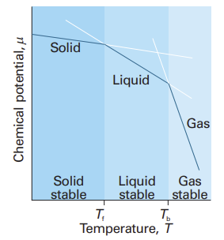
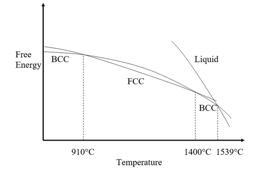
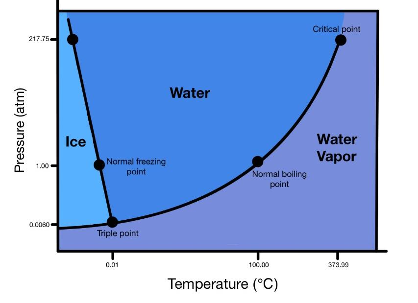
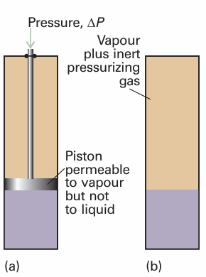
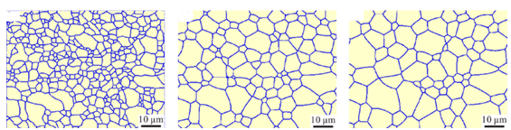

# Lecture 4 — Phase Equilibrium in Single-Component Systems

**MS1016 Thermodynamics of Materials · NTU · Prof Leonard Ng**

> **Prerequisite:** L3. You need the Gibbs free energy $\mathrm{d}G = V\,\mathrm{d}P - S\,\mathrm{d}T$, its two partial derivatives $(\partial G/\partial P)_T = V$ and $(\partial G/\partial T)_P = -S$, and the minimisation criterion $(\mathrm{d}G)_{T,P} = 0$ at equilibrium.

---

## 4.1 What this lecture does

This is the first lecture where all the abstract machinery (free energy, partial derivatives, Maxwell relations) gets applied to something you can point at: a lump of ice melting, a pot of water boiling, a chunk of iron rearranging its crystal lattice at 910 °C.

For a **single-component system** (pure substance — not a solution or alloy), we ask:

- Given a temperature and pressure, which phase (solid, liquid, gas) is the stable one?
- What happens *at* the boundary between two phases? Why does ice have a sharp melting point rather than melting over a range?
- How does the melting point shift with pressure? Why does ice (uniquely) melt at **lower** $T$ when you squeeze it?
- Why do small water droplets evaporate while larger ones don't?

By the end of this lecture you should be able to:

- state the equilibrium criterion $\mu_A = \mu_B$ for two phases in equilibrium,
- read a $P$–$T$ phase diagram and identify phase fields, boundaries, and the triple point,
- derive and apply the **Clapeyron equation** $\mathrm{d}P/\mathrm{d}T = \Delta S/\Delta V$,
- apply the **Clausius-Clapeyron equation** to relate vapour pressure and temperature,
- explain why small particles coarsen into larger ones (Ostwald ripening / grain growth).

---

## 4.2 Chemical potential — the molar Gibbs energy

For a single-component system, the **chemical potential** is just the molar Gibbs energy:

$$
\boxed{\;\mu \;\equiv\; \underline{G} \;=\; G/n\;}
$$

Because it inherits its differentials from $G$:

$$
\mathrm{d}\mu \;=\; \underline{V}\,\mathrm{d}P \;-\; \underline{S}\,\mathrm{d}T
$$

with

$$
\left(\frac{\partial \mu}{\partial T}\right)_{\!P} = -\underline{S}, \qquad \left(\frac{\partial \mu}{\partial P}\right)_{\!T} = \underline{V}
$$

(Molar quantities throughout this lecture — dropping the underline in most equations for readability, but everything is per mole.)

> **Note on naming.** We'll use $\mu$ interchangeably with "molar Gibbs energy" in this lecture. The term *chemical potential* will get its full treatment in L7 where it generalises to mixtures — there it becomes $\mu_i = (\partial G/\partial n_i)_{T,P,n_{j\neq i}}$, the Gibbs energy per mole of component $i$ added.

---

## 4.3 The equilibrium criterion for two phases

Imagine a container with some substance present as both phase A (e.g. solid) and phase B (e.g. liquid) simultaneously, at fixed $T$ and $P$. The total Gibbs energy is

$$
G_\text{sys} \;=\; n_A\,\mu_A \;+\; n_B\,\mu_B
$$

The total amount of substance is conserved: $n_A + n_B = \text{const}$, so $\mathrm{d}n_A = -\mathrm{d}n_B$.

Now move a tiny amount $\mathrm{d}n_A$ from phase B to phase A. At constant $T, P$:

$$
(\mathrm{d}G_\text{sys})_{T,P} \;=\; \mu_A\,\mathrm{d}n_A \;+\; \mu_B\,\mathrm{d}n_B \;=\; (\mu_A - \mu_B)\,\mathrm{d}n_A
$$

**Equilibrium** requires $(\mathrm{d}G_\text{sys})_{T,P} = 0$ for any small rearrangement. Since $\mathrm{d}n_A$ can have either sign, we must have

$$
\boxed{\;\mu_A(P, T) \;=\; \mu_B(P, T)\;}
$$

**At equilibrium, the molar Gibbs energies of the two phases are equal.** Doesn't matter how much of each phase is present — even a drop of water at 100 °C and 1 atm has the same $\mu$ as a lake of water at those same conditions.

### Maximum useful work of phase change

The maximum (reversible) work of transforming $\mathrm{d}n$ moles from A to B is $\delta W^{*}_\text{rev} = (\mu_B - \mu_A)\,\mathrm{d}n$. At equilibrium this is zero — no useful work can be extracted from a phase change that's already at equilibrium. A hot teacup cools because its temperature differs from the room's; ice at 0 °C and 1 atm in equilibrium with water at 0 °C and 1 atm does no work on you.

---

## 4.4 Temperature dependence — why hot liquids are more stable than hot solids

From $(\partial \mu/\partial T)_P = -S$ and the fact that entropy is always positive:

$$
\text{As } T \uparrow, \;\; \mu \downarrow \;\; \text{for every phase.}
$$

But the slopes differ by phase. Because $\underline{S}_\text{gas} > \underline{S}_\text{liquid} > \underline{S}_\text{solid}$ almost always, we have

$$
\left|\left(\frac{\partial \mu}{\partial T}\right)_{\!P}\right|_\text{gas} > \left|\left(\frac{\partial \mu}{\partial T}\right)_{\!P}\right|_\text{liquid} > \left|\left(\frac{\partial \mu}{\partial T}\right)_{\!P}\right|_\text{solid}
$$

The $\mu(T)$ plot has the gas sloping steepest down, then liquid, then solid.

{width=400px}

### The geometric picture

At any given $T$, the **stable phase is whichever has the lowest $\mu$**. The three lines cross at two points:

- $T_f$ (freezing/melting point): $\mu_\text{solid} = \mu_\text{liquid}$
- $T_b$ (boiling point): $\mu_\text{liquid} = \mu_\text{gas}$

Below $T_f$, solid wins. Between $T_f$ and $T_b$, liquid wins. Above $T_b$, gas wins. **The transition temperatures aren't arbitrary — they're where the lines cross.**

### Why ice gets slippery when you press on it

The **ice skate** question. When you skate, the blade applies high pressure to a thin film of ice. Does that film melt? The answer involves the pressure dependence of $\mu$ — next section.

---

## 4.5 Pressure dependence — why pressure usually raises melting points

From $(\partial \mu/\partial P)_T = V$, and $V > 0$ always:

$$
\text{As } P \uparrow, \;\; \mu \uparrow \;\; \text{for every phase.}
$$

But the *amount* of increase depends on the molar volume. Since liquids are typically a few percent less dense than solids, $\underline{V}_\text{liquid} > \underline{V}_\text{solid}$ for most substances. So when you squeeze:

- $\mu_\text{liquid}$ rises more than $\mu_\text{solid}$ (it has more room to be squeezed).
- The intersection point $T_f$ shifts to a **higher** temperature.
- Meaning: **most substances melt at higher $T$ under pressure.**

### The water exception

Water is unusual: **ice floats on water**, meaning $\underline{V}_\text{ice} > \underline{V}_\text{liquid water}$. This is a peculiarity of hydrogen bonding in ice crystal structure. The inequality flips:

- $\mu_\text{liquid water}$ rises **less** than $\mu_\text{ice}$ under pressure.
- $T_f$ shifts **down**.
- **Water freezes at a lower $T$ under pressure** — equivalently, ice melts at a lower $T$ under pressure.

This is why ice skates *can* leave a liquid film (though most of the slipperiness is actually from frictional heating, not pressure melting — the pressure effect is small). Similarly, glaciers flow downhill partly because pressure at the base of the glacier depresses the melting point.

### Materials consequence

For almost every material engineering process involving solid-liquid equilibrium (casting, welding, sintering), higher external pressure means higher melting temperature. That's why hot isostatic pressing (HIP) uses very high pressures and temperatures simultaneously — the high pressure shifts phase boundaries and sinters porosity closed.

---

## 4.6 Allotropes — phase transitions within the solid state

Many pure elements and compounds have multiple **crystal structures** that can be stable under different conditions. These different crystalline forms are called **allotropes** (for elements) or **polymorphs** (for compounds).

### Iron as the canonical example

{width=440px}

Pure iron runs through *three* solid crystal structures plus one liquid phase as you heat it at 1 atm:

| Temperature range | Phase | Crystal structure | Common name |
|---|---|---|---|
| Below 910 °C (1183 K) | $\alpha$-iron | BCC | ferrite |
| 910–1394 °C (1183–1667 K) | $\gamma$-iron | FCC | austenite |
| 1394–1538 °C (1667–1811 K) | $\delta$-iron | BCC | (high-$T$ ferrite) |
| Above 1538 °C | liquid iron | — | — |

The $\mu(T)$ curves for each phase intersect at these transition temperatures — the phase with the lowest $\mu$ wins at each $T$, just as before. Different slopes come from different molar entropies (FCC iron is more close-packed and has slightly different vibrational entropy than BCC).

### First- vs. second-order transitions

A transition is **first-order** if there's a discontinuity in the first derivatives of $G$ (i.e. in $V$ or $S$ — equivalently, there's a latent heat $\Delta H \neq 0$ and a density change). Melting, boiling, and most allotropic transitions (including iron's $\alpha \leftrightarrow \gamma$) are first-order.

A transition is **second-order** if first derivatives are continuous but second derivatives (heat capacity, compressibility) are discontinuous. Classic examples: superconductor onset, ferromagnetic Curie transition.

$$
\left(\frac{\partial^2 \mu}{\partial T^2}\right)_{\!P} \;=\; -\left(\frac{\partial S}{\partial T}\right)_{\!P} \;=\; -\frac{C_P}{T}
$$

For a second-order transition, $\mu$ and $(\partial \mu/\partial T)_P$ (and therefore $S$) are continuous across the transition, but $C_P$ jumps.

> **Flag for Prof Leonard** — the source notes call allotropic transformations "second-order transitions" because the curvature of $\mu(T)$ differs between phases. Strictly this is incorrect: iron's $\alpha \leftrightarrow \gamma$ transformation has a (small) latent heat and density change and is **first-order** by the Ehrenfest classification. See the corrections section at the bottom.

### Materials significance

The α↔γ transition in iron is arguably the single most important allotropic transition in engineering — it underlies the entire steel heat-treatment world. Austenite (γ) dissolves much more carbon than ferrite (α); cooling austenite rapidly traps the carbon, producing martensite; cooling slowly allows carbon to partition, producing ferrite + cementite microstructures like pearlite and bainite. All of L5-L7 applies to these; here we just note that the phase transition is driven by the free-energy crossover.

---

## 4.7 Phase diagrams — the $P$–$T$ map

A phase diagram plots the regions of $(P, T)$ space where each phase is the most stable one.

{width=520px}

### Features of every phase diagram

- **Phase fields** — regions in which one phase is stable (interior of the diagram).
- **Phase boundaries** — the lines separating two phases; along a boundary, $\mu_A = \mu_B$ (i.e. two phases coexist).
- **Triple point** — where three phases coexist simultaneously. For a pure substance this is a single $(P, T)$ — completely out of your control, a property of the substance.
- **Critical point** — where the liquid-gas boundary terminates. Above the critical point, there's no distinction between liquid and gas (supercritical fluid).

### Water's phase diagram, read off the plot above

- **Triple point:** 273.16 K (0.01 °C), 611 Pa (0.006 atm). At this single point, ice, water, and water vapour coexist.
- **Normal freezing point:** 0 °C at 1 atm (where the solid-liquid boundary crosses $P = 1$ atm).
- **Normal boiling point:** 100 °C at 1 atm (where the liquid-gas boundary crosses $P = 1$ atm).
- **Critical point:** 374 °C, ~218 atm.
- **Solid-liquid boundary slopes backward** (negative $\mathrm{d}P/\mathrm{d}T$) — a hallmark of water, consequence of $\underline{V}_\text{ice} > \underline{V}_\text{liquid}$.

### Why water's triple point is a metrology standard

Because the triple point of a pure substance is fixed by nature — independent of who's measuring, what thermometer they use — the triple point of water was *defined* to be exactly 273.16 K, and this defined the kelvin from 1954 until a 2019 SI redefinition. Any lab with clean water and a triple-point cell can reproduce the same temperature to ~0.1 mK. That's why 0 °C is not exactly 273.15 K — 0 °C is the normal freezing point at 1 atm, which is slightly different from the triple point.

---

## 4.8 The Clapeyron equation — slopes of phase boundaries

Along any phase boundary, $\mu_A = \mu_B$. Now move an infinitesimal distance along the boundary: both $\mu_A$ and $\mu_B$ change, but in such a way that they stay equal.

$$
\mathrm{d}\mu_A \;=\; \mathrm{d}\mu_B
$$

Using $\mathrm{d}\mu = V\,\mathrm{d}P - S\,\mathrm{d}T$ on each side:

$$
V_A\,\mathrm{d}P - S_A\,\mathrm{d}T \;=\; V_B\,\mathrm{d}P - S_B\,\mathrm{d}T
$$

Collect the $\mathrm{d}P$ and $\mathrm{d}T$ terms:

$$
(V_B - V_A)\,\mathrm{d}P \;=\; (S_B - S_A)\,\mathrm{d}T
$$

Divide:

$$
\boxed{\;\frac{\mathrm{d}P}{\mathrm{d}T} \;=\; \frac{\Delta_\text{trs} S}{\Delta_\text{trs} V}\;}
$$

This is the **Clapeyron equation**. It's an *exact* relation — it applies to any phase transition of any pure substance. The subscript "trs" stands for "transition"; $\Delta_\text{trs} S = S_B - S_A$ and $\Delta_\text{trs} V = V_B - V_A$ are the molar entropy and volume changes going from phase A to phase B.

### Equivalent form using latent heat

Since the transition happens at constant $T$, $\Delta_\text{trs} S = \Delta_\text{trs} H / T$ (from L2), so:

$$
\boxed{\;\frac{\mathrm{d}P}{\mathrm{d}T} \;=\; \frac{\Delta_\text{trs} H}{T\,\Delta_\text{trs} V}\;}
$$

This form is often more convenient because tabulated data usually give $\Delta H$ (latent heats of fusion or vaporisation) rather than $\Delta S$.

### Interpreting the slope

- If $\Delta V > 0$ (the new phase is less dense): $\mathrm{d}P/\mathrm{d}T > 0$ → boundary slopes up and to the right.
- If $\Delta V < 0$ (the new phase is *more* dense — e.g. ice→water): $\mathrm{d}P/\mathrm{d}T < 0$ → boundary slopes up and to the *left*. Water.

### Worked example — solid-liquid boundary of water

*At 1 atm, ice melts at 273.15 K with $\Delta H_\text{fus} = 6010$ J/mol. Molar volume of ice $\approx 19.66$ cm³/mol, of liquid water $\approx 18.02$ cm³/mol. What's $\mathrm{d}P/\mathrm{d}T$?*

$$
\Delta_\text{fus} V \;=\; (18.02 - 19.66) \times 10^{-6} \;=\; -1.64 \times 10^{-6}\;\text{m}^3/\text{mol}
$$

$$
\frac{\mathrm{d}P}{\mathrm{d}T} \;=\; \frac{6010}{(273.15)(-1.64\times 10^{-6})} \;=\; \frac{6010}{-4.48 \times 10^{-4}} \;\approx\; -1.34 \times 10^{7}\;\text{Pa/K}
$$

**Interpretation.** Raising pressure by 1.34 × 10⁷ Pa (≈ 134 atm) lowers the melting point by 1 K. Equivalently, a pressure of 100 atm lowers water's melting point by only about 0.75 K. **The ice-skate pressure-melting story is real but tiny** — most of skating's slipperiness comes from friction-generated heat, not pressure. Glaciers flow via a related mechanism at their bases where 100s of metres of ice produce much higher pressures.

---

## 4.9 The Clausius-Clapeyron equation — for vapours

For liquid→gas (or solid→gas) transitions, two simplifications let us turn Clapeyron into something cleaner.

**Simplification 1.** The vapour is much less dense than the condensed phase, so

$$
\Delta_\text{vap} V \;=\; V_\text{gas} - V_\text{liquid} \;\approx\; V_\text{gas}
$$

(throwing away a term that's typically ∼1000× smaller).

**Simplification 2.** Treat the vapour as an ideal gas, so $V_\text{gas} = RT/P$ per mole.

Substitute into Clapeyron:

$$
\frac{\mathrm{d}P}{\mathrm{d}T} \;=\; \frac{\Delta_\text{vap} H}{T\,(RT/P)} \;=\; \frac{P\,\Delta_\text{vap} H}{RT^2}
$$

Rearrange (divide both sides by $P$):

$$
\frac{1}{P}\,\frac{\mathrm{d}P}{\mathrm{d}T} \;=\; \frac{\Delta_\text{vap} H}{RT^2} \qquad\Longrightarrow\qquad \boxed{\;\frac{\mathrm{d}\ln P}{\mathrm{d}T} \;=\; \frac{\Delta_\text{vap} H}{RT^2}\;}
$$

using $\mathrm{d}x/x = \mathrm{d}\ln x$. This is the **Clausius-Clapeyron equation**.

### Integrated form (assuming $\Delta_\text{vap} H$ constant with $T$)

$$
\ln\!\frac{P_2}{P_1} \;=\; -\frac{\Delta_\text{vap} H}{R}\!\left(\frac{1}{T_2} - \frac{1}{T_1}\right)
$$

If you plot $\ln P$ against $1/T$ for a substance's vapour pressure data, you get a straight line with slope $-\Delta_\text{vap} H / R$. This is the standard way experimentalists measure latent heats of vaporisation.

### Worked example — boiling point of water on Mount Everest

*Water boils at 100 °C (373 K) at 1 atm. $\Delta_\text{vap} H$ ≈ 40.7 kJ/mol. Atmospheric pressure at the summit of Everest is ∼0.33 atm. At what temperature does water boil there?*

Water boils when its vapour pressure equals the ambient atmospheric pressure. So we want the $T_2$ such that $P_2 = 0.33$ atm given $P_1 = 1$ atm at $T_1 = 373$ K.

$$
\ln(0.33) \;=\; -\frac{40{,}700}{8.314}\!\left(\frac{1}{T_2} - \frac{1}{373}\right)
$$

$$
-1.109 \;=\; -4895\!\left(\frac{1}{T_2} - 0.002681\right)
$$

$$
\frac{1}{T_2} \;=\; \frac{1.109}{4895} + 0.002681 \;=\; 0.0002266 + 0.002681 \;=\; 0.002908
$$

$$
T_2 \;\approx\; 344\;\text{K} \;=\; 71\;°\text{C}
$$

Water boils at about 71 °C at Everest's summit. That's why cooking at high altitude takes longer — the water just isn't hot enough. Pressure cookers solve this by raising pressure (and therefore boiling point) inside the vessel.

### Common mistakes on this problem

1. **Forgetting the units for $R$ and $\Delta H$.** Use $R = 8.314$ J mol⁻¹ K⁻¹ with $\Delta H$ in J/mol, or $R = 8.314 \times 10^{-3}$ with $\Delta H$ in kJ/mol. Mixing gives answers off by 1000×.
2. **Sign errors.** $(1/T_2 - 1/T_1)$: if $T_2 < T_1$ (lower T at higher altitude means the new boiling point is *lower*), then $1/T_2 > 1/T_1$, making the bracket positive, paired with the minus sign out front gives a negative $\ln(P_2/P_1)$ — consistent with $P_2 < P_1$. Keep track.
3. **Confusing "vapour pressure" with "ambient pressure".** The boiling condition is *vapour pressure = ambient pressure*. The Clausius-Clapeyron equation tells you how *vapour pressure* varies with $T$; the *ambient pressure* is an external given.

---

## 4.10 Effect of external pressure on vapour pressure

{width=340px}

Consider a liquid in equilibrium with its own vapour. Now apply extra pressure to the liquid — either mechanically (a piston) or by pressurising the gas space with an **inert gas** like nitrogen or argon. What happens to the equilibrium vapour pressure?

Physical intuition: squeezing the liquid raises $\mu_\text{liq}$; to re-establish equilibrium, the vapour's $\mu$ must rise too. For an ideal gas vapour, $\mu$ rising means $P_\text{vapour}$ rising. So **mechanically squeezing a liquid raises its vapour pressure.**

### Quantitative derivation

At constant $T$, apply an extra pressure $\Delta P$ to the liquid. Its chemical potential changes by

$$
\Delta \mu_\text{liq} \;=\; V_\text{liq}\,\Delta P
$$

The vapour (ideal gas) sits at its own equilibrium vapour pressure $P$. Its chemical potential change is

$$
\mathrm{d}\mu_\text{vap} \;=\; V_\text{vap}\,\mathrm{d}P \;=\; \frac{RT}{P}\,\mathrm{d}P \;=\; RT\,\mathrm{d}\ln P
$$

Integrating from the original vapour pressure $P^*$ (with no extra pressure on the liquid) to the new vapour pressure $P$:

$$
\Delta \mu_\text{vap} \;=\; RT\,\ln\!\frac{P}{P^*}
$$

At equilibrium, $\Delta \mu_\text{liq} = \Delta \mu_\text{vap}$:

$$
\boxed{\;V_\text{liq}\,\Delta P \;=\; RT\,\ln\!\frac{P}{P^*}\;}
$$

Since $V_\text{liq}$ is small, you need a lot of mechanical $\Delta P$ to notice much change in vapour pressure. For water at 298 K with $V_\text{liq} = 18 \times 10^{-6}$ m³/mol, going to $\Delta P = 10$ atm ≈ 10⁶ Pa:

$$
\ln\!\frac{P}{P^*} \;=\; \frac{18\times 10^{-6} \times 10^6}{8.314 \times 298} \;\approx\; 0.0073
$$

i.e. vapour pressure rises by ∼0.73%. Small, but measurable — and foundational for the next topic.

---

## 4.11 Small droplets have higher vapour pressure — the Kelvin equation

Now the really interesting case: the "extra pressure" on the liquid comes not from a piston or inert gas, but from **surface tension** in a curved surface.

### Laplace pressure in a droplet

A liquid droplet of radius $r$ with surface tension $\gamma$ has an *internal* pressure higher than the outside by the Laplace pressure:

$$
P_\text{inside} - P_\text{outside} \;=\; \frac{2\gamma}{r}
$$

(Factor of 2 because a sphere has curvature in two directions.) This surface tension pressure acts like an external squeeze on the liquid inside the droplet.

### The Kelvin equation

Substitute $\Delta P = 2\gamma/r$ into the previous relation (assuming $P_T \gg P^*$ so we keep only the $\Delta P$ contribution):

$$
V_\text{liq}\,\frac{2\gamma}{r} \;=\; RT\,\ln\!\frac{P}{P^*}
$$

$$
\boxed{\;\ln\!\frac{P}{P^*} \;=\; \frac{2\gamma\,V_\text{liq}}{RT\,r}\;}
$$

This is the **Kelvin equation**. Small $r$ → large $\ln(P/P^*)$ → **small droplets have higher equilibrium vapour pressure than big droplets (or flat surfaces).**

### Numerical feel

For water at 20 °C: $\gamma \approx 0.073$ N/m, $V_\text{liq} \approx 18 \times 10^{-6}$ m³/mol, $RT \approx 2437$ J/mol. For a droplet of radius $r = 10^{-8}$ m (10 nm):

$$
\ln\!\frac{P}{P^*} \;=\; \frac{2 \times 0.073 \times 18\times 10^{-6}}{2437 \times 10^{-8}} \;\approx\; 0.108
$$

So $P/P^* \approx 1.11$ — nanometre-scale droplets have ~11% higher vapour pressure than a flat surface. For bigger droplets (1 μm and above), the effect is under 1% and usually ignored.

---

## 4.12 Grain coarsening — why big grains eat small grains

{width=420px}

The Kelvin equation applies to any curved interface — not just liquid droplets. For **solid grains** in a polycrystalline material, the curved grain boundaries produce an analogous effect: small grains have higher chemical potential than large grains because of the extra surface energy.

The consequence:

1. Atoms on the surface of a small grain have higher $\mu$.
2. Atoms diffuse from high-$\mu$ (small grains) to low-$\mu$ (large grains).
3. **Small grains shrink, large grains grow.**
4. Average grain size increases with time, especially at elevated temperature where diffusion is fast.

This is **Ostwald ripening** in liquids and precipitates; the same physics under the name **grain coarsening** or **normal grain growth** in solids. Key engineering implications:

- **Heat treatment of metals** — holding at high $T$ for long times coarsens grain size, which usually *lowers* yield strength (by Hall-Petch: smaller grains = higher strength).
- **Precipitation-hardened alloys** (e.g. Al-Cu, superalloys) — rapid-cooled microstructure has many small precipitates; ageing grows some at the expense of others. Over-ageing coarsens to the point where strength drops.
- **Sintering** of ceramic powders — densification *and* coarsening happen simultaneously; good sinter processing trades them off.

> **Driving force.** The coarsening rate is proportional to the surface-energy gradient, which goes as $\gamma/r$. Fine-grained microstructures have huge driving force to coarsen but can be kinetically stabilised by impurity pinning (Zener pinning), which is why real alloys contain trace elements specifically chosen to drag on grain boundaries.

---

## 4.13 Worked TYU / concept check

*(L4 notes have few TYU prompts; a few common conceptual checks for this chapter:)*

| Question | Answer |
|---|---|
| Why does ice have a sharp melting point, not a range? | Because for a pure substance, $\mu_\text{solid} = \mu_\text{liquid}$ at a *single* $T$ at each fixed $P$. On either side of that $T$, one phase has strictly lower $\mu$. Alloys and solutions do melt over a range because their $\mu$ depends on composition, which can change. |
| How many degrees of freedom do you have if all three phases of water are in equilibrium? | Zero. Three coexisting phases require all three $\mu$'s to be equal, which is two equations — fixing both $P$ and $T$. This gives the "triple point", a single $(P, T)$. (This previews the **Gibbs phase rule**, L6.) |
| Can water boil at room temperature? | Yes — in a vacuum chamber. Lower the ambient pressure below water's vapour pressure at 25 °C (about 3.2 kPa), and the water will boil. This is how freeze-drying works (partially). |
| Why can't we have supercritical ice? | The solid-liquid boundary doesn't terminate at a critical point — ice and water remain distinguishable at all $P, T$ where they coexist. Only the liquid-gas transition has a critical point because liquid and gas are the same symmetry (both disordered fluids) and can become continuously indistinguishable. Solid and liquid have different symmetry (crystalline vs. disordered) and can never merge continuously. |
| A sealed bottle of water: fill it half with water, heat it to the critical point. What do you see? | The meniscus disappears — you can no longer distinguish liquid from vapour. At $T_c$ the densities of the two phases become equal, surface tension goes to zero, and the fluid becomes uniform. Dramatic visual effect in high-$P$ glass tubes. |

---

## Source-slide corrections applied in this consolidated version

1. **Slide 5 — allotropes classified as "second-order transitions".** The source states: *"For allotropes, the significant change is in the second derivative of the chemical potential. Since we are using the second derivative, the change in crystal structure is called a second-order transition."* This is **factually incorrect** for iron (and most allotropic transitions). Iron's $\alpha \leftrightarrow \gamma$ transition at 910 °C is **first-order** — it has a latent heat (∼900 J/mol) and a density change (∼1%). The Ehrenfest classification says: first-order = discontinuity in first derivatives ($V$, $S$); second-order = first derivatives continuous, second derivatives discontinuous. **Applied:** §4.6 presents the correct definition, flags iron as first-order, and gives superconductor onset / ferromagnetic Curie as classic examples of second-order transitions. This is the single most important correction in L4 — students who memorise the wrong classification will get exam questions wrong.

2. **Slide 5 — sentence fragment: *"iron can exist as either BCC iron below 910°C, and at 910°C both cases can exist in equilibrium."*** Missing "or FCC iron above 910 °C" or similar. The figure caption correctly describes the BCC→FCC→BCC→liquid sequence, but the body text is truncated. **Applied:** §4.6 gives the full 4-phase table for iron.

3. **Slide 9 — typo "reises" for "rises"** in *"When pressure is applied to a condensed phase, its vapour pressure reises."* Minor; noted.

4. **Slide 11 — equation reference error.** *"Substitue equation (4.29) to (4.30)"* — should be "substitute (4.29) into (4.28)", since (4.30) is the *result*. **Applied:** §4.11 presents the derivation without cross-references, so no equation-number issue.

5. **Slide 4 — the claim that "the chemical potential of the gas phase plunges steeply downwards" is right but the slope only matters relative to the other phases' slopes.** The source notes correctly identify that gas has the steepest (most negative) slope, but could make clearer that *relative* slopes determine which phase wins at each $T$. **Applied:** §4.4 uses the $(\partial\mu/\partial T) = -S$ identity directly and notes the ordering $S_\text{gas} > S_\text{liq} > S_\text{sol}$.

6. **Slide 2 — the derivation of $\mu_A = \mu_B$ uses $G_\text{sys} = n_A G_A + n_B G_B$ with "molar $G$"** but later writes the equilibrium condition as "$G_A = G_B$" without making explicit that these are molar. **Applied:** §4.3 writes the condition as $\mu_A = \mu_B$ and flags the notation choice at the top of the lecture.

7. **Slide 1 review — "Gibbs free energy is a function that depends on the temperature, pressure, and mole of the component"** — correct but "mole" should be "moles" / "composition". Minor wording.

On to L5 — Solid Solutions.
