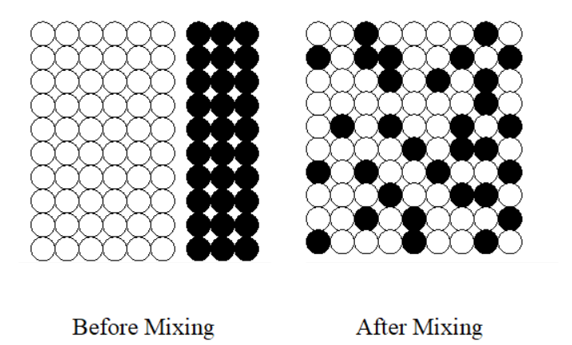
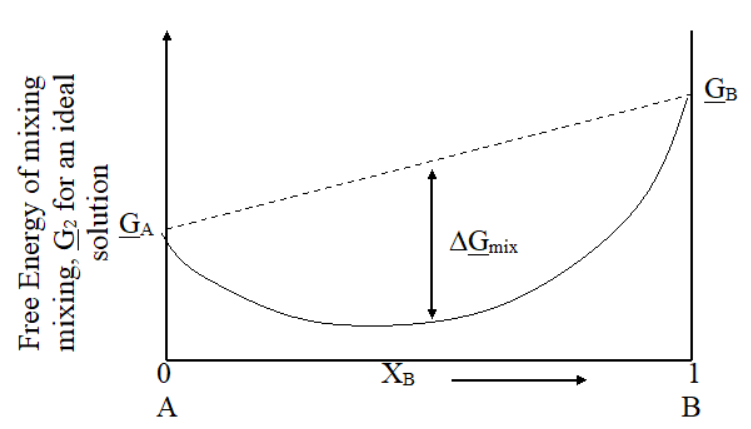
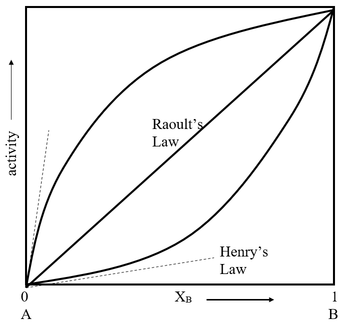
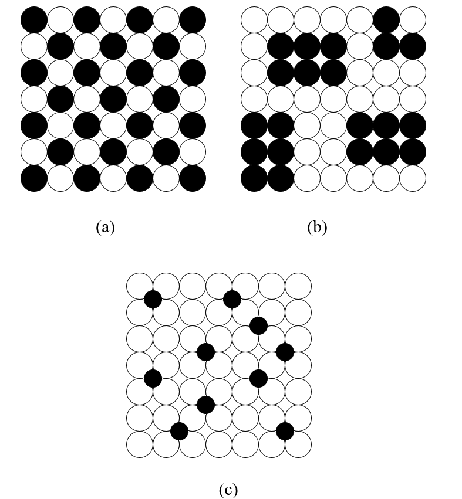
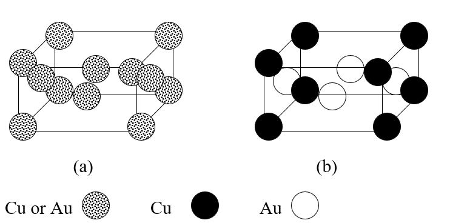
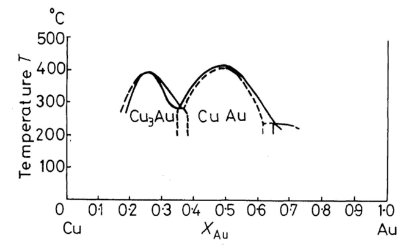

# Lecture 5 — Solid Solutions and Multi-Component Systems

**MS1016 Thermodynamics of Materials · NTU · Prof Leonard Ng**

> **Prerequisite:** L3 (Gibbs free energy, Maxwell relations) and L4 (chemical potential of a pure substance). We now generalise $\mu$ from a single-component to a multi-component system — the central object for the rest of the course.

---

## 5.1 What this lecture does

Up to L4, every system had one chemical identity — pure water, pure iron, pure carbon. Materials engineers almost never work with pure substances. Steel is iron + carbon + alloying elements; brass is copper + zinc; solder is tin + lead (or tin + silver + copper in modern lead-free varieties); every engineering ceramic is a multi-component oxide.

When two or more substances share a crystal lattice or a liquid phase, they form a **solution**. This lecture sets up the thermodynamics of those solutions — specifically:

- How does the Gibbs energy of a mixture depend on composition?
- When is mixing spontaneous? (Almost always, entropically — but not always energetically.)
- What determines whether two substances dissolve in each other (miscible) vs. refuse to mix (immiscible)?
- What's an *ordered* solid solution vs. a *random* one?

By the end you should be able to:

- define and compute the **chemical potential** of a component in a mixture,
- relate chemical potential to **activity** $a_i$, fugacity $f_i$, and activity coefficient $\gamma_i$,
- derive the ideal-solution mixing laws ($\Delta H_\text{mix} = 0$, $\Delta S_\text{mix} = -R\sum X_i \ln X_i$),
- use **Raoult's Law** and **Henry's Law** for the two limits of a binary solution,
- interpret the bond-energy parameter $\varepsilon$ and predict whether a solution will be ordered, random, or clustered,
- apply the **Gibbs-Duhem equation** to connect activities of components.

---

## 5.2 Chemical potential in a multi-component system

From L4, chemical potential for a **pure** substance is just the molar Gibbs energy, $\mu = \underline{G}$. For a **mixture**, it's the **partial molar Gibbs energy** — how much $G$ changes when you add one more mole of component $i$, keeping $T$, $P$, and all other moles fixed.

### General differential form of $G$

For a system with multiple components, the Gibbs energy is a function of $T$, $P$, *and the moles of every component*:

$$
G = G(T, P, n_1, n_2, n_3, \ldots, n_N)
$$

Its total differential contains partial derivatives with respect to each variable:

$$
\mathrm{d}G \;=\; \left(\frac{\partial G}{\partial T}\right)_{\!P, n_i}\!\mathrm{d}T \;+\; \left(\frac{\partial G}{\partial P}\right)_{\!T, n_i}\!\mathrm{d}P \;+\; \sum_{i=1}^{N}\left(\frac{\partial G}{\partial n_i}\right)_{\!T, P, n_{j\neq i}}\!\mathrm{d}n_i
$$

The first two partials are the familiar $-S$ and $V$ from L3. The new quantity is the third:

$$
\boxed{\;\mu_i \;\equiv\; \left(\frac{\partial G}{\partial n_i}\right)_{\!T, P, n_{j\neq i}}\;}
$$

This is the **chemical potential of component $i$**. Two equivalent readings:

1. $\mu_i$ = Gibbs energy added to the mixture per mole of $i$ added (with everything else held fixed).
2. $\mu_i$ = slope of a plot of $G$ against $n_i$ at fixed $T, P$, and other $n_j$.

The chemical potential of a species depends on the **composition** of the mixture, not just on the species itself. One mole of iron in molten steel has a different $\mu_\text{Fe}$ from one mole of iron in molten lead.

### Total differential at constant $T, P$

Dropping the $\mathrm{d}T$ and $\mathrm{d}P$ terms:

$$
(\mathrm{d}G)_{T,P} \;=\; \sum_i \mu_i\,\mathrm{d}n_i
$$

This is how $G$ of a mixture changes as its composition changes at constant $T$ and $P$.

### Mole fractions

Throughout this lecture we express composition by **mole fraction**:

$$
X_i \;\equiv\; \frac{n_i}{\sum_j n_j}, \qquad \sum_i X_i = 1
$$

**Not zero — one.** (This is a common source-slide typo.) For a binary system, $X_A + X_B = 1$, so you only need one variable to specify composition.

### Partial molar quantities generalise

Any extensive property can be written as a sum of partial molar contributions:

- Partial molar **volume**: $\bar{V}_i = (\partial V/\partial n_i)_{T,P,n_{j\neq i}}$ — how much total volume changes per mole of $i$ added.
- Partial molar **enthalpy**: $\bar{H}_i = (\partial H/\partial n_i)_{T,P,n_{j\neq i}}$

**But note:** $\bar{H}_i \neq \mu_i$ — partial molar enthalpy is *not* chemical potential. $\mu_i$ specifically refers to the Gibbs-energy partial. This trips students up — don't conflate them.

---

## 5.3 Activity and fugacity

Solutions are *usually* non-ideal. To keep ideal-solution-style formulas usable in the real world, we define two bookkeeping devices.

### Fugacity $f$ — "effective pressure" for non-ideal gases

For an **ideal gas** at constant $T$,
$$
\mathrm{d}\underline{G} \;=\; V\,\mathrm{d}P - S\,\mathrm{d}T \;\xrightarrow{T \text{ const}}\; \underline{V}\,\mathrm{d}P \;=\; \frac{RT}{P}\,\mathrm{d}P \;=\; RT\,\mathrm{d}\ln P
$$

i.e. $\mathrm{d}\underline{G} = RT\,\mathrm{d}\ln P$. For a **non-ideal** gas, this identity breaks — but we *want* to keep the nice logarithmic form. So define **fugacity** $f$ as the quantity that makes the formula work:

$$
\mathrm{d}\underline{G} \;=\; RT\,\mathrm{d}\ln f
$$

Fugacity has units of pressure. It equals $P$ for an ideal gas; for a real gas, $f/P$ measures the degree of non-ideality. As $P \to 0$, every gas behaves ideally and $f \to P$.

### Activity $a_i$ — the dimensionless version

Divide fugacity by the fugacity of the component in its **standard state** $f_i^\circ$ to get a dimensionless ratio:

$$
\boxed{\;a_i \;\equiv\; \frac{f_i}{f_i^\circ}\;}
$$

**Standard states** (conventions that you'll just memorise):

| Phase | Standard state |
|---|---|
| Gas | Pure gas at 1 atm |
| Liquid | Pure liquid at 1 atm |
| Solid | Pure solid at 1 atm |
| Solute in dilute solution | Hypothetical 1 molal solution at 1 atm |

In its standard state, **$a_i = 1$** by definition. Activity is sometimes called the "effective mole fraction" — for an ideal solution it literally *is* the mole fraction (see §5.5).

### Chemical potential in terms of activity

Integrate $\mathrm{d}\mu_i = RT\,\mathrm{d}\ln f_i$ from the standard state to the actual state:

$$
\boxed{\;\mu_i \;=\; \mu_i^\circ \;+\; RT\ln a_i\;}
$$

This single equation is the workhorse for the rest of the course. It says the chemical potential in a mixture differs from its standard-state value by a term that scales logarithmically with activity. Every equilibrium calculation from here on — phase equilibria (L6), chemical equilibria (L7), electrochemistry — starts from this identity.

**For an ideal gas specifically**, $a_i = P_i/P_i^\circ$ (fugacity = pressure in the ideal limit):

$$
\mu_i \;=\; \mu_i^\circ \;+\; RT\ln\!\frac{P_i}{P_i^\circ}
$$

---

## 5.4 Mixing two components — before vs. after

{width=420px}

Take components A and B, each pure and at the same $T, P$, with the same crystal structure (necessary for them to form a single solid-solution phase). Before mixing, the total Gibbs energy is

$$
G_1 \;=\; n_A\,\underline{G}_A \;+\; n_B\,\underline{G}_B
$$

Dividing by the total moles ($n_\text{total} = n_A + n_B$):

$$
\underline{G}_1 \;=\; X_A\,\underline{G}_A \;+\; X_B\,\underline{G}_B
$$

where $\underline{G}_A, \underline{G}_B$ are the molar Gibbs energies of the pure components. This is a **straight line** between $\underline{G}_A$ at $X_B = 0$ and $\underline{G}_B$ at $X_B = 1$ on a plot against composition.

After mixing, the free energy changes by an amount $\Delta G_\text{mix}$:

$$
\underline{G}_2 \;=\; \underline{G}_1 \;+\; \Delta G_\text{mix}
$$

With $\Delta G_\text{mix} = \Delta H_\text{mix} - T\,\Delta S_\text{mix}$. Whether mixing is spontaneous depends on the sign of $\Delta G_\text{mix}$:

- $\Delta G_\text{mix} < 0$ → mixing is spontaneous → single homogeneous solution
- $\Delta G_\text{mix} > 0$ → mixing is non-spontaneous → phases separate (immiscible)

---

## 5.5 The ideal solution

An **ideal solution** is one where all A-A, B-B, and A-B interactions are equally strong (or equivalently, interchanging atoms doesn't change the total bond energy). The name is analogous to "ideal gas" — a useful limit that some real systems approximate.

### Activity = mole fraction

In an ideal solution, $a_i = X_i$ (identically). Substituting into $\mu_i = \mu_i^\circ + RT\ln a_i$:

$$
\mu_i \;=\; \underline{G}_i^\circ \;+\; RT\ln X_i \qquad \text{(ideal solution)}
$$

### Gibbs energy of an ideal binary mixture

Using $(\mathrm{d}G)_{T,P} = \mu_A\,\mathrm{d}n_A + \mu_B\,\mathrm{d}n_B$, integrating, and dividing by total moles:

$$
\underline{G}_2 \;=\; X_A\,\mu_A \;+\; X_B\,\mu_B
$$

Plugging in the ideal-solution form of each $\mu$:

$$
\underline{G}_2 \;=\; X_A\,\underline{G}_A^\circ + X_B\,\underline{G}_B^\circ \;+\; RT\,[X_A\ln X_A + X_B\ln X_B]
$$

Subtract the pre-mixing value $\underline{G}_1 = X_A\,\underline{G}_A^\circ + X_B\,\underline{G}_B^\circ$:

$$
\boxed{\;\Delta G_\text{mix} \;=\; RT\,(X_A\ln X_A \;+\; X_B\ln X_B)\;}
$$

### Sign of $\Delta G_\text{mix}$

Since $0 < X_A, X_B < 1$, both logarithms are negative, so $\Delta G_\text{mix} < 0$ for all compositions. **An ideal solution always mixes spontaneously.**

The Gibbs energy curve "bulges down" from the straight-line before-mixing reference:

{width=460px}

### Entropy of mixing

From $\Delta G_\text{mix} = \Delta H_\text{mix} - T\,\Delta S_\text{mix}$ and $(\partial G/\partial T)_P = -S$:

$$
\Delta S_\text{mix} \;=\; -\left(\frac{\partial \Delta G_\text{mix}}{\partial T}\right)_{\!P,X} \;=\; -R\,(X_A\ln X_A + X_B\ln X_B)
$$

$$
\boxed{\;\Delta S_\text{mix} \;=\; -R\sum_i X_i\ln X_i \;>\; 0\;}
$$

Entropy of mixing is *always positive* for an ideal solution. Physical picture: many more microstates when atoms can be randomly arranged throughout the lattice than when they're segregated into pure A and pure B blocks.

### Enthalpy of mixing

$$
\Delta H_\text{mix} \;=\; \Delta G_\text{mix} + T\,\Delta S_\text{mix} \;=\; RT(X_A\ln X_A + X_B\ln X_B) \;+\; T\cdot(-R)(X_A\ln X_A + X_B\ln X_B) \;=\; 0
$$

$$
\boxed{\;\Delta H_\text{mix} \;=\; 0 \qquad \text{(ideal solution)}\;}
$$

**An ideal solution mixes with zero enthalpy change.** The driving force is *entirely* entropic. If $\Delta H_\text{mix} \neq 0$, you don't have an ideal solution.

### Maximum of $\Delta S_\text{mix}$ (and minimum of $\Delta G_\text{mix}$)

Both are at $X_A = X_B = 0.5$:

$$
\Delta S_\text{mix}^\text{max} \;=\; -R\,(0.5\ln 0.5 + 0.5\ln 0.5) \;=\; R\ln 2 \;\approx\; 5.76\;\text{J mol}^{-1}\text{K}^{-1}
$$

This is the "mixing entropy" that shows up in entropy-of-alloying calculations everywhere.

---

## 5.6 Real (non-ideal) solutions

For real solutions, $a_i \neq X_i$. We patch the ideal formula with an **activity coefficient** $\gamma_i$:

$$
\boxed{\;a_i \;=\; \gamma_i\,X_i\;}
$$

$\gamma_i$ captures all the deviation from ideality:

- $\gamma_i = 1$ → ideal behaviour (for that component, at that composition).
- $\gamma_i > 1$ → the component "wants out" more than ideal — positive deviation, like-like bonds preferred.
- $\gamma_i < 1$ → the component "likes being there" more than ideal — negative deviation, A-B bonds preferred.

Then the chemical potential is

$$
\mu_i \;=\; \mu_i^\circ + RT\ln(\gamma_i X_i) \;=\; \underbrace{\mu_i^\circ + RT\ln X_i}_\text{ideal part} \;+\; \underbrace{RT\ln \gamma_i}_\text{excess}
$$

The second piece is called the **excess chemical potential**; it vanishes for an ideal solution.

### Two limiting laws — Raoult and Henry

{width=440px}

Consider component A dissolved in B. Look at the two limits:

**Limit 1: $X_A \to 1$ (A is the majority — the *solvent*).** Most of A's neighbours are A. A behaves as if it were nearly pure. Its activity coefficient $\gamma_A \to 1$, and

$$
a_A \;\to\; X_A, \qquad \mu_A \;\approx\; \mu_A^\circ + RT\ln X_A
$$

This is **Raoult's Law**. Equivalently, if A is a volatile liquid with pure-liquid vapour pressure $P_A^{*}$, then

$$
P_A \;=\; X_A\,P_A^{*} \qquad \text{(Raoult's Law, solvent)}
$$

**Limit 2: $X_A \to 0$ (A is the minority — the *solute*).** Every A atom is surrounded almost entirely by B neighbours. A's chemical environment is fixed (determined by B), so its activity coefficient approaches a constant: $\gamma_A \to \gamma_A^\infty$ (the "infinite-dilution activity coefficient"), and

$$
P_A \;=\; k_H\,X_A \qquad \text{(Henry's Law, solute)}
$$

where $k_H = \gamma_A^\infty P_A^{*}$ is Henry's Law constant for A in B.

### Why both laws matter

Most real binary solutions — steel (C in Fe, < 1% typically), Si-doped semiconductors, dilute alloys — have the solute at very low concentration. **The solvent follows Raoult's Law and the solute follows Henry's Law in the same solution.** Both laws together cover the two ends of a real activity curve; the middle is genuinely non-ideal and needs the activity coefficient treated explicitly.

---

## 5.7 Bond-energy picture — why solutions are ideal, ordered, or clustered

A powerful way to think about solid solutions is in terms of **pair bond energies**. Define

$$
\varepsilon \;\equiv\; E_{AB} \;-\; \tfrac{1}{2}(E_{AA} + E_{BB})
$$

i.e. how much lower (or higher) an A-B bond energy is than the average of the two like-like bond energies.

Three regimes (for a binary with similar atomic sizes):

| $\varepsilon$ | A-B vs. A-A/B-B | Arrangement | $\Delta H_\text{mix}$ | Example |
|:---:|---|---|:---:|---|
| $< 0$ | A-B preferred | **Ordered** (alternating) | negative | Cu-Au at low $T$ (Cu$_3$Au, CuAu superlattices) |
| $= 0$ | All equivalent | **Random** (ideal) | zero | Hypothetical ideal solution |
| $> 0$ | A-A & B-B preferred | **Clustered** (separate regions) | positive | Au-Ni at low $T$, Cu-Ag |

(a) **Ordered** — every A is surrounded by B and vice versa. $\varepsilon < 0$.
(b) **Clustered** — like atoms group together. $\varepsilon > 0$. If extreme enough, the system **phase-separates** (forms distinct A-rich and B-rich regions).
(c) **Interstitial** — when A and B differ greatly in atomic size, small atoms slot into the gaps of the large-atom lattice rather than substituting for them (classic example: carbon in iron).

### Connecting $\varepsilon$ to $\Delta H_\text{mix}$

In the **regular-solution model**, the enthalpy of mixing for a random arrangement is

$$
\Delta H_\text{mix} \;=\; \Omega\, X_A\, X_B
$$

where $\Omega$ is the **regular-solution interaction parameter**, related to $\varepsilon$ by $\Omega \approx Z N_A\,\varepsilon$ (with $Z$ = coordination number, $N_A$ = Avogadro's number). Sign of $\Omega$ matches sign of $\varepsilon$:

- $\Omega < 0$: $\Delta H_\text{mix} < 0$ → always miscible (mixing favoured by both $\Delta H$ and $\Delta S$); at low $T$ the solution may order.
- $\Omega > 0$: $\Delta H_\text{mix} > 0$ → compete against $T\Delta S_\text{mix}$. At high $T$ entropy wins, miscible. At low $T$, $T\Delta S_\text{mix}$ shrinks and enthalpy wins → **miscibility gap**, the two phases unmix.

This temperature dependence — miscible hot, unmix cold — is why many alloys show solubility that shrinks as they cool. It's also the foundation for precipitation hardening (age-harden aluminium alloys, etc.), which you'll meet in L6.

### The size mismatch case

When A and B differ greatly in atomic radius (e.g. C in Fe, or N in Ti), substituting one for the other creates large local strain. Instead the solute goes into **interstitial sites** — gaps between solvent atoms — which accommodate small atoms without much strain. Interstitial solubility is typically much lower than substitutional solubility (room for small atoms is limited), but the effect on mechanical properties can be dramatic (carbon interstitials are what make steel stronger than pure iron).

---

## 5.8 Ordered vs. disordered phases — the Cu-Au system

Copper and gold are the textbook case. Both are FCC with similar atomic radii (Cu 127 pm, Au 144 pm), and they're completely miscible at high temperatures.

{width=480px}

**At high $T$ (above ∼400 °C):** thermal agitation dominates, atoms swap positions freely. A random FCC solid solution forms — any lattice site has equal probability of being Cu or Au.

**At low $T$ (below ∼400 °C):** the small but negative $\varepsilon$ matters. Near specific compositions (notably Cu$_3$Au and CuAu), the system rearranges into an **ordered superlattice**:

- **Cu$_3$Au** — one Au at each cube corner, Cu at each face-centre (L1$_2$ structure).
- **CuAu** — Cu and Au alternating in layers (L1$_0$ tetragonal structure).

{width=480px}

The phase diagram shows two "domes" where the superlattices are stable. Above the domes, the alloy is a disordered FCC solid solution.

### Why does ordering happen at low $T$?

$\Delta G_\text{mix} = \Delta H_\text{mix} - T\,\Delta S_\text{mix}$. Ordering lowers $\Delta H_\text{mix}$ (more energetically favourable A-B bonds) but also lowers $\Delta S_\text{mix}$ (fewer microstates in the ordered arrangement). The minimum-$G$ tradeoff:

- High $T$: entropy term $T\Delta S_\text{mix}$ dominates → disordered wins.
- Low $T$: enthalpy term $\Delta H_\text{mix}$ dominates → ordered wins.

The critical temperature is roughly $T_c \sim \Omega/k_B$ (regular-solution estimate). Order-disorder transitions happen through most of materials science: Fe$_3$Al, Ni$_3$Al (basis of the γ' strengthening phase in superalloys), brass β $\to$ β' transition.

---

## 5.9 The Gibbs-Duhem equation

One last identity, which constrains how component activities must vary together.

### Derivation

For a binary solution at constant $T, P$, the molar Gibbs energy is

$$
\underline{G} \;=\; X_A \mu_A + X_B \mu_B
$$

Differentiate everything:

$$
\mathrm{d}\underline{G} \;=\; X_A\,\mathrm{d}\mu_A + X_B\,\mathrm{d}\mu_B + \mu_A\,\mathrm{d}X_A + \mu_B\,\mathrm{d}X_B
$$

**Alternative expression** for $\mathrm{d}\underline{G}$ at constant $T, P$: from $(\mathrm{d}G)_{T,P} = \mu_A\,\mathrm{d}n_A + \mu_B\,\mathrm{d}n_B$, divide through by total moles:

$$
\mathrm{d}\underline{G} \;=\; \mu_A\,\mathrm{d}X_A + \mu_B\,\mathrm{d}X_B
$$

Setting the two forms equal:

$$
X_A\,\mathrm{d}\mu_A + X_B\,\mathrm{d}\mu_B \;=\; 0
$$

$$
\boxed{\;X_A\,\mathrm{d}\mu_A + X_B\,\mathrm{d}\mu_B \;=\; 0\;}
$$

This is the **Gibbs-Duhem equation** (binary form). Generalised to $N$ components: $\sum_i X_i\,\mathrm{d}\mu_i = 0$ at constant $T, P$.

### Interpretation and use

The Gibbs-Duhem equation says **you can't vary the chemical potentials of all the components independently** — if one changes, the others must compensate. In particular:

- If $\mu_A$ increases as composition changes, $\mu_B$ **must decrease** (and vice versa).
- Knowing $\mu_A$ as a function of composition fully determines $\mu_B$ (up to a constant).

Rewritten in terms of activities ($\mathrm{d}\mu_i = RT\,\mathrm{d}\ln a_i$):

$$
X_A\,\mathrm{d}\ln a_A + X_B\,\mathrm{d}\ln a_B \;=\; 0 \qquad\Longleftrightarrow\qquad \mathrm{d}\ln a_A \;=\; -\frac{X_B}{X_A}\,\mathrm{d}\ln a_B
$$

### Why this is useful experimentally

Activities are hard to measure. If you can measure one component's activity (say by vapour-pressure measurements of a volatile solvent), you can **integrate Gibbs-Duhem** to get the other:

$$
\ln a_A(X_A) \;=\; \ln a_A(X_A^{\text{ref}}) \;-\; \int_{X_B^{\text{ref}}}^{X_B} \frac{X_B}{X_A}\,\mathrm{d}\ln a_B
$$

This is how solute activities are typically inferred in metallurgy — you measure the solvent, Gibbs-Duhem gives you the solute.

---

## 5.10 Worked example — mixing entropy for a steel approximation

*A low-carbon steel at 1000 °C contains 0.2 wt% C in γ-iron (austenite). Approximating this as an ideal solution of Fe and C on a molar basis, compute $\Delta S_\text{mix}$, $\Delta G_\text{mix}$, and $\Delta H_\text{mix}$ per mole.*

### Step 1 — convert weight fractions to mole fractions

Molar masses: $M_\text{Fe} = 55.85$ g/mol, $M_\text{C} = 12.01$ g/mol.

Per 100 g of alloy: 0.2 g C and 99.8 g Fe.

$$
n_\text{C} = 0.2/12.01 \;=\; 0.01666\;\text{mol}, \qquad n_\text{Fe} = 99.8/55.85 \;=\; 1.787\;\text{mol}
$$

$$
X_\text{C} = 0.01666/(0.01666 + 1.787) \;\approx\; 0.00924, \qquad X_\text{Fe} \;\approx\; 0.99076
$$

### Step 2 — apply the ideal-solution formulas

$$
\Delta S_\text{mix} \;=\; -R\,(X_\text{Fe}\ln X_\text{Fe} + X_\text{C}\ln X_\text{C})
$$

$$
= -8.314 \times (0.99076 \times \ln 0.99076 + 0.00924 \times \ln 0.00924)
$$

$$
= -8.314 \times (0.99076 \times (-0.00928) + 0.00924 \times (-4.685))
$$

$$
= -8.314 \times (-0.00920 - 0.04329)
$$

$$
= -8.314 \times (-0.05249) \;\approx\; +0.437\;\text{J mol}^{-1}\text{K}^{-1}
$$

### Step 3 — Gibbs and enthalpy of mixing

At $T = 1273$ K:

$$
\Delta G_\text{mix} \;=\; RT(X_\text{Fe}\ln X_\text{Fe} + X_\text{C}\ln X_\text{C}) \;=\; 8.314 \times 1273 \times (-0.05249) \;\approx\; -555\;\text{J/mol}
$$

For an ideal solution, $\Delta H_\text{mix} = 0$.

### Interpretation

$\Delta G_\text{mix} < 0$ — mixing is spontaneous, which matches reality (C does dissolve in austenite at 1000 °C). The magnitude (~500 J/mol) is modest but non-trivial. Real steel is *not* ideal — the actual $\Delta H_\text{mix}$ of C in γ-Fe is small but negative, and the practical solubility limit of C in γ-Fe is about 2.1 wt% at 1147 °C (the austenite-cementite eutectic line), set by $\Delta G$ going through a minimum at higher carbon content.

### Why this matters

Even a rough ideal-solution estimate tells you **whether** a given solute is likely to dissolve in a given solvent. For more quantitative work (solubility limits, phase-diagram prediction) you need a real activity model (regular solution at minimum; subregular or sublattice models for serious alloy thermodynamics). Commercial software like Thermo-Calc / FactSage is essentially this equation, applied to thousands of systems with measured activity data.

---

## 5.11 Concept checks

| Question | Answer |
|---|---|
| Why is $\Delta H_\text{mix} = 0$ "ideal"? | In an ideal solution, all pair bond energies ($E_{AA}$, $E_{BB}$, $E_{AB}$) are equal, so swapping atoms doesn't change the total bond-energy bookkeeping. Real systems have non-zero $\varepsilon$ and therefore non-zero $\Delta H_\text{mix}$. |
| Why does $\Delta S_\text{mix} > 0$ always for an ideal solution? | Because $X \ln X < 0$ for $0 < X < 1$ and there's a minus sign in front. Physically: mixing increases the number of microstates (more ways to arrange atoms in a lattice when they're randomly placed than when they're segregated). |
| When is Raoult's Law exact? | Never, strictly. It's the $X \to 1$ limit of real behaviour. It's approximately exact for the solvent of a very dilute solution. |
| When is Henry's Law exact? | Same caveat — only in the $X \to 0$ limit. In practice, Henry's Law is useful for solutes at compositions below ~1 at% in most binary systems. |
| What does it mean physically when $\gamma_i > 1$? | Component $i$ is less happy in this solution than it would be in an ideal solution at the same $X_i$. Like-like bonds are preferred. Given enough of a thermodynamic push, the system will want to segregate. |
| For a regular solution with $\Omega > 0$, what happens as $T$ drops? | At high $T$, $T\Delta S_\text{mix}$ dominates — the system is one random solid solution. As $T$ decreases, $|T\Delta S_\text{mix}|$ shrinks while $\Delta H_\text{mix}$ stays about constant, so at some critical $T_c$ the two-phase state becomes lower in $G$ than the random solution — the system unmixes (miscibility gap opens below $T_c$). |
| Why is the Gibbs-Duhem equation useful? | It lets you infer the activity of the component you couldn't measure from the one you could. Experimentally, $a_\text{solvent}$ is easy (vapour pressure); $a_\text{solute}$ is hard; Gibbs-Duhem bridges them. |

---

## Source-slide corrections applied in this consolidated version

1. **Page 1 — mole-fraction sum typo.** Source says "$X_1 + X_2 + \cdots + X_n = 0$". This is a **critical error** — mole fractions sum to **1** (not 0). A student memorising the source verbatim would fail any basic composition problem. **Applied:** §5.2 writes $\sum_i X_i = 1$ and flags the correction.

2. **Page 11 — text/figure mismatch for "ordered phase".** The body text says *"Fig 5.8b is an example of an ordered phase where the sites for atoms A and B are specific and not inter-changeable."* But Fig 5.8b actually shows **clustering** (regions of same-kind atoms, corresponding to $\varepsilon > 0$). The ordered phase is **Fig 5.8a** (checkerboard-like alternation, $\varepsilon < 0$). **Applied:** §5.7 uses the figure correctly — 5.8a = ordered ($\varepsilon < 0$), 5.8b = clustered ($\varepsilon > 0$), 5.8c = interstitial.

3. **Page 11 — oversimplification of "$\varepsilon = \Delta H_\text{mix}$".** The source says *"the term $\varepsilon$ is the $\Delta H_\text{mix}$"* which is technically wrong — in the regular-solution model, $\Delta H_\text{mix} = \Omega X_A X_B$ where $\Omega \approx Z N_A \varepsilon$, with $Z$ the coordination number of the lattice. $\varepsilon$ is the *pair interaction energy*, not the *mixing enthalpy*. They have different units (J per pair vs. J/mol). **Applied:** §5.7 distinguishes $\varepsilon$ from $\Omega$ and shows the $X_A X_B$ composition dependence that $\varepsilon$-only phrasing hides.

4. **Page 9 wording — "mix a small amount of A onto B"** should be "into B". Minor but noticeable.

5. **Page 10 claim — "steel where the carbon content is not more than 1% in most cases"** is approximately right for plain carbon steels but wrong for tool steels and cast irons. **Applied:** §5.10 cites the actual solubility of C in γ-iron (∼2.1 wt% at 1147 °C) for the worked example.

6. **Page 1 review wording — "mole of the component"** should be "moles of the components". Minor grammar.

7. **Page 4 — standard states defined informally.** The source mentions "standard states are normally taken as pure material at 1 atm where activity is 1" but doesn't summarise the full standard-state table. **Applied:** §5.3 gives the full table (gas / liquid / solid / dilute-solute) since students will need all four across L5–L8.

On to L6 — Gibbs Phase Rule and Phase Diagrams.
