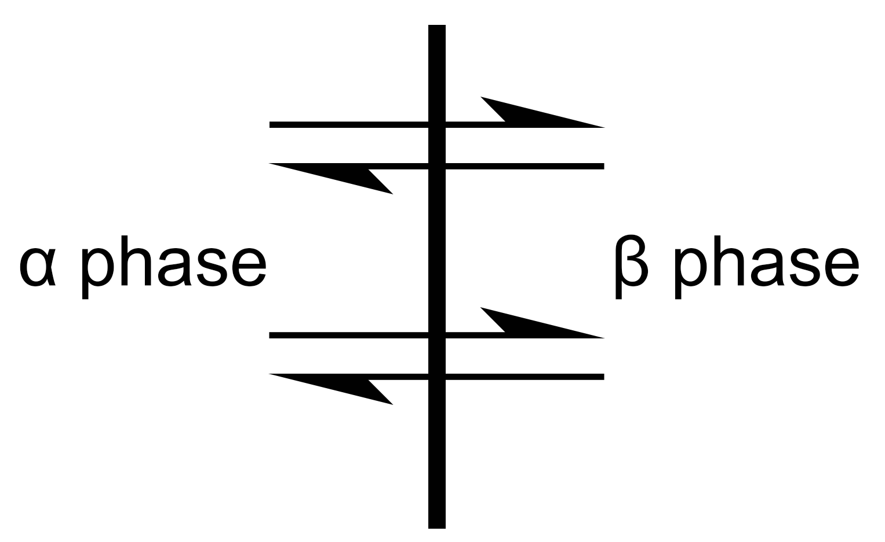
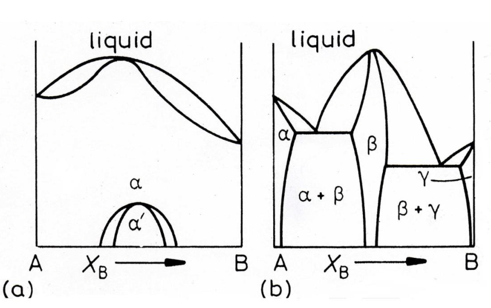
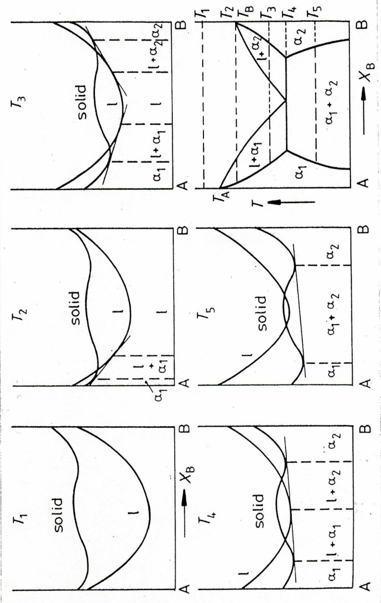
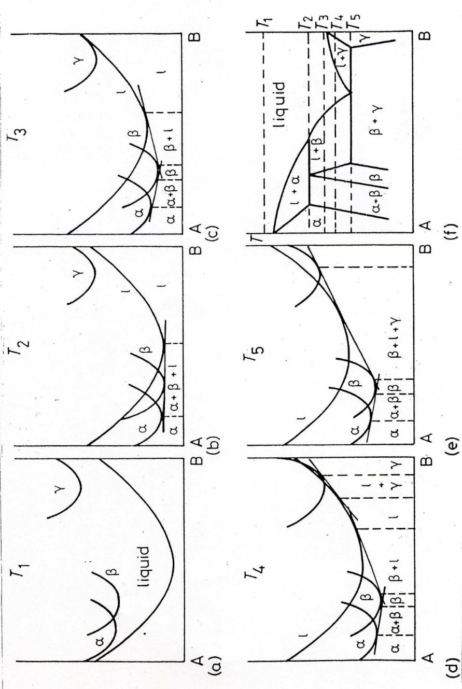

# Lecture 6 — Gibbs Phase Rule and Phase Diagrams

**MS1016 Thermodynamics of Materials · NTU · Prof Leonard Ng**

> **Prerequisite:** L4 (chemical potential, single-component phase diagrams) and L5 (chemical potential in mixtures, Gibbs energy of solutions). This lecture is where solid-solution thermodynamics lands on the practical map — the binary phase diagram.

---

## 6.1 What this lecture does

L4 gave us phase diagrams for pure substances ($P$ vs. $T$ with solid, liquid, gas regions and a triple point). L5 gave us the Gibbs energy of mixtures.

Now we combine them. For a two-component (**binary**) alloy, we plot temperature against composition and map out which phase (or phases) is stable at each point. These **binary phase diagrams** are the single most-used reference in all of materials engineering — every metallurgist, ceramicist, and polymer engineer reads them daily.

By the end of this lecture you should be able to:

- state and apply the **Gibbs phase rule** $F = C - P + 2$,
- derive binary phase diagrams graphically from **free-energy vs. composition** curves using the **common tangent construction**,
- interpret single-phase regions, two-phase regions, and invariant points (eutectic, peritectic, congruent maximum),
- use the **lever rule** to read phase fractions and compositions at any point on a phase diagram.

---

## 6.2 The equilibrium criterion — generalised

From L4 we had $\mu_A = \mu_B$ for two phases of a pure substance. From L5 we had $\mu_i = \mu_i^\circ + RT\ln a_i$ for a component in a mixture. Putting them together:

### Two-phase equilibrium for every component

Consider a binary alloy (components A and B) with two phases present, called $\alpha$ and $\beta$. Let $\mu_A^\alpha$ be the chemical potential of A in phase $\alpha$, and so on.

{width=420px}

**Starting point:** at equilibrium, $(\mathrm{d}G)_{T,P} = 0$. The total Gibbs energy is $G = G^\alpha + G^\beta$. Each phase's $G$ depends on the moles of each component in that phase:

$$
\mathrm{d}G^\alpha \;=\; \mu_A^\alpha\,\mathrm{d}n_A^\alpha \;+\; \mu_B^\alpha\,\mathrm{d}n_B^\alpha \quad\text{(at constant $T, P$)}
$$

$$
\mathrm{d}G^\beta \;=\; \mu_A^\beta\,\mathrm{d}n_A^\beta \;+\; \mu_B^\beta\,\mathrm{d}n_B^\beta
$$

**Mass conservation:** the total moles of each species doesn't change, just gets re-divided between phases:

$$
\mathrm{d}n_A^\alpha \;=\; -\mathrm{d}n_A^\beta, \qquad \mathrm{d}n_B^\alpha \;=\; -\mathrm{d}n_B^\beta
$$

**Putting it together,** $\mathrm{d}G = \mathrm{d}G^\alpha + \mathrm{d}G^\beta = 0$:

$$
(\mu_A^\alpha - \mu_A^\beta)\,\mathrm{d}n_A^\alpha \;+\; (\mu_B^\alpha - \mu_B^\beta)\,\mathrm{d}n_B^\alpha \;=\; 0
$$

Since $\mathrm{d}n_A^\alpha$ and $\mathrm{d}n_B^\alpha$ can take arbitrary signs independently, each coefficient must separately vanish:

$$
\boxed{\;\mu_A^\alpha \;=\; \mu_A^\beta \qquad\text{and}\qquad \mu_B^\alpha \;=\; \mu_B^\beta\;}
$$

**At equilibrium between phases, every component has the same chemical potential in every phase.** Different phases can have wildly different *compositions* ($X_A^\alpha \neq X_A^\beta$, which is exactly what makes phase diagrams interesting), but the *chemical potentials* of each element are continuous across phase boundaries.

### Physical picture

If $\mu_A^\alpha > \mu_A^\beta$, component A has higher escaping tendency in phase $\alpha$ than in $\beta$. Atoms of A will diffuse from $\alpha$ into $\beta$ until the chemical potentials equalise — much like heat flowing from hot to cold. Diffusion is the equalising mechanism; chemical potentials are the driving forces.

### What this means in activity terms

Since $\mu_i = \mu_i^\circ + RT\ln a_i$ for each component, equality of $\mu_i$ across phases at the same $T, P$ means **equality of activities**:

$$
a_A^\alpha \;=\; a_A^\beta, \qquad a_B^\alpha \;=\; a_B^\beta
$$

— a useful reformulation we'll use in L7.

---

## 6.3 The Gibbs Phase Rule

Suppose the system has $C$ components and $P$ phases all in equilibrium simultaneously. How many independent variables can we choose before the state is fully determined?

### Counting variables

- **Intensive variables** describing each phase: composition requires $C - 1$ mole fractions (since the last one is fixed by $\sum X_i = 1$). So $P$ phases contribute $P(C - 1)$ composition variables.
- Plus $T$ and $P$ — 2 more variables in general.
- **Total raw variables:** $P(C - 1) + 2$.

### Counting constraints

Equilibrium requires equal chemical potentials for each component across all phases. For $C$ components distributed among $P$ phases, each component gives $P - 1$ independent equations ($\mu_i^1 = \mu_i^2$, $\mu_i^2 = \mu_i^3$, …).

- **Total constraints:** $C(P - 1)$.

### Degrees of freedom

$$
F \;=\; \text{variables} - \text{constraints} \;=\; [P(C - 1) + 2] - C(P - 1) \;=\; C - P + 2
$$

$$
\boxed{\;F \;=\; C - P + 2\;}
$$

$F$ is the **variance** or **degrees of freedom** — the number of intensive variables you can change independently without changing the number of phases in equilibrium.

### Consequences

| Phases in equilibrium | Gibbs phase rule says | Meaning |
|---|---|---|
| $P = 1$ | $F = C + 1$ | Single-phase region — a volume in $(T, P, X)$ space. |
| $P = 2$ | $F = C$ | Two-phase coexistence — a surface in $(T, P, X)$ space. |
| $P = 3$ | $F = C - 1$ | Three-phase coexistence — a line. |
| $P = C + 1$ | $F = 1$ | Univariant — one variable free. |
| $P = C + 2$ | $F = 0$ | Invariant point — all variables fixed. |

### Applied to a pure substance ($C = 1$)

| Phases | $F$ | Example |
|---|---|---|
| 1 | 2 | Liquid water — can vary $T$ and $P$ in a range. |
| 2 | 1 | Ice-water at equilibrium — fix $P$, $T$ is determined (or vice versa). Traces a curve in $(P, T)$. |
| 3 | 0 | Ice-water-vapour triple point — unique $(T, P)$ for each pure substance (water: 273.16 K, 611 Pa). |

You can't have more than 3 phases of a pure substance in equilibrium (would need $F < 0$, impossible).

### Applied to a binary ($C = 2$)

| Phases | $F$ | Geometry on a $T$-$X$ diagram (at fixed $P$) |
|---|---|---|
| 1 | 3 | Single-phase field — a 2D region. |
| 2 | 2 | Two-phase coexistence — 2D region on $T$-$X$ (because $F = 2$ = $T$ + composition); bounded by two phase-boundary curves. |
| 3 | 1 | Three-phase equilibrium — a horizontal line on $T$-$X$ at fixed $P$; example: the eutectic reaction. |

### The common "$F = C - P + 1$" shortcut

For most practical phase-diagram work, pressure is held at 1 atm (atmospheric). With $P$ fixed, we lose one degree of freedom, so the effective rule becomes

$$
F \;=\; C - P + 1 \qquad \text{(pressure fixed)}
$$

That's why at 1 atm for a binary alloy ($C = 2$), three-phase equilibrium gives $F = 0$ — an invariant point at a specific $(T, X)$.

---

## 6.4 Free-energy curves → phase diagrams — the common tangent construction

How do we actually draw a phase diagram? From free-energy curves, one temperature at a time.

### The common tangent rule

{width=480px}

Suppose at some temperature $T$, the $G(X)$ curves for phases $\alpha$ and $\beta$ look like two parabolas — $\alpha$ with its minimum near $A$ (so $\alpha$ is A-rich) and $\beta$ with its minimum near $B$ (so $\beta$ is B-rich).

**Claim:** at equilibrium, compositions lying between the two tangent points $L$ and $M$ of the **common tangent line** are in two-phase equilibrium: phase $\alpha$ at composition $X^\alpha = L$ coexisting with phase $\beta$ at composition $X^\beta = M$.

**Why?** The slope of the $G$-vs-$X$ curve at any composition is the chemical potential contribution. More formally, the intercepts of the tangent line at $X = 0$ (pure A) and $X = 1$ (pure B) are $\mu_A$ and $\mu_B$ respectively. If the tangent lines to $G^\alpha$ at $L$ and to $G^\beta$ at $M$ are the **same line**, then:

$$
\mu_A^\alpha \;=\; \mu_A^\beta \qquad\text{and}\qquad \mu_B^\alpha \;=\; \mu_B^\beta
$$

— exactly the equilibrium condition from §6.2. Any other pairing of compositions violates one equality or the other.

### Reading the graph

| Composition | What's stable |
|---|---|
| $X < X^\alpha_L$ | Pure $\alpha$ phase (at some $X < L$, $G^\alpha$ alone is lowest). |
| $X^\alpha_L \leq X \leq X^\beta_M$ | $\alpha$ at composition $L$ + $\beta$ at composition $M$, with proportions set by the lever rule (next section). |
| $X > X^\beta_M$ | Pure $\beta$ phase. |

This construction is done at **every temperature**; the locus of tangent points (as $T$ varies) gives the phase-diagram boundaries.

---

## 6.5 The lever rule — how much of each phase?

If you're at a composition $X_0$ in the two-phase region, with $\alpha$ at composition $X^\alpha$ and $\beta$ at composition $X^\beta$, the mole fractions of each phase are:

$$
f^\alpha \;=\; \frac{X^\beta - X_0}{X^\beta - X^\alpha}, \qquad f^\beta \;=\; \frac{X_0 - X^\alpha}{X^\beta - X^\alpha}
$$

(Notice $f^\alpha + f^\beta = 1$.) Each phase-fraction is the length of the *opposite* lever arm divided by the full tie-line length. The name comes from the lever analogy: $X_0$ is the fulcrum; $f^\alpha$ is on the $X^\alpha$ end weighted by the distance to $X^\beta$.

### Derivation

Mass balance for component B:

$$
X_0 \;=\; f^\alpha\,X^\alpha \;+\; f^\beta\,X^\beta \;=\; f^\alpha\,X^\alpha + (1 - f^\alpha)\,X^\beta
$$

Solve for $f^\alpha$:

$$
f^\alpha \;=\; \frac{X^\beta - X_0}{X^\beta - X^\alpha}
$$

### Worked example — 40% B alloy in a two-phase region

*In an alloy at 40 at% B (so $X_0 = 0.40$), the $\alpha$ phase has $X^\alpha = 0.10$ and the $\beta$ phase has $X^\beta = 0.80$. What are the phase fractions?*

$$
f^\alpha \;=\; \frac{0.80 - 0.40}{0.80 - 0.10} \;=\; \frac{0.40}{0.70} \;\approx\; 0.571
$$

$$
f^\beta \;=\; \frac{0.40 - 0.10}{0.80 - 0.10} \;=\; \frac{0.30}{0.70} \;\approx\; 0.429
$$

So 57% of the material is in the $\alpha$ phase (low-B), 43% is in the $\beta$ phase (high-B).

---

## 6.6 Isomorphous systems — complete solid solubility

Consider A and B that are:

- Same crystal structure (both BCC, or both FCC).
- Similar atomic radii.
- Similar electronegativity.
- $\Delta H_\text{mix} \approx 0$ or slightly negative.

Then they're likely completely miscible in both liquid and solid — an **isomorphous** binary. Classic examples: Cu-Ni, Ag-Au, Ge-Si.

### Phase diagram (isomorphous case, $\Delta H_\text{mix} \approx 0$)

The resulting phase diagram has a lens-shaped two-phase region between the liquid and solid single-phase fields:

- Above the **liquidus** line: single liquid phase.
- Between liquidus and **solidus**: liquid + solid coexist (2-phase).
- Below the solidus: single solid phase.

At any composition, melting doesn't happen at a single temperature — it happens over a range (between solidus and liquidus), and during that range the liquid and solid that coexist have *different* compositions.

### The $\Delta H_\text{mix} < 0$ variant — melting-point maximum

{width=380px}

If $\Delta H_\text{mix} < 0$ strongly enough, the *solid* is stabilised relative to pure components at an intermediate composition — the melting point is **higher** for the alloy than for either pure component. The phase-diagram curves peak at that composition. This reflects the same physics as the Cu-Au ordering in L5: strong A-B attractive interactions lower the solid's $G$.

---

## 6.7 The eutectic system

For $\Delta H_\text{mix} > 0$ in the solid phase (A and B prefer like-neighbours), the solid phase is *destabilised* relative to pure components. If the destabilisation is strong enough, the two solid phases become distinct ($\alpha$-rich in A, $\beta$-rich in B), and the alloy can't sustain a single solid solution across the full composition range.

{width=520px}

### The eutectic invariant

Reading across the six panels above (free-energy curves at progressively cooler temperatures):

- At $T_1$ (hot): Only liquid is stable across all compositions.
- At $T_m(A)$: The liquid and solid A curves meet at pure A — A is melting.
- At $T_2$: Liquid is stable in the middle; $\alpha$ (A-rich) and $\beta$ (B-rich) solids are stable near the edges. Two-phase lenses on each side.
- At $T_m(B)$: Liquid and solid B curves meet at pure B — B is melting.
- At $T_E$ (the **eutectic temperature**): A single tangent line touches three free-energy curves at once — $\alpha$, $L$ (liquid), and $\beta$. Three phases coexist. At this invariant point, $F = C - P + 1 = 2 - 3 + 1 = 0$ (at fixed $P$).
- Below $T_E$: Only $\alpha$ + $\beta$; no liquid. The resulting phase diagram has a **V-shape** meeting at the eutectic point.

### The eutectic reaction

At the eutectic composition, on cooling through $T_E$:

$$
\text{Liquid} \;\xrightarrow{\text{cooling through } T_E}\; \alpha \;+\; \beta
$$

Three phases are briefly in equilibrium (invariant). The liquid decomposes into two solid phases simultaneously. The resulting microstructure is a fine lamellar or rod-like two-phase aggregate — very distinctive under a microscope, and mechanically interesting (often harder than either pure phase).

### Classic eutectic systems

- **Pb-Sn** (tin-lead solder) — eutectic at 63% Sn, 183 °C. Used for electronic soldering for decades until lead was phased out.
- **Al-Si** (casting alloys) — eutectic at ~12.6% Si, 577 °C. Backbone of automotive cast parts.
- **Fe-C** (cast iron) — eutectic at 4.3 wt% C, 1147 °C.

### Why do eutectics have the *lowest* melting point in the system?

Because liquid is stabilised by the positive entropy of mixing. In a binary with $\Delta H_\text{mix} > 0$ in the solid, the liquid (with more mixing entropy per bond) is relatively more stable than the solid as you mix. The competition between each component's preference to freeze and mixing's preference to keep liquid produces a minimum melting temperature at some intermediate composition — the eutectic.

---

## 6.8 More-complex phase diagrams

{width=460px}

Real alloy systems often have:

- **Intermediate phases / intermetallic compounds** — distinct crystal structures at specific compositions (e.g. $\beta$-brass, Fe$_3$C).
- **Multiple eutectics** — one on each side of an intermetallic.
- **Peritectic reactions** — liquid + one solid $\to$ another solid on cooling (important in Fe-C for the δ-ferrite to austenite transition).
- **Miscibility gaps** — two-phase regions within what would otherwise be a single solid-solution field.

All of this is built up from the same free-energy curves + common-tangent construction, applied at every temperature. Modern alloy thermodynamics is done computationally (CALPHAD method) — fit free-energy functions to experimental data, then the entire phase diagram falls out automatically.

### Example — the Fe-C phase diagram

The most-used phase diagram in the world. Features include:

- BCC α-ferrite (low $T$) and δ-ferrite (high $T$).
- FCC γ-austenite (intermediate $T$).
- **Fe₃C (cementite)** — intermetallic compound at 6.67 wt% C.
- **Eutectoid** at 0.76 wt% C, 727 °C: γ-austenite $\to$ α-ferrite + Fe₃C (the pearlite reaction — foundation of carbon-steel metallurgy).
- **Eutectic** at 4.3 wt% C, 1147 °C: liquid $\to$ γ-austenite + Fe₃C (cast iron).
- **Peritectic** at 0.17 wt% C, 1495 °C: liquid + δ-ferrite $\to$ γ-austenite.

Every heat treatment of steel — quench, temper, anneal, normalise — is a navigation through this diagram plus the cooling-rate kinetics that govern which phases are actually formed vs. their equilibrium map.

---

## 6.9 Worked example — reading a phase diagram

*An alloy of 30 wt% Ni in Cu is cooled slowly from 1500 °C to 1100 °C. The Cu-Ni system is isomorphous (complete solid solubility). Given the following approximate phase-boundary data:*

| T (°C) | Liquidus (wt% Ni) | Solidus (wt% Ni) |
|---|---|---|
| 1500 | 100 | 100 |
| 1400 | 65 | 80 |
| 1300 | 42 | 55 |
| 1200 | 28 | 35 |
| 1100 | 15 | 20 |

*At 1200 °C, what phases are present and in what proportions?*

**Step 1 — identify the region.** 30 wt% Ni at 1200 °C. Looking at the table, at 1200 °C the liquidus is at 28 wt% Ni and the solidus is at 35 wt% Ni. Our alloy composition (30 wt%) lies between them → **two-phase region** (liquid + solid).

**Step 2 — read off the phase compositions.**

- Liquid composition at 1200 °C: **$X_L = 28$ wt% Ni**
- Solid composition at 1200 °C: **$X_S = 35$ wt% Ni**

**Step 3 — apply the lever rule.** With overall composition $X_0 = 30$:

$$
f_L \;=\; \frac{X_S - X_0}{X_S - X_L} \;=\; \frac{35 - 30}{35 - 28} \;=\; \frac{5}{7} \;\approx\; 0.714
$$

$$
f_S \;=\; \frac{X_0 - X_L}{X_S - X_L} \;=\; \frac{30 - 28}{35 - 28} \;=\; \frac{2}{7} \;\approx\; 0.286
$$

**Interpretation.** At 1200 °C, the alloy is **71.4% liquid + 28.6% solid by mass** (or more precisely, by moles if the compositions are given in at%; for wt% the mass fractions are what we just computed). The liquid is lean in Ni (28%) compared to the overall alloy (30%), and the solid is rich in Ni (35%).

**Sanity check.** Mass balance: $0.714 \times 28 + 0.286 \times 35 = 20.0 + 10.0 = 30.0$ wt% Ni. ✓

**What happens on further cooling?**

- As we cool through this two-phase region, more solid forms and less liquid remains.
- Both the liquid and the solid compositions *change* as we cool (they slide along the liquidus and solidus curves). At equilibrium, diffusion is fast enough for the entire solid to re-equilibrate with the new liquid at each temperature.
- Below the solidus (1100 °C for our alloy, approximately), the alloy is entirely solid at 30 wt% Ni — single phase.

### Common mistakes

1. **Reading compositions from the wrong axis/curve.** Make sure you read the **liquidus** ($L$ phase composition) and **solidus** ($S$ phase composition) at the tie-line temperature, not at the overall composition.
2. **Getting the lever rule upside-down.** Remember: fraction of *phase $i$* is the lever arm on the *opposite* side of the tie line. Fraction of liquid = distance from overall composition to *solid* end / total tie line.
3. **Using at% vs. wt% inconsistently.** Phase diagrams can be plotted on either basis; the lever rule gives answers in whichever basis the axis uses. Mixing them gives wrong answers.

---

## 6.10 Concept checks

| Question | Answer |
|---|---|
| Why is the eutectic an invariant point at fixed $P$? | Three phases in equilibrium in a binary ($C = 2$) at fixed $P$: $F = C - P + 1 = 2 - 3 + 1 = 0$. All variables ($T$, $X_L$, $X_\alpha$, $X_\beta$) are pinned. |
| Can I have 4 phases in equilibrium at fixed $P$ in a binary? | Only if $F \geq 0$. For $C = 2$, $P = 4$, fixed $P$: $F = 2 - 4 + 1 = -1 < 0$. **Impossible** at fixed pressure. With pressure allowed to vary, $F = 2 - 4 + 2 = 0$ — possible at a single $(T, P)$, very rare. |
| How does $\Delta H_\text{mix}$ sign affect the melting-point profile? | $\Delta H_\text{mix} > 0$ (in solid) → alloy has *lower* melting than components (eutectic). $\Delta H_\text{mix} < 0$ (ordered, A-B preferred) → alloy has *higher* melting than components (melting-point maximum). $\Delta H_\text{mix} = 0$ → simple lens (isomorphous). |
| Why do eutectic alloys have such characteristic microstructures? | Because three phases (L, $\alpha$, $\beta$) coexist in zero-thermodynamic-freedom equilibrium at a single $T$. The liquid, forced to produce both solid phases simultaneously, solidifies as fine lamellae or rods — a minimum-surface-energy arrangement for the two phases to grow side by side. |
| What's a peritectic reaction? | $L + \alpha \to \beta$ on cooling — liquid plus one solid transform into a *different* solid. Contrast with eutectic ($L \to \alpha + \beta$). Peritectics have a characteristic "step" shape on the phase diagram rather than a "V". |

---

## Source-slide corrections applied in this consolidated version

1. **Page 7 — "In 3 3-phase alloy, there is a unique point that we call the eutectic point."** Typo ("3 3-phase"). More importantly, the definition that follows is confused: *"The eutectic point is the lowest temperature at which the liquid phase is stable at a given temperature."* This is circular ("lowest temperature at a given temperature") and imprecise. **Applied:** §6.7 defines the eutectic properly as the invariant $(T, X)$ point where three phases (L, $\alpha$, $\beta$) coexist, below which no liquid can exist, and notes it's the lowest liquidus temperature in the system.

2. **Page 9 — "For an ordered alloy, $\Delta H_\text{mix} < 0$, meaning that melting is more difficult in the alloys and a maximum melting point of mixture may appear."** The direction of causation is right but the wording ("melting is more difficult") is imprecise. **Applied:** §6.6 explains via "solid stabilised relative to liquid by strong A-B attractive interactions, so the melting curves peak at an intermediate composition."

3. **Page 11 — phase-diagram narration is composition-confused.** The source text says *"when the alloy mixture has only B, the L and S free energy curves meet"* to describe $T_m(B)$. But "having only B" means $X_B = 1$; the $T_m(B)$ is the temperature at which the pure-B liquid and pure-B solid have equal $G$. The conflation of composition and temperature makes the narrative hard to follow. **Applied:** §6.7 narrates the construction cleanly by temperature only.

4. **Page 7 — Gibbs phase rule derivation skipped.** The source states $F = C - P + 2$ as a result without showing the counting of variables and constraints. **Applied:** §6.3 gives the full derivation (variables = $P(C-1) + 2$, constraints = $C(P-1)$, $F$ = difference).

5. **Review on page 1 — "$\mu_i = G_A + RT\ln(a_A)$"** has a component-subscript mismatch (should be $\mu_i = G_i^\circ + RT\ln a_i$ or the same formula with A throughout). Minor but confusing. **Applied:** §6.2 uses consistent subscripting.

6. **Lever rule missing.** The notes don't include the lever rule explicitly, but it's required to *use* phase diagrams for anything quantitative. **Applied:** §6.5 gives the full statement, derivation, and worked example (and it's used in §6.9).

7. **Fe-C phase diagram not mentioned.** Given that this is the single most-used phase diagram in all of materials engineering and this course feeds into materials science, it should at least be named with its key features. **Applied:** §6.8 summarises Fe-C: eutectic, eutectoid, peritectic, cementite, and notes that heat-treatment navigates it.

On to L7 — Chemical Equilibrium.
