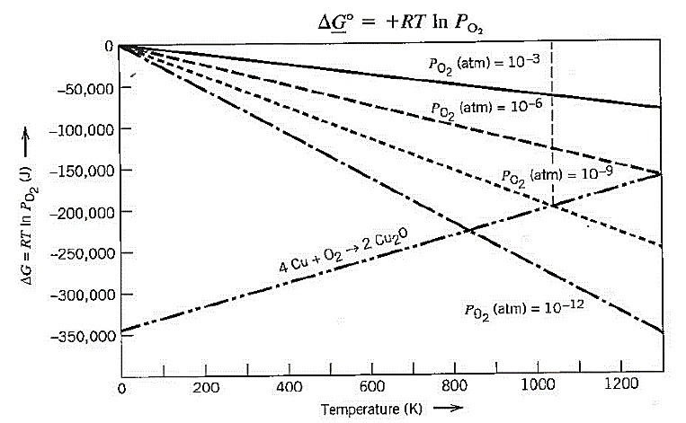
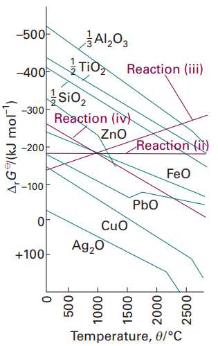
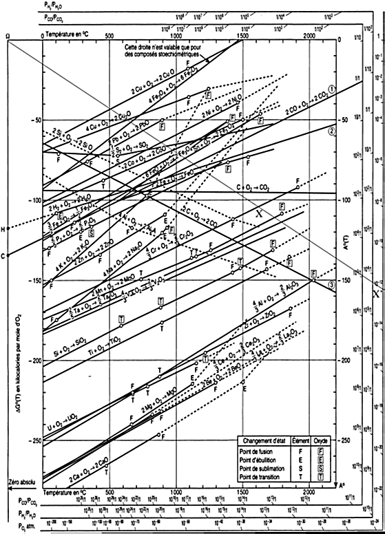

# Lecture 7 — Chemical Equilibrium

**MS1016 Thermodynamics of Materials · NTU · Prof Leonard Ng**

> **Prerequisite:** L3 (Gibbs free energy), L5 (chemical potential and activity), L6 (equal chemical potentials at phase equilibrium). L7 extends equilibrium from phases to *chemical reactions*.

---

## 7.1 What this lecture does

L4 and L6 told us when phases are in equilibrium. This lecture tells us when **chemical reactions** are at equilibrium — and, crucially, which way they run and how completely.

Some reactions go essentially to completion (burning methane produces essentially all CO₂ and water). Others sit at an equilibrium mixture where significant amounts of both reactants and products are always present (iron + water ⇌ iron oxide + hydrogen, critical for corrosion science). Thermodynamics predicts the equilibrium composition and the direction of change.

By the end of this lecture you should be able to:

- relate the **equilibrium constant** $K$ to the **standard reaction Gibbs energy** $\Delta G^\circ_\text{rxn}$ via $\Delta G^\circ = -RT\ln K$,
- compute a **reaction quotient** $Q$ and compare to $K$ to predict reaction direction,
- apply this to **solid-gas equilibria** like metal oxidation,
- read an **Ellingham diagram** to predict metal-oxide stability and design reduction processes,
- explain Le Chatelier's principle using the $Q$ vs $K$ framework,
- (supplementary) derive the **Van't Hoff** and **Gibbs-Helmholtz** equations for the temperature dependence of $K$.

---

## 7.2 Chemical equilibrium — setup

Consider a general reaction

$$
xA \;\rightleftharpoons\; yB
$$

where $x$ and $y$ are stoichiometric coefficients. Mix A and B in a container, wait for equilibrium. The **Gibbs energy change per unit extent of reaction** (i.e. how much $G$ changes when $x$ moles of A become $y$ moles of B) is

$$
\Delta G_\text{rxn} \;=\; y\,\mu_B \;-\; x\,\mu_A
$$

(products minus reactants, each weighted by its coefficient — a familiar pattern from L1's Hess's Law).

Using $\mu_i = \mu_i^\circ + RT\ln a_i$ from L5:

$$
\Delta G_\text{rxn} \;=\; y(\mu_B^\circ + RT\ln a_B) \;-\; x(\mu_A^\circ + RT\ln a_A)
$$

$$
= \underbrace{(y\mu_B^\circ - x\mu_A^\circ)}_{\equiv\;\Delta G_\text{rxn}^\circ} \;+\; RT\ln\!\frac{a_B^y}{a_A^x}
$$

$$
\boxed{\;\Delta G_\text{rxn} \;=\; \Delta G_\text{rxn}^\circ \;+\; RT\ln Q\;}
$$

where

$$
Q \;\equiv\; \frac{a_B^y}{a_A^x} \qquad \text{(reaction quotient)}
$$

## 7.3 The reaction quotient $Q$

$Q$ is the **ratio of product activities to reactant activities**, each raised to its stoichiometric coefficient. For the general reaction

$$
cC + dD \;\rightleftharpoons\; mM + yY
$$

$$
Q \;=\; \frac{a_M^m\,a_Y^y}{a_C^c\,a_D^d}
$$

**Crucial feature of $Q$:** it's computed from the *current* activities, whatever they are. Before equilibrium, during equilibrium, after perturbing from equilibrium — $Q$ is well-defined at any moment.

---

## 7.4 The equilibrium constant $K$

At equilibrium, $\Delta G_\text{rxn} = 0$. Setting the previous boxed equation to zero:

$$
0 \;=\; \Delta G_\text{rxn}^\circ \;+\; RT\ln K
$$

where $K$ is the value of $Q$ **specifically at equilibrium**:

$$
\boxed{\;\Delta G_\text{rxn}^\circ \;=\; -RT\,\ln K\;}
$$

This is the **single most important equation in chemical thermodynamics**. It connects tables of thermodynamic data ($\Delta H_f^\circ$, $S^\circ_{298}$ from L1–L2) to the chemically crucial equilibrium composition.

### Rearranging

$$
K \;=\; \exp\!\left(-\frac{\Delta G_\text{rxn}^\circ}{RT}\right)
$$

- $\Delta G_\text{rxn}^\circ < 0$ (exergonic reaction) → $K > 1$ → products favoured at equilibrium.
- $\Delta G_\text{rxn}^\circ > 0$ (endergonic) → $K < 1$ → reactants favoured at equilibrium.
- $\Delta G_\text{rxn}^\circ = 0$ → $K = 1$ → equal amounts of each at equilibrium.

### When is a reaction "spontaneous"?

**Not** simply when $K > 1$. That's an oversimplification. The correct criterion is $\Delta G_\text{rxn} < 0$, which means

$$
\Delta G_\text{rxn}^\circ + RT\ln Q \;<\; 0 \qquad\Longleftrightarrow\qquad Q \;<\; K
$$

So:

| Comparison | $\Delta G_\text{rxn}$ | Direction |
|---|:---:|---|
| $Q < K$ | $< 0$ | Reaction proceeds **forward** (toward products). |
| $Q = K$ | $= 0$ | Equilibrium — no net change. |
| $Q > K$ | $> 0$ | Reaction proceeds **backward** (toward reactants). |

**Picture $K$ as a fixed destination; $Q$ as your current position.** If you're not where you should be, the reaction moves you toward where you should be — regardless of whether $K > 1$ or $K < 1$.

### Caveat — thermodynamically vs. kinetically spontaneous

$\Delta G_\text{rxn} < 0$ means the reaction is **thermodynamically allowed**. It says nothing about *rate*. Diamond → graphite at 298 K has $\Delta G < 0$ but takes geological time. Carbon + oxygen at 298 K has $\Delta G \ll 0$ but a lump of coal sits in your storeroom for years without igniting — it needs activation energy. Always distinguish "thermodynamically favourable" from "kinetically fast".

---

## 7.5 Solid-vapour reactions — metal oxidation

A staple of extractive metallurgy. Consider copper oxidation:

$$
4\,\text{Cu(s)} \;+\; \text{O}_2(\text{g}) \;\rightleftharpoons\; 2\,\text{Cu}_2\text{O(s)}
$$

The equilibrium constant is

$$
K \;=\; \frac{a_{\text{Cu}_2\text{O}}^2}{a_\text{Cu}^4 \cdot a_{\text{O}_2}}
$$

### The pure-solid simplification

Pure solids have **activity = 1** (from L5's standard-state definitions). So $a_\text{Cu} = 1$ and $a_{\text{Cu}_2\text{O}} = 1$. For the gas (treated as ideal), $a_{\text{O}_2} = P_{\text{O}_2}/P^\circ$ where $P^\circ = 1$ atm. So $a_{\text{O}_2} \approx P_{\text{O}_2}$ in atmospheres. The equilibrium constant simplifies dramatically:

$$
\boxed{\;K \;=\; \frac{1}{P_{\text{O}_2}}\;}
$$

**Remarkable:** the equilibrium condition depends *only* on the oxygen partial pressure. Amount of Cu or Cu$_2$O doesn't matter (activities of pure solids are 1 regardless of quantity).

### Worked example — Cu equilibrium $P_{\text{O}_2}$ at 1000 K

*Given $\Delta G_\text{rxn}^\circ = -190{,}366$ J/mol at 1000 K, find the equilibrium $P_{\text{O}_2}$.*

From $\Delta G^\circ = -RT\ln K$:

$$
-190{,}366 \;=\; -(8.314)(1000)\,\ln K
$$

$$
\ln K \;=\; \frac{190{,}366}{8314} \;=\; 22.9 \qquad\Longrightarrow\qquad K \;=\; e^{22.9} \;\approx\; 8.78 \times 10^{9}
$$

Since $K = 1/P_{\text{O}_2}$:

$$
\boxed{\;P_{\text{O}_2}^\text{eq} \;\approx\; 1.14 \times 10^{-10}\;\text{atm}\;}
$$

**Interpretation.** At 1000 K, Cu and Cu$_2$O coexist in equilibrium only if $P_{\text{O}_2} = 1.14 \times 10^{-10}$ atm. If the ambient $P_{\text{O}_2}$ is *higher* than this (e.g. atmospheric at 0.21 atm), the reaction drives forward — Cu oxidises to Cu$_2$O. If *lower* (e.g. in a reducing atmosphere), Cu$_2$O decomposes back to Cu. **Controlling $P_{\text{O}_2}$ controls oxidation.**

### Direction of reaction — $Q$ vs $K$ with numbers

*Say you have $P_{\text{O}_2} = 10^{-6}$ atm. Which way does the reaction go?*

$$
Q \;=\; \frac{1}{P_{\text{O}_2}} \;=\; \frac{1}{10^{-6}} \;=\; 10^{6}
$$

$Q = 10^6 < K = 8.78 \times 10^9$, so $Q < K$. Reaction proceeds **forward** — Cu gets oxidised.

What if $P_{\text{O}_2} = 10^{-12}$ atm? $Q = 10^{12} > K$, so the reaction goes **backward** — any Cu$_2$O present gets reduced back to Cu. A sufficiently low oxygen atmosphere *unmakes* the oxide.

---

## 7.6 Visualising oxide equilibria — pressure-temperature plots

At a single temperature, the equilibrium $P_{\text{O}_2}$ is a single number. Across a range of temperatures, it traces a curve.

{width=560px}

The plot shows $\Delta G$ vs. $T$. The equilibrium $\Delta G$ line for Cu/Cu$_2$O has a particular slope and intercept. Superimposed are lines of constant $P_{\text{O}_2}$: each one has slope $R\ln P_{\text{O}_2}$ (from $\Delta G = RT\ln P_{\text{O}_2}$) emanating from the origin. The **intersection** of the Cu line with a constant-$P_{\text{O}_2}$ line gives the temperature at which that $P_{\text{O}_2}$ is the equilibrium pressure.

This is the core idea of the **Ellingham diagram**, which we'll see in full next.

---

## 7.7 The Ellingham diagram

{width=420px}

### Setup

Plot $\Delta G_\text{rxn}^\circ$ vs. $T$ for many metal-oxide formation reactions, each normalised per mole of O$_2$:

$$
\tfrac{2x}{y}\,\text{M} \;+\; \text{O}_2 \;\rightleftharpoons\; \tfrac{2}{y}\,\text{M}_x\text{O}_y
$$

Three such reactions (for carbon, important for smelting):

| Reaction | Description |
|---|---|
| (ii) ½C + ½O$_2$ → ½CO$_2$ | Net gas moles unchanged ($\tfrac{1}{2}$ mol O₂ → $\tfrac{1}{2}$ mol CO₂). |
| (iii) C + ½O$_2$ → CO | Net gas moles **increase** ($\tfrac{1}{2}$ → 1 mol gas). |
| (iv) CO + ½O$_2$ → CO$_2$ | Net gas moles **decrease** ($\tfrac{3}{2}$ → 1 mol gas). |

### Slopes from entropy

From $(\partial \Delta G^\circ/\partial T)_P = -\Delta S^\circ$:

- **Reaction (iii)** C + ½O$_2$ → CO: gas moles increase → $\Delta S^\circ > 0$ → slope $-\Delta S^\circ < 0$. $\Delta G^\circ$ **decreases** with $T$.
- **Reaction (iv)** CO + ½O$_2$ → CO$_2$: gas moles decrease → $\Delta S^\circ < 0$ → slope $-\Delta S^\circ > 0$. $\Delta G^\circ$ **increases** with $T$.
- **Reaction (ii)** ½C + ½O$_2$ → ½CO$_2$: net gas moles unchanged → $\Delta S^\circ \approx 0$ → $\Delta G^\circ$ approximately **constant** with $T$.

Most metal oxide-formation reactions consume gas moles (metal is solid, metal oxide is solid, O$_2$ gets absorbed), so they look like reaction (iv): $\Delta S^\circ < 0$, slope positive, $\Delta G^\circ$ rises with $T$. Every metal-oxide line on the diagram tilts upward to the right.

### Why the C → CO line is special

Reaction (iii) has **decreasing $\Delta G^\circ$** with $T$. At very high $T$, the C → CO line lies *below* almost every metal-oxide line. That means carbon can **reduce** almost any metal oxide to its metal above some critical temperature — the temperature at which the C → CO line crosses the metal-oxide line.

This is the thermodynamic basis for **smelting with coke**: hot coke (carbon + carbon monoxide) pulls oxygen off metal oxides to make the metal plus CO/CO$_2$. Blast furnaces, electric arc furnaces, and many other reduction processes exploit exactly this.

### Reading the Ellingham diagram

{width=420px}

The full Ellingham diagram has three auxiliary scales along its edge:

1. **$P_{\text{O}_2}$** — the equilibrium oxygen partial pressure at any $(T, \Delta G^\circ)$ point.
2. **$P_{\text{H}_2}/P_{\text{H}_2\text{O}}$** — the equilibrium ratio for reduction by hydrogen (from the H$_2$O formation equilibrium).
3. **$P_{\text{CO}}/P_{\text{CO}_2}$** — the equilibrium ratio for reduction by carbon monoxide.

### How to read it (worked example)

*Find the equilibrium $P_{\text{O}_2}$ for chromium oxidation at 1300 °C.*

1. Find the Cr line (Cr + O$_2$ → Cr$_2$O$_3$, normalised per mole O$_2$).
2. Mark point A on the Cr line at $T = 1300$ °C.
3. Draw a straight line from the "O" marker on the left edge through point A.
4. Extend to the $P_{\text{O}_2}$ scale on the right.
5. Read: $P_{\text{O}_2}^\text{eq} \approx 10^{-16}$ atm.

So even ludicrously small oxygen partial pressures (far below any vacuum you can make in an ordinary furnace) will oxidise chromium at 1300 °C. To keep Cr metal from oxidising, you need a strongly reducing atmosphere.

### Why chromium is oxidised so easily — and what to do

The practical consequence: in heat-treating chromium or chrome-containing alloys (stainless steel, nichrome, etc.), you can't rely on a vacuum alone — trace oxygen will oxidise the surface. Two mitigations:

**(a) Hydrogen atmosphere.** If you have a furnace atmosphere of H$_2$ + H$_2$O vapour, the H$_2$/H$_2$O ratio sets an effective $P_{\text{O}_2}$ via the equilibrium $\text{H}_2 + \tfrac{1}{2}\text{O}_2 \rightleftharpoons \text{H}_2\text{O}$:

$$
K_1 \;=\; \frac{P_{\text{H}_2\text{O}}^2}{P_{\text{H}_2}^2\,P_{\text{O}_2}} \qquad\Longrightarrow\qquad P_{\text{O}_2} \;=\; \frac{1}{K_1}\!\left(\frac{P_{\text{H}_2\text{O}}}{P_{\text{H}_2}}\right)^{\!2}
$$

Read the required $P_{\text{H}_2}/P_{\text{H}_2\text{O}}$ from the "H" auxiliary scale: for Cr at 1300 °C it's around 400:1. You need *400 times more* H$_2$ than H$_2$O vapour to keep Cr from oxidising. Dry, pure H$_2$ atmospheres are standard practice in heat-treating stainless fasteners.

**(b) CO/CO$_2$ atmosphere.** Works the same way, with the equilibrium $\text{CO} + \tfrac{1}{2}\text{O}_2 \rightleftharpoons \text{CO}_2$:

$$
P_{\text{O}_2} \;=\; \frac{1}{K_2}\!\left(\frac{P_{\text{CO}_2}}{P_{\text{CO}}}\right)^{\!2}
$$

High CO / low CO$_2$ → low $P_{\text{O}_2}$ → reducing. Used in blast-furnace atmospheres, where CO is the active reducing agent pulling oxygen off iron ore.

### Broader engineering uses of the Ellingham diagram

- **Metal extraction** — pick a temperature and reductant (C, H$_2$, or less-noble metal) such that the reductant's line lies *below* the target metal's oxide line.
- **Heat-treatment atmospheres** — choose H$_2$/H$_2$O or CO/CO$_2$ ratios to prevent oxidation (or to deliberately decarburise / carburise steel surfaces).
- **Refractory compatibility** — which ceramic crucibles are stable at which temperatures with which molten metals.
- **Corrosion prediction** — at what temperature does a given alloy begin to oxidise?

Essentially every refining, casting, or heat-treatment step in extractive metallurgy begins with a look at an Ellingham diagram.

---

## 7.8 Response of equilibrium to temperature — Le Chatelier

Le Chatelier's principle (qualitative): a system at equilibrium, disturbed, shifts to counteract the disturbance.

Applied to temperature:

- **Increase $T$** → system shifts in the **endothermic** direction (absorbs the added heat).
- **Decrease $T$** → system shifts in the **exothermic** direction (releases heat to replace the lost heat).

### Simple mnemonic — treat "energy" as a reactant or product

For an **endothermic** reaction: energy + A ⇌ B. Adding heat is like adding "energy" on the reactant side → Le Chatelier pushes forward toward B.

For an **exothermic** reaction: A ⇌ B + energy. Removing heat is like removing "energy" on the product side → Le Chatelier pushes forward toward B.

This is a pedagogical crutch — "energy" isn't literally a chemical species and doesn't appear in $K$ — but it gives the correct qualitative direction every time.

### Quantitative version — Van't Hoff

See §7.10 for the full derivation. Result:

$$
\boxed{\;\frac{\mathrm{d}\ln K}{\mathrm{d}T} \;=\; \frac{\Delta H^\circ_\text{rxn}}{RT^2}\;}
$$

This is the **Van't Hoff equation**. Key consequences:

- **Exothermic** reaction ($\Delta H^\circ < 0$): $\mathrm{d}\ln K/\mathrm{d}T < 0$ → $K$ *decreases* with $T$. Products less favoured at high $T$. (Example: NH$_3$ synthesis — endothermic in reverse, so run the Haber process at low $T$ for maximum NH$_3$ yield... except kinetics forces high $T$.)
- **Endothermic** reaction ($\Delta H^\circ > 0$): $\mathrm{d}\ln K/\mathrm{d}T > 0$ → $K$ *increases* with $T$. Products more favoured at high $T$. (Example: rock → gas decomposition reactions — easier at high $T$.)

### Integrated form

Assuming $\Delta H^\circ$ roughly constant over the relevant $T$ range:

$$
\ln\!\frac{K(T_2)}{K(T_1)} \;=\; -\frac{\Delta H^\circ_\text{rxn}}{R}\!\left(\frac{1}{T_2} - \frac{1}{T_1}\right)
$$

Identical form to the Clausius-Clapeyron equation from L4, and for the same reason — both describe how a logarithmic equilibrium quantity varies with temperature.

---

## 7.9 Worked example — extending the Cu oxidation across temperature

*Given $\Delta G^\circ_\text{rxn}(\text{Cu → Cu}_2\text{O})$ at 1000 K = $-190{,}366$ J/mol and $\Delta H^\circ \approx -330{,}000$ J/mol (approximately temperature-independent), what's the equilibrium $P_{\text{O}_2}$ at 1500 K?*

### Step 1 — find $K(1500\,\text{K})$ via Van't Hoff

$$
\ln\!\frac{K_2}{K_1} \;=\; -\frac{-330{,}000}{8.314}\!\left(\frac{1}{1500} - \frac{1}{1000}\right)
$$

$$
= 39{,}692 \times (6.667\times 10^{-4} - 10^{-3})
$$

$$
= 39{,}692 \times (-3.333\times 10^{-4}) \;\approx\; -13.23
$$

$$
\frac{K_2}{K_1} \;=\; e^{-13.23} \;\approx\; 1.79 \times 10^{-6}
$$

### Step 2 — compute $K(1500\,\text{K})$

We had $K(1000\,\text{K}) = 8.78 \times 10^9$. So

$$
K(1500\,\text{K}) \;\approx\; 8.78 \times 10^9 \times 1.79 \times 10^{-6} \;\approx\; 1.57 \times 10^{4}
$$

### Step 3 — corresponding $P_{\text{O}_2}^\text{eq}$

$$
P_{\text{O}_2}^\text{eq}(1500\,\text{K}) \;=\; \frac{1}{K} \;\approx\; 6.4 \times 10^{-5}\;\text{atm}
$$

### Interpretation

At 1000 K, equilibrium oxygen partial pressure is $1.1 \times 10^{-10}$ atm.
At 1500 K, it's $6.4 \times 10^{-5}$ atm — about **a million times higher**.

The oxide is **much less stable at high $T$**. At 1500 K, a much more oxygen-rich atmosphere is needed to keep Cu oxidised. This is consistent with the $\Delta G^\circ$ line sloping up as $T$ rises on the Ellingham diagram. It's also why molten copper in furnaces doesn't readily oxidise even in mildly oxidising atmospheres — the high temperature makes the oxide unstable.

### Sanity check

The reaction is exothermic ($\Delta H^\circ < 0$). Van't Hoff predicts $K$ decreases with $T$. We got $K(1500) \ll K(1000)$ ✓. Le Chatelier: heating an exothermic reaction shifts it backward (less product). Consistent.

---

## 7.10 Supplementary — deriving the Van't Hoff equation

(This section can be skipped on first reading. Included because it ties together several concepts from L3.)

### Target

We want to derive $\mathrm{d}\ln K/\mathrm{d}T = \Delta H^\circ/(RT^2)$ from first principles.

### Starting point

$$
\Delta G^\circ_\text{rxn} \;=\; -RT\ln K
$$

Divide both sides by $T$:

$$
-\frac{\Delta G^\circ_\text{rxn}}{T} \;=\; R\ln K
$$

Differentiate with respect to $T$:

$$
\frac{\mathrm{d}\ln K}{\mathrm{d}T} \;=\; -\frac{1}{R}\,\frac{\mathrm{d}(\Delta G^\circ/T)}{\mathrm{d}T}
$$

We need to evaluate $\mathrm{d}(\Delta G^\circ/T)/\mathrm{d}T$.

### Step 1 — quotient rule on $\Delta G^\circ/T$

$$
\frac{\mathrm{d}(\Delta G^\circ/T)}{\mathrm{d}T} \;=\; \frac{1}{T}\,\frac{\mathrm{d}\Delta G^\circ}{\mathrm{d}T} \;-\; \frac{\Delta G^\circ}{T^2}
$$

### Step 2 — substitute $\mathrm{d}\Delta G^\circ/\mathrm{d}T = -\Delta S^\circ$ (from L3)

$$
\frac{\mathrm{d}(\Delta G^\circ/T)}{\mathrm{d}T} \;=\; -\frac{\Delta S^\circ}{T} \;-\; \frac{\Delta G^\circ}{T^2}
$$

### Step 3 — combine using $\Delta G^\circ = \Delta H^\circ - T\Delta S^\circ$

$$
-\frac{\Delta S^\circ}{T} - \frac{\Delta G^\circ}{T^2} \;=\; -\frac{\Delta S^\circ}{T} - \frac{\Delta H^\circ - T\Delta S^\circ}{T^2}
$$

$$
= -\frac{\Delta S^\circ}{T} - \frac{\Delta H^\circ}{T^2} + \frac{\Delta S^\circ}{T} \;=\; -\frac{\Delta H^\circ}{T^2}
$$

### Step 4 — the Gibbs-Helmholtz equation

$$
\boxed{\;\frac{\mathrm{d}(\Delta G^\circ/T)}{\mathrm{d}T} \;=\; -\frac{\Delta H^\circ_\text{rxn}}{T^2}\;} \qquad\text{(Gibbs-Helmholtz)}
$$

This tells you how the *$G/T$ ratio* varies with temperature — a useful intermediate result in its own right.

### Step 5 — put into the ln $K$ derivative

$$
\frac{\mathrm{d}\ln K}{\mathrm{d}T} \;=\; -\frac{1}{R}\,\frac{\mathrm{d}(\Delta G^\circ/T)}{\mathrm{d}T} \;=\; -\frac{1}{R}\!\left(-\frac{\Delta H^\circ}{T^2}\right)
$$

$$
\boxed{\;\frac{\mathrm{d}\ln K}{\mathrm{d}T} \;=\; \frac{\Delta H^\circ_\text{rxn}}{RT^2}\;} \qquad\text{(Van't Hoff)}
$$

Exactly what we wanted.

### Integrated form

Assuming $\Delta H^\circ$ constant with $T$:

$$
\ln K(T) \;=\; -\frac{\Delta H^\circ}{RT} \;+\; \text{constant}
$$

— a straight line when $\ln K$ is plotted against $1/T$, with slope $-\Delta H^\circ/R$. This is *the* experimental way to extract $\Delta H^\circ_\text{rxn}$ from equilibrium data: measure $K$ at several temperatures, plot $\ln K$ vs. $1/T$, read the slope.

---

## 7.11 Concept checks

| Question | Answer |
|---|---|
| Why doesn't $K$ depend on amount of pure solid? | Because activity of a pure solid is 1 by convention (independent of how much you have). The activity's independence of amount reflects the fact that a solid's molar $G$ doesn't change as you add more of it. |
| $\Delta G^\circ = -RT\ln K$ — but at what temperature? | Whatever $T$ you're computing at. Both $\Delta G^\circ$ and $K$ depend on $T$; the relation is valid at every $T$. For different $T$, use $\Delta G^\circ(T)$, not $\Delta G^\circ_{298}$. |
| If I double all stoichiometric coefficients (e.g. 2A ⇌ B becomes 4A ⇌ 2B), how does $K$ change? | $K \to K^2$. The reaction quotient is raised to the power of the scaling factor. $\Delta G^\circ$ also doubles (it's per extent of reaction). Check: $\Delta G^\circ_\text{new} = 2\Delta G^\circ_\text{old} = -RT\ln K_\text{new}$ gives $\ln K_\text{new} = 2\ln K_\text{old}$, so $K_\text{new} = K_\text{old}^2$. ✓ |
| $\Delta G^\circ$ at 1000 K says Cu/Cu$_2$O equilibrium needs $P_{\text{O}_2} = 10^{-10}$ atm. How do I realistically achieve that in a lab? | Not by pumping air out — vacuum chambers rarely get below $10^{-8}$ atm of residual O$_2$. Instead use a **reducing atmosphere**: H$_2$/H$_2$O at a controlled ratio (∼10 000:1 gives ∼$10^{-10}$ atm effective $P_{\text{O}_2}$ at 1000 K) or CO/CO$_2$. This is how industrial annealing furnaces prevent oxidation. |
| Why does the C → CO line on the Ellingham diagram tilt *down*? | Reaction is C(s) + ½O$_2$(g) → CO(g). Moles of gas go ½ → 1 (increase). $\Delta S^\circ > 0$. Slope $-\Delta S^\circ < 0$ → $\Delta G^\circ$ decreases with $T$. At high enough $T$ this line lies below every metal-oxide line, meaning carbon can reduce any oxide — the thermodynamic basis of carbon-reductive smelting. |
| Why can't Al be smelted by carbon reduction? | Look at the Ellingham diagram: the Al$_2$O$_3$ line is very low (very stable oxide). Carbon's reduction line only crosses Al$_2$O$_3$ at extremely high $T$ (∼2000+ °C), which is industrially impractical. That's why aluminium is produced electrolytically (Hall-Héroult process) rather than by carbothermal reduction. |

---

## Source-slide corrections applied in this consolidated version

1. **Page 3 — "the reaction will be spontaneous if and only if K > 1".** This is an oversimplification that will mislead students. Spontaneity of a reaction **at the current conditions** depends on $Q$ vs $K$, not on whether $K > 1$. For instance, even a reaction with $K = 10^{20}$ runs backward if $Q > 10^{20}$. **Applied:** §7.4 states the correct criterion ($Q < K$) and includes a table showing all three cases.

2. **Page 6 footnote typo** — "rela(on" for "relation" (pdftotext artifact; shouldn't be in the PDF source). Minor, but noted.

3. **Page 8 — reaction (ii) stoichiometry not always clear.** The source writes $\tfrac{1}{2}\text{C}(\text{s}) + \tfrac{1}{2}\text{O}_2 \to \tfrac{1}{2}\text{CO}_2$ and argues its gas moles are unchanged. This is formally true ($\tfrac{1}{2}$ mol O$_2$ → $\tfrac{1}{2}$ mol CO$_2$) but the fractional coefficients obscure the physical logic. The standard Ellingham-diagram form uses **per mole O$_2$** as the normalisation. **Applied:** §7.7 walks through all three reactions in a table and explicitly counts gas moles on both sides.

4. **Page 11 (Ellingham diagram) — figure lacks scale legends.** The source image is a bare scan of an Ellingham diagram without annotations to help students read it. The paragraph-style "how to read it" on page 12 is good but dense. **Applied:** §7.7 works through one explicit example (Cr at 1300 °C, giving $P_{\text{O}_2} \approx 10^{-16}$ atm) and includes the numerical recipe for H$_2$/H$_2$O and CO/CO$_2$ atmospheres.

5. **Page 14 — Le Chatelier "energy as reactant" is flagged as a pedagogical crutch in the source** (good). Leaving in place with the same caveat.

6. **Supplementary pages 14–16 — Gibbs-Helmholtz derivation.** Correct but dense; the key result (Van't Hoff equation) appears at the very end without enough signposting. **Applied:** §7.10 restructures the derivation with labelled steps and boxed key equations (Gibbs-Helmholtz as an intermediate, Van't Hoff as the final).

7. **No worked example of temperature-shifted equilibrium.** The source derives Van't Hoff but doesn't use it numerically. **Applied:** §7.9 uses Van't Hoff to extend the Cu oxidation example from 1000 K to 1500 K, showing that $P_{\text{O}_2}$ rises 6 orders of magnitude — an important practical point.

---

## All seven lectures complete

This is the last of the core lecture notes (L0–L7). Recall L8 (Electrochemistry) was dropped from the 2025-26 syllabus per your earlier instruction, so the consolidated-notes set ends here. Summary across the set:

| | Lines | Figures |
|---|---:|---:|
| L0 Introduction | 477 | 12 |
| L1 First Law | 922 | 10 |
| L2 Second Law | 470 | 11 |
| L3 Free Energy & Maxwell | 559 | 1 |
| L4 Phase Equilibrium (Single-Component) | 489 | 5 |
| L5 Solid Solutions | 548 | 6 |
| L6 Phase Rule & Phase Diagrams | 403 | 10 |
| L7 Chemical Equilibrium | ~650 | 10 |
| **Total** | **~4,500** | **65** |

Happy to go back and expand / revise any section, produce a master index / table of contents, extract a one-page cheat sheet, or do anything else with the corpus.
