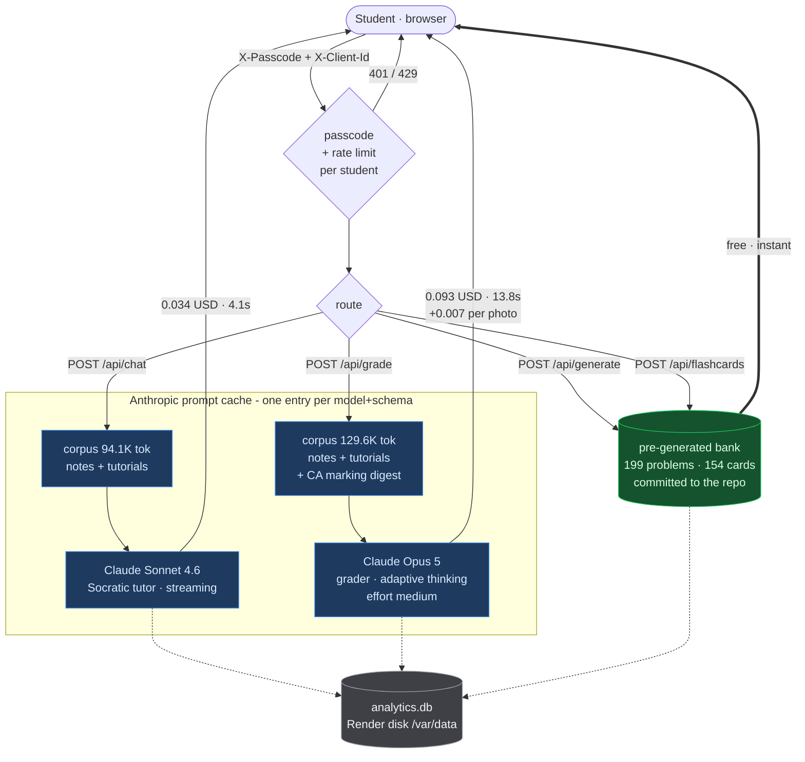
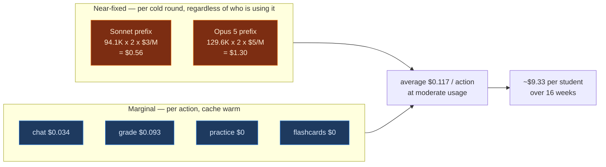

# Captain Thermo — deployment architecture

All figures are measured against the live deployment, not estimated.

## Request flow

The thing worth reading here is which paths cost money. Two of the four tools
never reach the API at all, and the two that do sit behind separate prompt
caches that are the dominant cost driver.

**Why the bank exists.** Fifty students asking for an L2 deck used to be fifty
near-identical API calls, each re-reading the ~94K-token corpus. Pre-generating
removes ~35% of live traffic *and* two of the four cache prefixes the app must
keep warm. A cold round now costs $1.86, down from $2.39.

**Why the grader has a bigger corpus.** Tutorials show the teaching style; the
past CAs show the examining style — mark allocation, how much working earns
full credit. The grader has no other source for what "good enough" means in
this course — but it does not need the papers themselves, only what they encode.
`scripts/build_ca_digest.py` distils them into an 8K-token marking standard
(0.5-mark itemisation, the 60:40 setup-to-evaluation split, error-carried-forward,
house conventions), down from 51K. The tutor is not charged for it at all.

> The digest records that the CA papers write $dU = \delta Q - P\,dV$ while the
> consolidated notes use $\Delta U = Q + W$. The grader is told the convention is
> the student's to choose provided they state it and stay consistent, which is
> what the published CA solutions do. Only inconsistency is a conceptual error.

## Cost structure

Marginal and average cost differ by 3x, and the gap is the cache.

Because the write cost is near-fixed, **more usage makes each action cheaper**:
$0.150/action at light usage, $0.100 at heavy. An under-used deployment is the
expensive one per unit of value.

`CACHE_TTL=adaptive` narrows that gap from the other side: a 1h write costs 2x
input price and a 5m write 1.25x, so 1h only repays itself above ~3 requests per
hour. The app counts the last hour's requests and picks. The TTL is not part of
the cache key — verified — so switching between them re-reads the same entry
rather than forking it.

## Build and deploy

```mermaid
flowchart LR
    PDF["course_content/<br/>notes · tutorials<br/>19 CA papers"]
    PDF -->|"scripts/extract_ca.py"| TXT["ca_papers.txt<br/>51K tok"]
    TXT -->|"scripts/build_ca_digest.py"| DIG["ca_digest.txt<br/>8K tok · marking standard"]
    DIG --> CORP["corpus.py"]

    CORP -->|"offline, once per revision"| MK["scripts/make_bank.sh"]
    MK --> G["build_bank.py --direct"]
    G --> AU["audit_bank.py --remove"]
    AU --> DD["dedupe_bank.py --apply"]
    DD -->|"still thin?"| G
    DD -->|"clean AND full"| BJ[("practice_bank.json<br/>flashcard_decks.json")]

    BJ --> GH["git push"]
    CORP --> GH
    GH -->|"auto-deploy ~90s"| RN["Render · Docker<br/>1 instance + 1GB disk"]

    classDef gate fill:#7c2d12,stroke:#ea7317,color:#ffedd5
    class AU gate
```

**The audit is a gate, not a report.** Adding the course conventions to the
authoring prompt halved the defect rate (measured 9.5% to 5.3% on freshly
generated problems) but did not eliminate it — roughly 1 in 19 still shipped a
wrong sign convention or an irreversible process described as reversible. A
prompt is not a guarantee, so `make_bank.sh` loops until the audit comes back
clean and cannot exit with a dirty bank.

The loop's exit condition checks **clean AND full**: an empty bank is trivially
clean, and a full one can still be dirty.

> The audit proves only the absence of the three defects it can detect. It says
> nothing about whether a problem is well-posed — the first problem reviewed by
> hand had correct arithmetic throughout and a self-contradictory premise. A
> human read is still owed before students see the bank.
